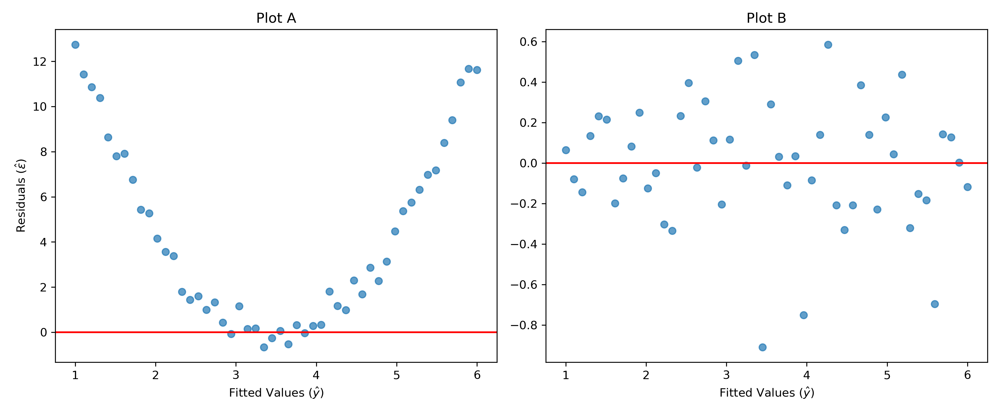

**Name: ________________________________________________________________________________________________________ **                          **Student ID: ________________________________________________________________________________________________________ **

## ECON 0150 | MiniExam 07 | Spring 2025

This MiniExam will take 8 minutes with a quick break to follow. MiniExams are designed to both test your knowledge and challenge you to apply familiar concepts in new environments. Treat it as if you're trying to show me that you understand the material. Answer clearly, completely, and concisely. 

#### Academic Conduct Code

The following academic conduct code is designed to protect the integrity of your work. Print your name/initials beside the three academic honesty agreements. I pledge to my fellow students, the university, and the instructor, that:

________ I will complete this MiniExam solely using my own work.
________ I will not use any digital resources unless explicitly allowed by the instructor.
________ I will not communicate directly or indirectly with others during the MiniExam.Q1. Agricultural Productivity and Rainfall


1. Below are two residual plots from separate regression analyses:



a) Which regression assumption is violated in Plot A?

□ Linearity
□ Normality
□ Homoskedasticity
□ Independence

b) The most appropriate approach to address the issue in Plot A would be:

□ Transform the dependent variable (e.g., take the log)
□ Add a squared term of the independent variable to the model
□ Use robust standard errors
□ Remove outliers from the dataset

c) If a residual plot shows a fan shape (with spread increasing as fitted values increase), what assumption is being violated?

□ Linearity
□ Normality
□ Homoskedasticity
□ Independence

2. A labor economist analyzes the relationship between years of education, work experience, and hourly wages. Here are the regression results:

```
                            OLS Regression Results                            
==============================================================================
                 coef    std err          t      P>|t|      [0.025      0.975]
------------------------------------------------------------------------------
Intercept      5.427      1.203      4.512      0.000       3.019       7.836
education      1.238      0.182      6.803      0.000       0.874       1.602
experience     0.452      0.073      6.189      0.000       0.306       0.598
==============================================================================
```

a) Write the estimated regression equation for this model.

□ wage = 5.427 + 1.238 × education + 0.452 × experience
□ wage = 5.427 + 0.452 × education + 1.238 × experience
□ education = 5.427 + 1.238 × wage + 0.452 × experience
□ wage = 5.427 × (1.238 × education) × (0.452 × experience)

b) Interpret the coefficient for experience in this model.

□ For each additional year of experience, hourly wage increases by $0.452, holding education constant
□ For each additional year of experience, hourly wage increases by 0.452%, holding education constant
□ Experience is 0.452 times more important than education in determining wages
□ The correlation between experience and wages is 0.452

c) If we had instead run a simple regression of wage on education only (without including experience), the coefficient on education would likely be:

□ The same as in the multiple regression (1.238)
□ Lower than in the multiple regression (<1.238)
□ Higher than in the multiple regression (>1.238)
□ Cannot be determined from the information provided

3. An education researcher wants to study whether student performance on standardized tests differs between schools with different levels of per-pupil funding. They have data on test scores and funding levels for 70 schools.

a) What regression model would be most appropriate to answer this question?

□ TestScore = β₀ + β₁ × Funding + ε
□ TestScore = β₀ + β₁ × I(Funding > threshold) + ε
□ Funding = β₀ + β₁ × TestScore + ε
□ log(TestScore) = β₀ + β₁ × log(Funding) + ε

b) If the researcher finds β₁ = 0.042 with p = 0.005 in the model TestScore = β₀ + β₁ × Funding + ε (where funding is in hundreds of dollars), what can they conclude?

□ Higher funded schools have significantly higher test scores
□ Increasing school funding causes higher test scores
□ For every \$100 increase in per-pupil funding, test scores increase by 0.042 points
□ For every 1 point increase in test scores, funding increases by $0.042 per pupil
