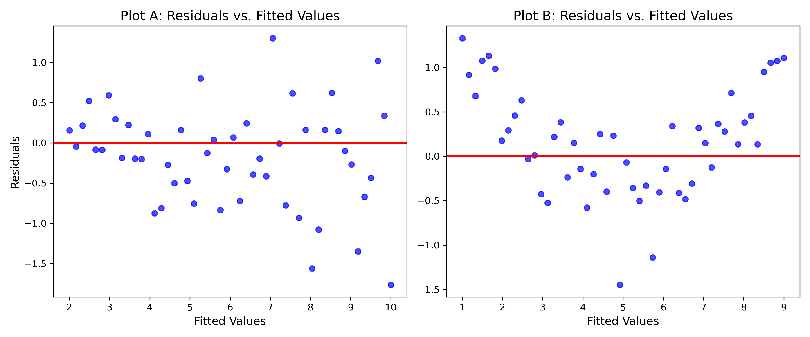

**Name: ________________________________________________________________________________________________________ **                          **Student ID: ________________________________________________________________________________________________________ **

## ECON 0150 | MiniExam 07 | Demo

This MiniExam will take 8 minutes with a quick break to follow. MiniExams are designed to both test your knowledge and challenge you to apply familiar concepts in new environments. Treat it as if you're trying to show me that you understand the material. Answer clearly, completely, and concisely. 

#### Academic Conduct Code

The following academic conduct code is designed to protect the integrity of your work. Print your name/initials beside the three academic honesty agreements. I pledge to my fellow students, the university, and the instructor, that:

________ I will complete this MiniExam solely using my own work.
________ I will not use any digital resources unless explicitly allowed by the instructor.
________ I will not communicate directly or indirectly with others during the MiniExam.

1. The following figure shows two residual plots. 



a) Plot A shows a violation of:
   □ Linearity
   □ Normality
   □ Homoskedasticity
   □ Independence

b) The appropriate fix for the issue in Plot A would be:
   □ Transform the dependent variable
   □ Add a squared term to the model
   □ Use robust standard errors
   □ Remove outliers

c) If residuals show increasing spread with larger fitted values, this violates:
   □ Linearity
   □ Normality
   □ Homoskedasticity
   □ Independence

2. A labor economist analyzes the relationship between years of education, work experience (in years), and hourly wages (in dollars) using data from 60 workers. Here are the regression results:

```
                          OLS Regression Results                          
===========================================================================
                 coef    std err        t      P>|t|    [0.025    0.975]
---------------------------------------------------------------------------
Intercept      5.427     1.203      4.512     0.000     3.019     7.836
education      1.238     0.182      6.803     0.000     0.874     1.602
experience     0.452     0.073      6.189     0.000     0.306     0.598
===========================================================================
```

a) Write the estimated regression equation for this model.
   □ wage = 5.427 + 1.238 × education + 0.452 × experience
   □ wage = 5.427 + 0.452 × education + 1.238 × experience
   □ education = 5.427 + 1.238 × wage + 0.452 × experience
   □ wage = 5.427 × (1.238 × education) × (0.452 × experience)

b) Interpret the coefficient for experience in this model.
   □ For each additional year of experience, hourly wage increases by $0.452, holding education constant
   □ For each additional year of experience, hourly wage increases by 0.452%, holding education constant
   □ Experience is 0.452 times more important than education in determining wages
   □ The correlation between experience and wages is 0.452

3. An education researcher wants to study whether student performance on standardized tests differs between schools with different levels of per-pupil funding. They have data on test scores (0-100 scale) and funding levels (in hundreds of dollars per student) for 70 schools.

a) What regression model would be most appropriate to answer this question if the researcher wants to directly measure the relationship between funding levels and test scores?
   □ TestScore = β₀ + β₁ × Funding + ε
   □ TestScore = β₀ + β₁ × I(Funding > median) + ε
   □ Funding = β₀ + β₁ × TestScore + ε
   □ log(TestScore) = β₀ + β₁ × log(Funding) + ε

b) The researcher fits a model and obtains a statistically significant positive coefficient for funding. After checking the residuals, they notice a curved pattern rather than a random cloud. This indicates:
   □ The relationship between funding and test scores is non-linear
   □ The model has better predictive power than expected
   □ The R-squared value must be very high
   □ There is no significant relationship between funding and test scores
