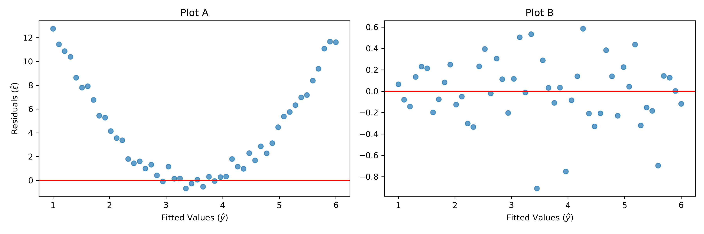

**Name: ________________________________________________________________________________________________________ **                          **Student ID: ________________________________________________________________________________________________________ **

## ECON 0150 | MiniExam 07 | Spring 2025

This MiniExam will take 8 minutes with a quick break to follow. MiniExams are designed to both test your knowledge and challenge you to apply familiar concepts in new environments. Treat it as if you're trying to show me that you understand the material. Answer clearly, completely, and concisely. 

#### Academic Conduct Code

The following academic conduct code is designed to protect the integrity of your work. Print your name/initials beside the three academic honesty agreements. I pledge to my fellow students, the university, and the instructor, that:

________ I will complete this MiniExam solely using my own work.
________ I will not use any digital resources unless explicitly allowed by the instructor.
________ I will not communicate directly or indirectly with others during the MiniExam.

1. Below are two residual plots from separate regression analyses:



a) Which regression assumption is violated in Plot A?

□ Linearity
□ Normality
□ Homoskedasticity
□ Independence

b) The most appropriate approach to address the issue in Plot A would be:

□ Transform the dependent variable (e.g., take the log)
□ Add a squared term of the independent variable to the model
□ Use robust standard errors
□ Remove outliers from the dataset

2. An economist studies the relationship between advertising spending, product quality ratings, and monthly sales. Here are the regression results:

```
                            OLS Regression Results                            
==============================================================================
                 coef    std err          t      P>|t|      [0.025      0.975]
------------------------------------------------------------------------------
Intercept     23.846      2.514      9.485      0.000      18.819      28.873
ad_spending    0.385      0.067      5.746      0.000       0.251       0.519
quality_rating 5.927      0.894      6.630      0.000       4.139       7.715
==============================================================================
```

a) Write the estimated regression equation for this model.

□ sales = 23.846 + 0.385 × ad_spending + 5.927 × quality_rating
□ sales = 23.846 + 5.927 × ad_spending + 0.385 × quality_rating
□ ad_spending = 23.846 + 0.385 × sales + 5.927 × quality_rating
□ sales = 23.846 × (0.385 × ad_spending) × (5.927 × quality_rating)

b) If we had instead run a simple regression of sales on quality_rating only (without including ad_spending), the coefficient on quality_rating would likely be:

□ The same as in the multiple regression (5.927)
□ Lower than in the multiple regression (<5.927)
□ Higher than in the multiple regression (>5.927)
□ Cannot be determined from the information provided

3. A health economist wants to study whether patient recovery time differs between hospitals with different levels of nurse-to-patient ratios. They have data on recovery time and nurse-to-patient ratios for 85 hospitals.

a) What regression model would be most appropriate to answer this question?

□ RecoveryTime = β₀ + β₁ × NurseRatio + ε
□ RecoveryTime = β₀ + β₁ × I(NurseRatio > threshold) + ε
□ NurseRatio = β₀ + β₁ × RecoveryTime + ε
□ log(RecoveryTime) = β₀ + β₁ × log(NurseRatio) + ε

b) The researcher runs an appropriate model and finds a significant negative relationship between nurse-to-patient ratios and recovery time (p = 0.003). Which of the following is the most accurate interpretation of this result?

□ Hospitals with higher nurse-to-patient ratios have significantly lower patient recovery times
□ Increasing nurse-to-patient ratios causes shorter recovery times
□ The data shows a negative correlation between nurse staffing levels and how long patients stay in the hospital
□ Hospitals should hire more nurses to reduce patient recovery times
