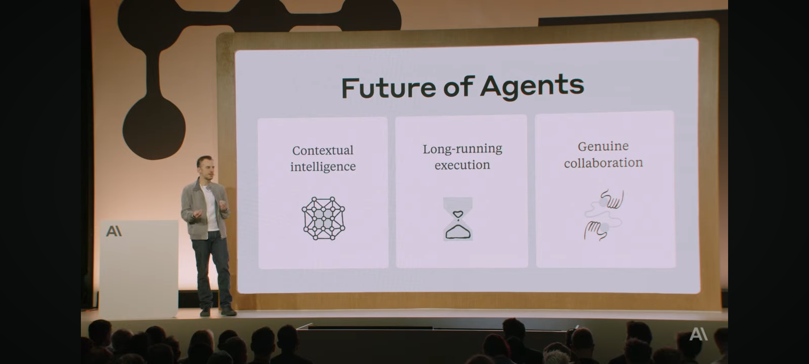

## ECON 0100

#### Microeconomics Outline

Part A / Coordination - Specialization and trade can benefit everyone

Part B / Market Efficiency - markets can effectively facilitate coordination

Part C / Externalities - externalities break the efficiency of markets

Part D / Strategic Interaction - 

Part E / Sellers - market power breaks the efficiency of markets

Part F / - Buyers - behavior is multifaceted 

#### Part A | Episode 0

some of you will be coming from your college econ class, some from highschool econ, and some this will be all new

no matter your background...

this series is not aimed at preparing you for an exam, although it might help 

there are other options for that

this series is based my lectures and is intended to show you the wonder at the heart of social science, and specifically economics

i used to think economics was about money, stocks, banking. like many, I've been motivated by this feeling of frustration about why we can't ... where did all the wealth go after the great depression? I came to the field by observing political violence, graduating high school into the great recession, seeing our failure as a planet to miss on climate change. if you're like me, you want to understand the big why's of our world. some of the biggest ones have to do with how 8 billion of us get what we want all at the same time. I found economics when I realized I could use my love for math to answer questions about why .... you don't need to care about math to care about economics. but if you've ever wondered why kale has the nearly the same price at every farmer's stand or that the phone in your pocket was designed in california, assembled in china, with parts sourced from many other countries, why we haven't yet solved climate change, you've found a field with subtantial ...

From March 2022

what is economics should start with a Google search on screen

then click on news

"what economics is about"

"coming up" and show clips of the next video

as a kid I was motivated by ... i didn't understand where all that money went during the great depression. and why couldn't we just stop adding CO2 to the atmosphere if its doing us harm? 

and as I consered engineering, I realized I wanted to understand that deeper questions about our choices as a planet. and I found a way to do that. this is both an explainer series and a way to capturing a way of understanding the world brilliant minds have been crafting for hundreds of years. I've spent years teaching this to undergrads and I think it has a power to change minds. and ... something about its a tool that can improve the world

"it started with Adam Smith." this is the first written account of ... often ideas in history were floating around the culture at the time but we attribute them the people who wrote them down. but he's the guy who wrote this down. here is where I say something about how this is the guy who modern economics starts from. but even before his main book, he wrote... this is the point where i say something like, you think it's x but actually its y. 

but it actually started with another guy, David Ricardo. 

From May 2022

this series is about the systems of thought economists have developed to understand many parts of the world. 

"how economists think"

#### Keep Notes

why coordinate and how we can facilitate coordination as a society

my goal with these videos is not to get you to pass an exam, although you will have to if you're taking my class 

it's to provide you with the understanding in your bones

outline: economics is part of the power structure. but it's generally seen as hard to understand. which leaves people with misunderstanding, confusion, skepticism, and . the ideas are powerful. my view is that this is many of our worlds problems are made worse when powerful people misuse powerful ideas and that economics when used with humility and clarity is a powerful tool to move the needle on human well-being, on many of the worlds most urgent problems. when I look at my field, I do not see a straw man built on flimsy assumptions but a well founded framework based on careful observations about human behavior. and I believe the problems created by both misusing and neglecting powerful ideas can be made better with clear communication of the ideas that makeup what we call economics. 

for most of the history of the field, good communication has taken place in elite lecture halls and seminar rooms. that is where I'm coming to you. you may even be my student. but today we have new tools which allow us to open these doors even just a crack, to communicate more effectively, in a simple and clear way. economics need not be difficult to understand and should not be only understood by a few. 

In my early years I had a question. look at this graph of wealth during the great depression. where did it all go? these are things like businesses and houses and food. what happened that it seemed to vanish? it was a mystery to me.

and take a look at this map, showing where people live in the US. why are people crammed into cities together? 

maybe shows map of all the largest cities in the world, that they are ports, and why this matters so much is a mystery we now understand, a hidden force that draws humans together in space 

economics aims to answer these kinds of questions. microeconomics, what we're doing in this course, is about individual decisions inside social systems with preferences and constraints. microeconomics tells us there's a deep fundamental reason why it pays to coordinate with each other, that markets can serve as an effective coordination device sometimes, that markets often fail, gives us a framework for when, and provides some alternatives for doing better. 

microeconomics is not about money or capitalism and is only about politics in so much as our government is one way in which we have decided to coordinate. 

what is Microeconomics about? it tells us that there's a reason to coordinate, that markets work sometimes, and gives us a framework to tell when. 

first video shows all six parts as animations and their conclusions

\------

second video should include more about decision theory

we're going to start at a place that may seem elementary but is the first building block of the foundation 

every decision has a cost and a benefit 

if the benefit is greater than the cost then we do it

everyone can have different costs and benefits 

each of us has preferences 

I like ...

and maybe you like ...

we can like different things and like the same things differently 

how much we like something is what we call a benefit 

on the vertical axis, higher means we like it better

the numbers don't matter here

all that matters is that higher numbers are better

we could even multiply the numbers by say 100 and higher things would still be higher

and we can change our preferences 

I used to like ... but now ...

on the other side, the cost of a decision is made up of all the things you can't have if you make that decision 

for example an apple at the moment could cost $1

if the price of an apple went up to $100, you're less likely to buy the apple

but costs are more basic than money

if a friendly fruit stand was generous enough to offer you an apple or a banana but only one, if you choose the apple, you cannot have the banana

so the cost of choosing the apple is how much you like the banana

op costs ...

maybe introduce marginal with demand but maybe do it here

it would be nice for them to have a notion of marginal cost and marginal benefit

if you have one think you just weight the costs against the benefits 

what if you have two?

do you weigh the costs and bens?

not quite

...

and what if we have two people and two things

both people like both things but not equally 

Andrew likes ... better than ...

and Molly likes ... better than ...

if we give Andrew the ... and Molly the ..., they both are happy enough 

but we could make them both better off by instead giving Andrew ... and Molly...

this would be what we call efficient in this small fake little system 

we can't do anything different and make people better off

swapping like this is what we call a Pareto improvement, and it's something we love to find in the world

most of the time we don't find Pareto improvements but instead we can improve some people while hurting others 

there are lots of little things we need to be thinking about though 

like what if both people liked the same thing the most 

who should be the one to get that best thing?

well one idea might be to give it to the person with the greater want or need

but think about this, how would you measure how much someone wants something like this?

or how would you compare who wants something more?

this is a problem that has stumped social scientists and philosophers as long as the question has existed

comparing different people's levels of want is tricky

and what if there are three people and we could improve two of them at the expense of the third?

you'll see later how economists think about this problem with markets and the limitations with that kind of approach

but 

\------

floating head physics has a nice style that often uses a mouse on the figure 

and a Socratic approach using characters and the questions they had

I think we could do it in 0100 too, especially at the beginning 

Ricardo was responding to merchantilism and hoarding gold

what was his name Mills? with demand and supply 

smith was walking around fish markets and seeing prices being very similar

pigou was noticing costs outside the system 

\------ 

something in here about interpersonal comparison 

like so which of these two people should get the apple?

well shouldn't it just go the person with the higher number? 

well how do we know these numbers?

people have debated for centuries how to measure them

and without some truly new technique, we cannot compare between people 

what we can do is compare within people

apple vs $1 

we measure both with numbers 

what we call utility

and here we can compare 

just ask someone which they will choose

the opportunity cost of the apple is a dollar 

but how do we know the opportunity cost of a dollar?

well think about all the things you could get if you give up a dollar

it's not just an apple but maybe an orange or a chocolate or a bike share

and we're saying it's the value of the next best alternative

so it's the maximum of their numbers

and if we decide we actually like chocolate more than we did, our opportunity cost will go up, meaning we may no longer buy the apple, but instead have the chocolate

when preferences change, so does our utility

so why don't we just think about apples and chocolate directly?

why use money?

coordination

when you're presented with these alternatives, you can just pick one

but how do you know that the person making this offer to you wants what you have to offer?

and why don't we just think about which option we'll choose?

why do we need opportunity cost at all?

well the answer that question takes us to the beating heart of economics

----+-

new scene for markets: a plane in 3d with little dots moving around, with a bar above them in the z axis representing their marginal benefit

for demand, have them populate, do it with one buyer, where they have many different MBs, then with many buyers with one MB, then many with many

order them and show law of demand

but it might not be necessary to do the 3d thing here

same for supply

then for equilibrium

start with one buyer with one MB and one seller with one MB

then one buyer and many sellers

the buyer can go around and look at all the prices and find the best one

do this by highlighting the one they want as they move down the line

do it first with a random order

but then do it with an ordered MC to show it's not a mystery

have the buyer move to the seller they exchange with, both buyer and seller being spotlighted or highlighted

show how not all sellers will be able to sell

if the buyers seller isn't in the market, then the buyer would need to switch, likely raising the price 

mention something about how prices are set here, let's just assume sellers post their price

then if the buyer decides they actually don't like the thing that much, they may not have anyone to buy from if the MB is too low

then introduce many buyers each with one MB

this is where it gets a little tricky because of prices

maybe start by just having sellers post their price 

then highlight one buyer, have them walk down the line of sellers, checking for the best available deal, doing the highlight of the one they like, then moving to the one they choose

then do the next one

if someone is already at a seller, the new buyer will have to make a better offer

walk through all incentives here

then if the buyer is willing to pay above the posted price, then highlight that seller and not the old buyer who stays until the new buyer chooses 

when the new buyer chooses, add a PS (and CS, should be done earlier), and move the old buyer to the buyers group again

eventually things settle down

this settling down where no one wants to move is equilibrium and there are a bunch of things to notice

first not everyone will buy and sell

some will be unhighlighted

also mention that if some people have way more money, they will be willing to pay more even if they need it less

and if the buyer wasn't able to look at all the prices, then this wouldn't work as well

then do this with many buyers and many sellers selling many things

each individual has many separate decisions so we can treat them as separate dots, visually in separate boxes

sellers are in a line, but their objects are lined up going back from the line

do this with one decision for buyers first

then add many buyer decisions

then mention how as we break decisions into smaller and smaller parts, this looks more and more like a line

keep referencing the standard market graph as it goes, overlaying the MB mc PS and CS

then maybe show what happens if someone tries to switch, that there's no better option for them, that this is true for everyone 

I think this way of talking about exchanges could work well for international trade and for externalities

\----

international trade

I think I want to tie this back to ppf by doing international trade op cost table explicitly

then mention how markets are often how we find the exchange rate

I think this connection would be tricky but productive

\----

https://youtu.be/DLg5tyxmXqQ?si=2v1ITwG9RfNlZI0c video on trades and prices

https://youtu.be/nST5BggdfUs?si=2awi9ZyIuekDN83l this video has some nice style, maybe do that focus on the model like a projector slide overlay fading in and out, laying it down on the glass, and maybe do a cutaway to an example done by hand on the desk in front of me on camera, recorded separately, and maybe use definitions without definition and define them on screen

episode a3 say something about how it's not just spinach and carrots, but about nearly everything in our lives, something about how much time it would take to build a smartphone on your own, or book, or house, or pencil, coordination though specialization and trade has made it possible by bending out the ppf

video style: desk with notes, brick background, blown out lamp, plant, switch between the grey model background with the model separated from the notes by a vertical bar, switches to direct to camera can either include the model and drop the notes with model and face side by side or drop the model and have face centered

\-------

talk to Carey about how she introduces demand using indifference curves and how she talks about sellers and mc, particularly with market power

videos are intended to inform but they cannot educate

that's what we're going to do in the room

eventually maybe I'd partly flip the class, so I have students watch the videos prior to lecture

https://www.pa.gov/en/agencies/vote/voter-support/college-students.html

economics from scratch

start from blank, put everything after last lecture in an archive, and start coding in vacode and copilot

can I come up a class in one file, and have it do things in another?

I'm going to start with voiceovers

maybe I can define more rigorously the bar I want them to clear, then set up the rubric to measure the bar

socal and electric vehicles probably wouldn't be whaybrhey are today if not for China, which came at a big cost for US producers, and at a loss to some Chinese consumers, but overall a benefit on both sides

have UTAs and TAs watch the video and mark down the questions / confusions that come to mind

pause the video when something isn't clear or engaging 

try to identify why

pause when the video doesn't address a concern or point of confusion

try to identify what it is

nice video on a tariff example 

https://youtu.be/_-eHOSq3oqI?si=iWXomeXcbsI2sM3y

I think there's a way to show part a farms using discrete numbers show it using dots like the marbles simulation

great video animation on election polls

https://youtu.be/In9Pqm9YlIo?si=OETyMvSrmsdYneaX

the map as an animation

https://youtu.be/hMloyp6NI4E?si=fWDD61l-zA6Gu0ap

nice soundtrack 

https://youtu.be/c9mvcfVfbio?si=PvG_Rx4ncBKXdmBG

a discovery that explains why we as a species tend to clump together

it was discovered in a different context 

Economics isn't about money [Part A Episode 1]

### Fall 2024 Notes

- I'm going to slow. For some reason it looks like I'm one class period behind where we were last fall. 
- I think i know how to make 0100 be better with videos. The problem has been that I don't want to duplicate work by posting videos of stuff i already do in class. Instead, here's a structure that fixes a lot of problems. Videos before class on Monday. In class is review of the episode plus a Vignette. There's a TopHat for the answers. Then recitations do more vignettes or even lower-key simulations, where they get their graphs checked. Maybe we don't do homework directly because of the vignettes or vignette for at home. Have a video for each, and have the vignettes not change year to year that often. They are in sequence, the TA just does the one in sequence. "Submit if you want your graph checked." But incentive should be to only submit work if they want help. You lose points if you submit a perfect graph. Maybe the homeowork is answering questions about the video. But maybe it's just watching the video before class. Maybe call all the little check-ins something like "status report" or something to be a reminder that it's about putting in the reps. But maybe I just call it extra.
- Elasticity visualization: use a horizontal line composed of two parts, the change part and the base part. This could show the idea that elasticity is a way of measuring the responsiveness and not just the slope. I'm thinking about a visual like grant's bayes video. The elasticity measure could be slighly different than the midpoint method, using the smaller of the two values instead of the middle of the two values. Then visualize the horizontal axis with a horizontal line in the elasticty fraction and the vertical in the elasticity fraction. Then have both up and down different colors and the changes part be a more vibrant color and the base be a muted color. Then move the base around moving the lines in the fraction. Then fade in the numbers, adding the number beside the bars in the SD graph and in the elasticity equation. Then show the elasticity number itself by the fraction. Then move it around. Then color the regions where it's elastic, and inelastic and fade in a bracket labeling each region. 
- I think it's better to push the homework due date back to Fridays to give students the chance to absorb content in Wednesday class. 
- I also wonder if Monday exams are better. I don't like having students need to study over the weekend, but it would give them a few extra days to absorb the material.
- I think I'm going to put less weight on the HW and Vignettes next time.
- New Structure: start class with a recap of the episode, then do a vignette from a crafted list, recitations do the next one in the list, just add a semester in the label for grading purposes. homework is automated, preferably multiple choice. 
- I think how "hard" a course is isn't the right measure since the aim of a class is to educate. a hard course doesn't mean students learned more. 
- Doing social choice at the beginning, talking about MB and price as separate things will make it way easier to conceptualize externalities later. I want them to think about the benefits and rewards, and separately think about price. Then when constructing demand, we then can talk about where the price comes from. I think students get confused when going from Demand and price to MSB and how to solve for the social planner. 
- Maybe lay out the part pages in chronological order instead of grouped?...
- One thought is to separate the first semester intro Econ into the nearly purely graphical and somewhat mathematic in the second semester, which might involve more than algebra.
- I think I can use my UTAs better. I want to have them try to type up solutions to the vignettes and homework. I have a bunch of nice notes from the past and a new format. So I want them to use an ipad or something similar to write up pretty solutions, and put their name on the sols. I also want to have them write up notes on the Episodes.
- I think the jump from intro to intermediate isn't quite what I've been thinking it is. In addition to the difference in difficulty of the math, I think one of the big unidentified problems with the jump is that students get to the difficult trees and miss the forest. I imagin a course sequence through microeconomics that makes it possible for students to get quickly back on the intro sequence ideas as they get up to speed on the math of intermediate. I've scripted out intro lectures, and a 50 minute lecture can be conveyed to a camera with animations in 20 mins or less. I've studied good explanation, and we as a university aren't the best in the world. The best is actually on youtube. Using a different format, one were we can keep the structure somewhat consistent between intro and intermediate is possible, and if we're making the content much more accessable to students outside the class, I think students will struggle much less with the jump. Some students just don't get the math. And that's one problem. But often the problem is that students don't get what we're doing in the first place. The why of the thing. That's primarily the role that I see for intro, laying out the fundamental ideas in economics. And if we can add a refresher to intermediate by sequencing the intro into the intermediate for any given topic, that I think will make it easier to see what the harder math is intended to do. I think once that's there, students will understand better why we're doing the harder math. We as economists often take for granted the motivation to study those things. But without it students will aways struggle. I've seen that consistently in intermediate. And I think it's a solvable problem at the INTRO level. And I think what I'm doing is aimed at doing it. But I want feedback on the sequence at the intro level to make it work with the intermediate level. I think we can do both with maybe a few tweaks. And I'm not  necessarily set on the way I'm teaching it.
- I think it would be better to separate some of the assessments into two parts. first they set up the model and the change. Second, they evaluate a change given to them. these seem like two separate skills, and would make the grading much easier. 

This file outlines the structure of ECON 0100 and the phillosophy guiding the structure. Notes are at the end.

### Lectures and Episodes

Lectures introduce the concepts and move students quickly to practice. Practice in Lecture is limited to small skills, leaving the bigger questions to recitation. Skillsheets organize the basic skills done in Lecture and Recitation. The idea is to build progressively, starting with small skills in lecture. 

Episodes are intended to tell a cohesive story of Microeconomics using animated visualizations. Episodes follow the same structure as Lectures. Some animations will be used in Lecture alongside the skills being developed in class. Animations cannot replace work on the board so I have both Lecture Notes and Episode Scripts. Eventually these two may converge, but it's difficult to get as much information on the screen as a whiteboard. So the Animations used in class will likely be different from those used in Episodes. 

Every Part ends with a MiniExam that is followed by a Simulation introducing some of the ideas in the next Part.

### Recitations

Recitations are primarily aimed at having students work on bigger skills, done in a structured way in Vignettes. The smaller skills are introduced in lecture then used as part of larger skills practiced in recitation. The TAs will guide students through the work, giving out all the solutions along the way after having them practice in groups. The grading is almost entirely completion based.

### Skillsheets

Skillsheets are a structured way of organizing the core concepts and skills developed in the class. The idea is not to replace one's notes but to offer a container for the skills we develop in Lecture and the Vignettes done in Recitation. Each Part starts with the smaller skills in Lecture and extends to the larger skills developed in Vignettes. The aim is to show all the basic skills broken out in a structured way. 

### Homework

Homework is a set of questions that looks similar to what will be on the MiniExams, which is less structured than what's done on Skillsheets. Students are strongly encouraged to work together. Homework is submitted to be automatically graded on Gradescope on the Wednesdays that do not have a MiniExam.

### Demos

Demos are essentially example MiniExams I do on camera. 

### MiniExams

MiniExams happen in lecture roughly every other Wednesday. I also want to organize the MEs so they are easier to have standards through time. I value having a bar and if students reach it, they get the grade. The way I'm grading right now feels a little to squishy. I'm not sure how to do this but it's something I'm thinking about. 

I might ask a question on the ME about how difficult it was and how much time studying.

### Attendance

I give 1 percent of a students' grade for attendance on top of the 100% of the grade coming elsewhere. This will have almost no impact on your grade. I want more from you than being in class. But I also want to signal to you that I'd like you to be here. And I'd like to know who's here. This is done on TopHat.

### Vignettes and Homework

### Part A

- Homework A covers calculating opportunity cost, absolute advantage, comparative advantage, and specialization. These are questions that can be auto-graded on Gradescope.
- Vignette A1 covers calculating opportunity cost and changes in the PPF.
- Vignette A2 covers specialization, trade, exchange rates, and plotting the post-trade quantities.
- Demo A does an example of finding and plotting post-trade quantities.

### Part B

- Know how to find $Q_s$ and $Q_d$ using a supply curve or demand curve and a price
- Know how to reason about the incentives of buyers and sellers
- Know how to find equilibirum
- Know how to find PS and CS for one exchange
- Know how to find PS and CS for all exchanges
- Know how to reason about price controls
- Know the intuition for DWL

I think international trade is a perfect way to wrap up Part B and move into Part C. Tariffs are easier to understand with a large global market than a tax equilibrium, since there's no tax wedge exactly.

### Part C

- Tariffs
- Taxes/Subsidies
- Externalities
- Corrective Taxes/Subsidies
- Social Planner

## Notes on the Origin of Capitalism

economics broadly is about how we should organize society. 
while we talk a lot about prices as a coordinating mechanism in markets, as you'll see, the questions were after are much bigger. 
the tradion of economics started around the time and place of the industrial revolution, as society (especially but not exclusively) started to transition. 
in many ways the dissatisfactory European feudalism of the pre-industrial revolution was more of a historical anomaly than the norm.
there's a great deal of interesting history of political economy, with markets, exchange, and specialization dating back for thousands of years and in nearly every part of the globe. 
but in many ways the origin of the study of economics in the way we understand it today began as a question during a historically unprecedented societal transition out of feudal then merchantilist Europe into an expanding industrial revolution: if not feudalism, then what?

"surplus value"

the industrial revolution was an inflection point in human history 
thinkers at the time went searching for a way to organize social life 
while many of the ideas have been discussed at many times and many places, the tradion of economics as we know it today began to formalize around this time

## From KEEP

#### Part E | Production Simulation

we've just shown how and when markets are useful tools to pick up the gains from trade

this is a powerful tool in our world

even if it is limited in scope

in part E and F, we are going to build the supply curve and demand curve from whole cloth

this requires understanding what goes into the sellers incentives in a more nuanced way

this means understanding where costs come from

simulation

make the connection to Molly's supply curve

it depends on what we call the production function

in the basic setup for the class, her production function for both goods was linear

but it isn't always the case

marginal product of labor

#### Class on March 23

start with production data from last time

show the marginal product of labor

talk about Cobb Douglas

do the thing on the board with the increase in labor and the increase in output

show how this relates to costs through wages and fixed costs

talk about TC and VC and FC

then do averages

then do marginal cost

#### Part C | Class 3 | Feb 14

start with vignette c1

make sure to mention incidence 

but we don't have to start with a tax

do a negative externality

show how to find the tax

talk about coase from Wikipedia on screen

do a positive externality

show how to find the prices

show how this must be a subsidy

vignette c2

#### MiniExam C | Class on Feb 16

MiniExam C

talk about a few web pages

\- ronald coase

\- the coase theorem is this extension of the Chicago School

\- here's the intuition with yard flowers

\- this depends on the ability to interact easily

\- this doesn't work well with carbon

\- talk about the acid rain program on wikipedia

\- then show the prices of nitrous oxide emissions and the huge success

\- talk about australia's carbon tax

\- then cap and trade in the us

\- then Oliver E. Williamson, student of coase

\- the Ostrom

\- this sets up the discussion of the commons

\- then do Part D E0

#### Part D | Episode 2 | Class on Feb 28

decision tree and backward induction 

show a game tree for a zero sum game

show the sequential nature of the game

show how player 1 could play since they know what player 2 will do

public goods have another set of tricky incentives 

instead of taking too much, public goods have a similar setup

do a public goods game with two players

in vignette D1 we'll show this also plays out in larger groups and offer a solution

vignette D1

voting is nice but doesn't always land

Condorcet cycles

#### Part D | Episode 1 | Common Resource Simulation 

episode 0 recap

simulation with sheets

mention 

\- end game effects

\- social planner 

\- dead weight loss

\- strategic interaction 

setup common resources normal form game

best response

dominant strategy

Nash equilibrium

#### Part D | Class 2 | Games and Public Goods

do a bunch of games in episode 1

do vignette D1

set up the axis in the background

set up five bar charts

set up the cost line

show what happens when the price is zero

non-excludability, show how no one will pay when the price

bring in a property tax

talk about where it would need to be set to pay for the memorial

talk about how it impacts each person

talk about the socially efficient decision

#### Part D | Episode 3 | Voting

here's a public good

heres a referendum 

social choice and decision theory

do the Condorcet cycle

do the referendum 

does it maximize welfare?

#### Part F Simulation | Class on April 13

have two goods and some pennies

I want to show an indifference curve and a budget

start with the indifference curve

give the player an endowment of one good

then start with a small number and ask whether they want to trade for some amount of the other good

do this for some intermediate amount of the two

then give them some pennies and prices and ask how much of each they would buy

then change the prices and buy back the goods

then let them buy again

use this to show a movement along the indifference curve 