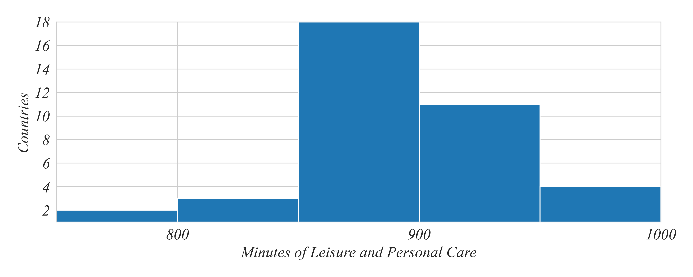
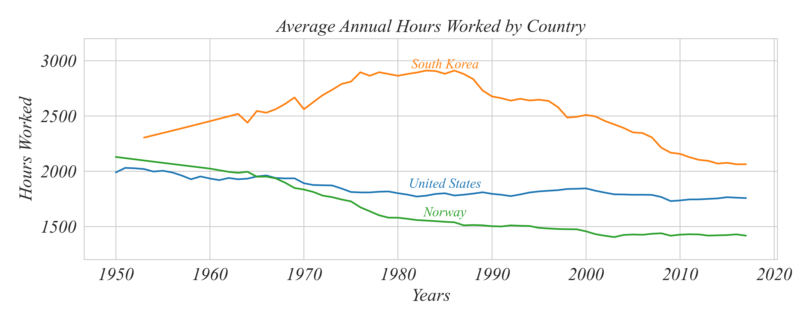

## ECON 0150 | Fall 2025 | Homework 1.0

### Due: Friday, Jan 17, 5PM

Homework is designed to both test your knowlege and challenge you to apply familiar concepts in new applications. Answer clearly and completely. You are welcomed and encouraged to work in groups so long as your work is your own. Submit your figures and answers to Gradescope.

#### Q1. Understanding Continuous Variables Visually

The following data from the Better Life Index was collected from OECD countries use using time-use surveys. This question is aimed at practicing the skill of analyzing continuous variables displayed visually. 

a. What is the most common 50 minute range of time spent on leisure?

b. In how many countries do people spend between 800 and 850 minutes on leisure and personal care?

c. How many countries spend more than 900 minutes on leisure and personal care?

d. What is the approximate difference between the two most common ranges?

#### Q2. Making Comparisons with Continuous Variables

The following data on hours worked is available from Our World in Data. This question is aimed at practicing the skill of making comparisons of continuous variables displayed visually. 

a. In which country did people work the most on average?

- South Korea
- United States
- Norway

b. When did Norwegians work less than Americans?

- Before 1965
- During 1965
- After 1965
- Never

c. When was the largest difference between the longest and the shortest annual working time?

- 1960s
- 1980s
- 2000s
- 2010s

d. In the 1980s, roughly how many times more did an average South Korean work than an average Norwegian?

- 2x
- 3x
- 4x
- 5x
