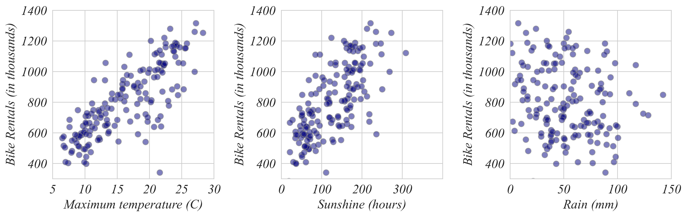

## ECON 0150 | Fall 2025 | Homework 2.1

### Due: Friday, Feb 7, 5PM

Homework is designed to both test your knowlege and challenge you to apply familiar concepts in new applications. Answer clearly and completely. You are welcomed and encouraged to work in groups so long as your work is your own. Use the datafile to answer the following questions. Then submit your figures and answers to Gradescope.

#### Q1. Bike Hires and Weather

In the following questions, we'll analyze a data set that includes the monthly number of bike hires in London as well as monthly weather data: minimum and maximum temperature in degree Celsius, rain in millimeters, and hours of sunshine.

a) From the list below, how much did it rain in the month with the largest number of bike hires?

- 7.6 mm
- 27.6 mm
- 137.6 mm
- 157.6 mm

b) When were bikes most popular?

- In very sunny months
- In moderately sunny months
- In cloudy months
- Sunshine and bike hires were not strongly related

c) In months with what maximum temperatures were bikes most popular?

- Between 5 C and 10 C
- Between 15 C and 20 C
- Between 25 C and 30 C
- Maximum temperature and bike hires were not strongly related

#### Q2. A Relationship Between Variables

Use python in a Colab Notebook and a dataset from the course page or an external source to visualize a relationship between two variables. Feel free to use HW_04_Q1.csv, but visualize a different relationship than the three above. Upload your figure to Gradescope. Is there a positive, a negative, or no clear relationship?
