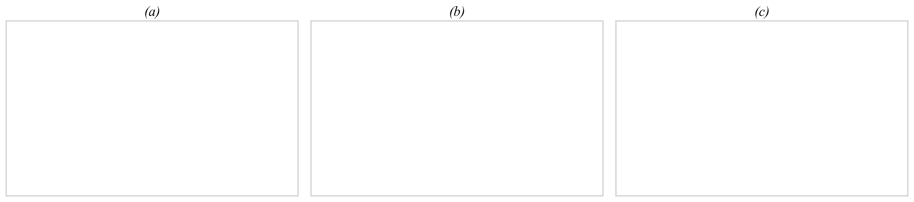
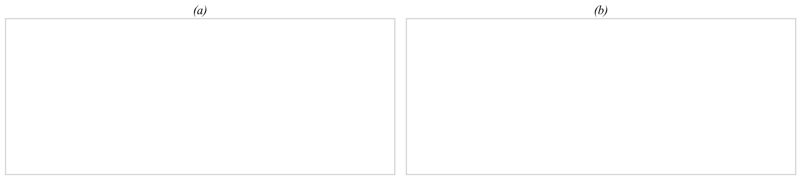
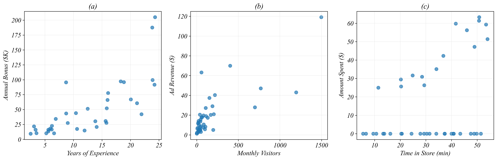
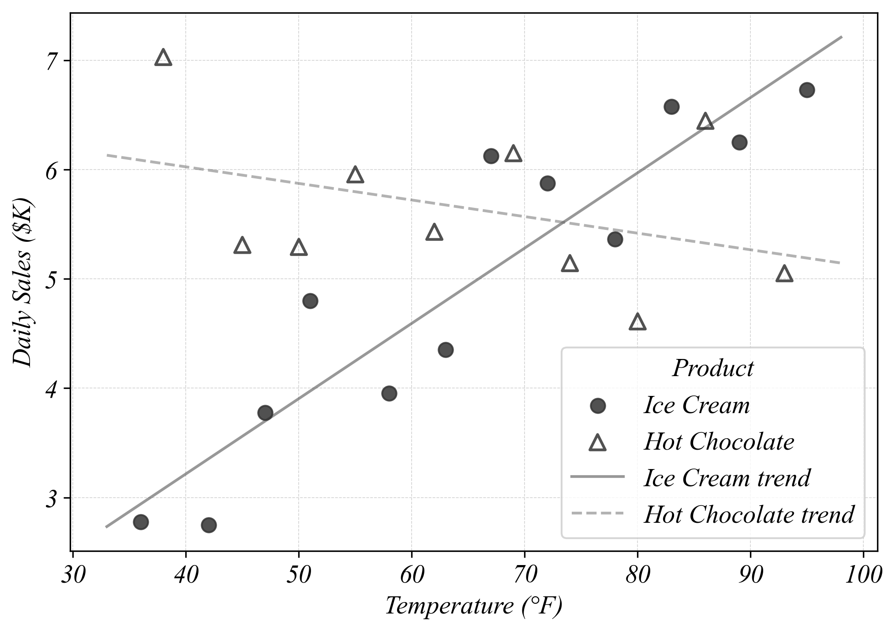

**Name: ________________________________________________________________________________________________________ **                          **Student ID: ________________________________________________________________________________________________________ **

## ECON 0150 | MiniExam 2 | Version B

MiniExams are designed to both test your knowledge and challenge you to apply familiar concepts in new environments. Treat it as if you're trying to show me that you understand the material. Answer clearly, completely, and concisely. Data tables are provided at the end.

#### Academic Conduct Code

The following academic conduct code is designed to protect the integrity of your work. Print your name/initials beside the three academic honesty agreements. I pledge to my fellow students, the university, and the instructor, that:

________ I will complete this MiniExam solely using my own work.
________ I will not use any digital resources unless explicitly allowed by the instructor.
________ I will not communicate directly or indirectly with others during the MiniExam.

##### Q1. Choose the Right Visualization (see Data 1a, 1b, 1c)

For each dataset, identify the variable types and draw the most appropriate Part 2 visualization.

a) **Data 1a** Variable Types: ______________________  b) **Data 1b** Variable Types: ______________________  c) **Data 1c** Variable Types: ______________________

##### Q2. Fix the Figure (see Data 2)

The three figures in Data 2 each have a problem that makes it hard to see patterns in the data. For each one, describe the problem and draw a better version of the figure in the box below.

##### Q3. Investigate and Visualize (see Data 3)

A rec center tracks data for all members. Data 3 shows each member's membership type, monthly fee, and average weekly workout time. Social members pay for pool and lounge access but don't use workout equipment.

a) Create a scatter plot of Monthly_Fee vs Workout_Min using all the data in Data 3. Be as specific as possible about the visualization. b) Filter for Active members only. Create a scatter plot of Monthly_Fee vs Workout_Min for Active members only.

##### Q4. Interpret Log Scales (no data needed)

a) On a log10 scale, each one-unit increase means the original value has been:

[multiplied by 2]    [multiplied by 10]    [increased by 10]    [multiplied by 100]

b) On a log2 scale, moving up by 4 units means the original value has been multiplied by:

[4]    [8]    [16]    [32]

c) Lake A has log10(Fish Population) = 2. Lake B has log10(Fish Population) = 5. How many times larger is Lake B's fish population than Lake A's?

[3 times]    [30 times]    [1,000 times]    [100,000 times]

##### Q5. Interpret a Scatter Plot by Category (see Data 5)

A store tracks daily temperature and sales for two products.

a) As Temperature increases, daily sales for Ice Cream:

[increase]    [decrease]    [stay about the same]    [no clear pattern]

b) As Temperature increases, daily sales for Hot Chocolate:

[increase]    [decrease]    [stay about the same]    [no clear pattern]

c) At 85°F, which product has higher daily sales?

[Ice Cream]    [Hot Chocolate]    [about the same]    [can't tell from the figure]

## Datasets

#### Data 1a: Store Size and Daily Sales

| Store | Sq_Feet | Daily_Sales ($K) |
|-------|---------|-----------------|
| S1    | 500     | 3               |
| S2    | 1,000   | 5               |
| S3    | 1,500   | 8               |
| S4    | 2,000   | 10              |
| S5    | 2,500   | 14              |

#### Data 1b: Experience, Salary, and Department

| Employee | Dept      | Experience | Salary ($K) |
|----------|-----------|------------|-------------|
| E1       | Marketing | 2          | 42          |
| E2       | Sales     | 2          | 35          |
| E3       | Marketing | 5          | 55          |
| E4       | Sales     | 5          | 48          |
| E5       | Marketing | 8          | 68          |
| E6       | Sales     | 8          | 58          |

#### Data 1c: Exam Scores by Section

| Student | Section | Exam_Score |
| ------- | ------- | ---------- |
| S1      | Morning | 82         |
| S2      | Evening | 71         |
| S3      | Morning | 88         |
| S4      | Evening | 65         |
| S5      | Morning | 79         |

#### Data 2: Three Visualizations

#### Data 3: Rec Center Membership Records

| Member_ID | Membership | Monthly_Fee | Workout_Min |
| --------- | ---------- | ----------- | ----------- |
| M01       | Social     | 10          | 0           |
| M02       | Active     | 45          | 30          |
| M03       | Social     | 25          | 0           |
| M04       | Active     | 75          | 60          |
| M05       | Social     | 10          | 0           |
| M06       | Social     | 40          | 0           |
| M07       | Active     | 35          | 25          |
| M08       | Social     | 25          | 0           |
| M09       | Active     | 85          | 80          |
| M10       | Social     | 10          | 0           |
| M11       | Social     | 40          | 0           |
| M12       | Active     | 55          | 45          |
| M13       | Social     | 25          | 0           |
| M14       | Active     | 65          | 55          |

#### Data 5: Temperature vs Daily Sales by Product (Version B)

