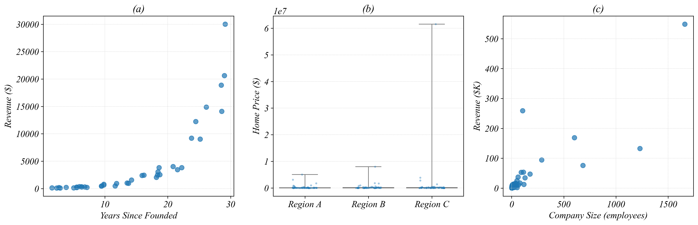

**Name: ________________________________________________________________________________________________________ **                          **Student ID: ________________________________________________________________________________________________________ **

## ECON 0150 | MiniExam 2 | Demo

MiniExams are designed to both test your knowledge and challenge you to apply familiar concepts in new environments. Treat it as if you're trying to show me that you understand the material. Answer clearly, completely, and concisely. Data tables are provided at the end.

#### Academic Conduct Code

The following academic conduct code is designed to protect the integrity of your work. Print your name/initials beside the three academic honesty agreements. I pledge to my fellow students, the university, and the instructor, that:

________ I will complete this MiniExam solely using my own work.
________ I will not use any digital resources unless explicitly allowed by the instructor.
________ I will not communicate directly or indirectly with others during the MiniExam.

---

##### Q1. Choose the Right Visualization (see Data 1a, 1b, 1c)

For each dataset, identify the variable types and draw the most appropriate Part 2 visualization. 

a) **Data 1a** Variable Types: ______________________  b) **Data 1b** Variable Types: ______________________  c) **Data 1c** Variable Types: ______________________ 

##### Q2. Fix the Figure (see Data 2)

The three figures in Data 2 each have a problem that makes it hard to see patterns in the data. For each one, draw a better version of the figure *(in the boxes below)*. Clearly label your figure to make it clear what the improvement is.

##### Q3. Interpret Log Scales (no data needed)

a) On a log2 scale, each one-unit increase means the original value has:

[increased by 2]    [doubled]    [tripled]    [increased by 10]

b) On a log10 scale, each one-unit increase means the original value has:

[increased by 2]    [doubled]    [tripled]    [increased by 10]

c) Product A has log2(1 + Revenue) = 4. Product B has log2(1 + Revenue) = 7. The difference is 3 units. About how many times more revenue does B have than A?

[2 times]    [3 times]    [8 times]    [128 times]

##### Q4. Investigate and Visualize (see Data 4)

A nonprofit tracks shift data for its volunteers and employees. Table 2 shows each person's role, the day of their shift, and their shift pay. Volunteers are unpaid.

a) Visualize Shift_Pay grouped by Day using all the data in Table 2. 

b) Filter for employees only. Visualize Shift_Pay grouped by Day for employees only.

##### Q5. Reshape Wide to Long (see Data 5)

Table 3 shows quarterly sales in wide format, where each quarter has its own column.

Reshape this table into long format so that each row represents one store in one quarter. Fill in the result:

| Store   | Quarter | Sales |
|---------|---------|-------|
| _______ | _______ | _____ |
| _______ | _______ | _____ |
| _______ | _______ | _____ |
| _______ | _______ | _____ |

How many rows does the long-format table have? ________

##### Q6. Scatter by Category (see Data 6)

Table 4 shows average class size and test scores for Public and Private schools.

a) **Draw a scatter plot with Avg_Class_Size (x-axis) vs Avg_Test_Score (y-axis), colored by Type →**

b) For Public schools, as Avg_Class_Size increases from 15 to 30, Avg_Test_Score changes by ________ points, or about ________ points per student.

c) For Private schools, as Avg_Class_Size increases from 15 to 30, Avg_Test_Score changes by ________ points, or about ________ points per student.

d) In one sentence, what do these findings tell you about the relationship between class size and test scores?

## Datasets

### Data 1a: Restaurant Tips by Meal Type
| Customer | Meal   | Tip ($) |
|----------|--------|---------|
| C1       | Lunch  | 4       |
| C2       | Dinner | 12      |
| C3       | Lunch  | 5       |
| C4       | Dinner | 15      |
| C5       | Lunch  | 3       |
| C6       | Dinner | 10      |

### Data 1b: House Size and Price
| House | Sq_Feet | Price ($K) |
|-------|---------|------------|
| H1    | 800     | 180        |
| H2    | 1,200   | 250        |
| H3    | 1,500   | 310        |
| H4    | 2,000   | 420        |
| H5    | 2,500   | 530        |

### Data 1c: Study Hours, GPA, and Major
| Student | Major | Study_Hours | GPA |
|---------|-------|-------------|-----|
| S1      | STEM  | 3           | 2.8 |
| S2      | Arts  | 3           | 3.2 |
| S3      | STEM  | 6           | 3.1 |
| S4      | Arts  | 6           | 3.6 |
| S5      | STEM  | 9           | 3.5 |
| S6      | Arts  | 9           | 3.9 |

### Data 2: Three Visualizations

### Data 4: Nonprofit Shift Records
| Person_ID | Role      | Day     | Shift_Pay |
|-----------|-----------|---------|-----------|
| P01       | Volunteer | Weekday | 0         |
| P02       | Employee  | Weekday | 100       |
| P03       | Volunteer | Weekend | 0         |
| P04       | Employee  | Weekend | 160       |
| P05       | Volunteer | Weekday | 0         |
| P06       | Volunteer | Weekend | 0         |
| P07       | Employee  | Weekday | 130       |
| P08       | Volunteer | Weekend | 0         |
| P09       | Employee  | Weekend | 200       |
| P10       | Volunteer | Weekday | 0         |
| P11       | Volunteer | Weekend | 0         |
| P12       | Employee  | Weekday | 110       |
| P13       | Volunteer | Weekday | 0         |
| P14       | Employee  | Weekend | 180       |

### Data 5: Quarterly Sales (Wide Format)
| Store   | Q1_Sales | Q2_Sales |
|---------|----------|----------|
| Store_A | 100      | 150      |
| Store_B | 200      | 180      |

### Data 6: Class Size and Test Scores by School Type
| School | Type    | Avg_Class_Size | Avg_Test_Score |
|--------|---------|----------------|----------------|
| S1     | Public  | 15             | 88             |
| S2     | Public  | 20             | 82             |
| S3     | Public  | 25             | 76             |
| S4     | Public  | 30             | 70             |
| S5     | Private | 15             | 72             |
| S6     | Private | 20             | 78             |
| S7     | Private | 25             | 84             |
| S8     | Private | 30             | 90             |
