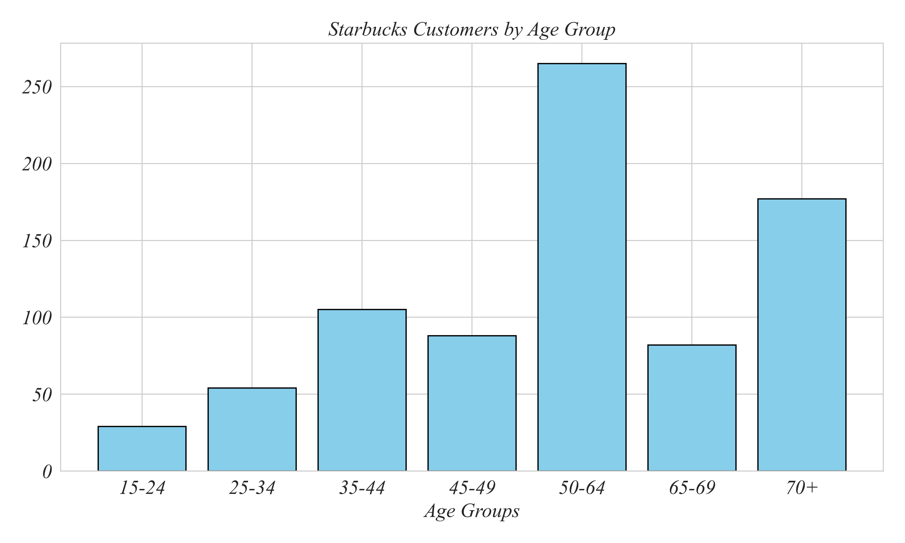
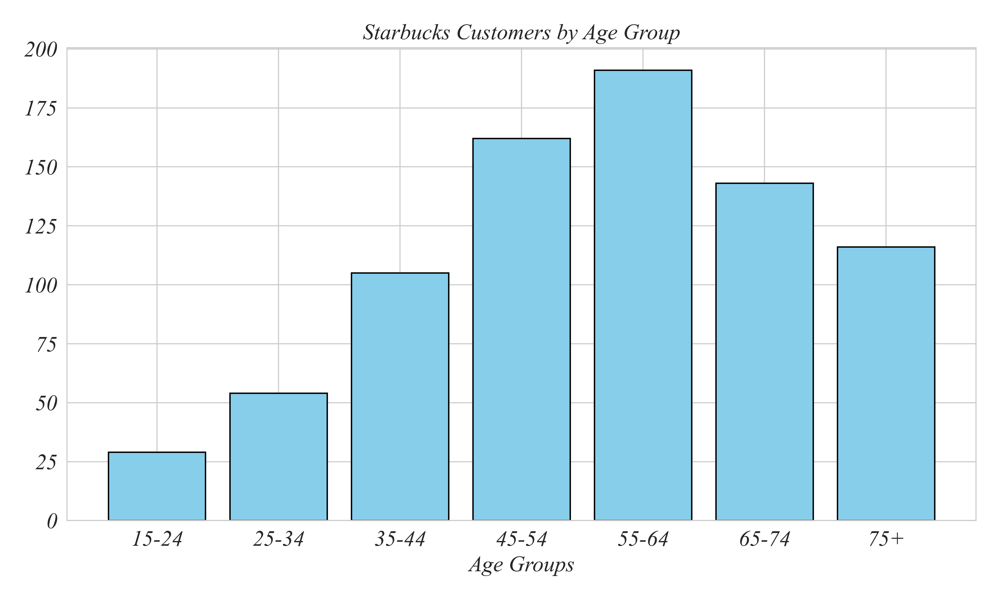
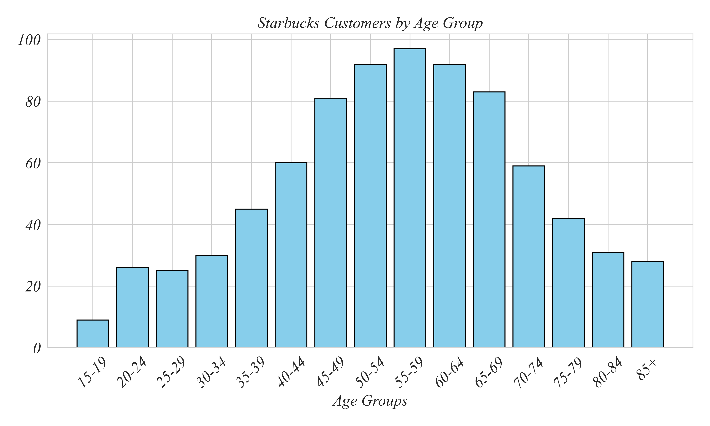
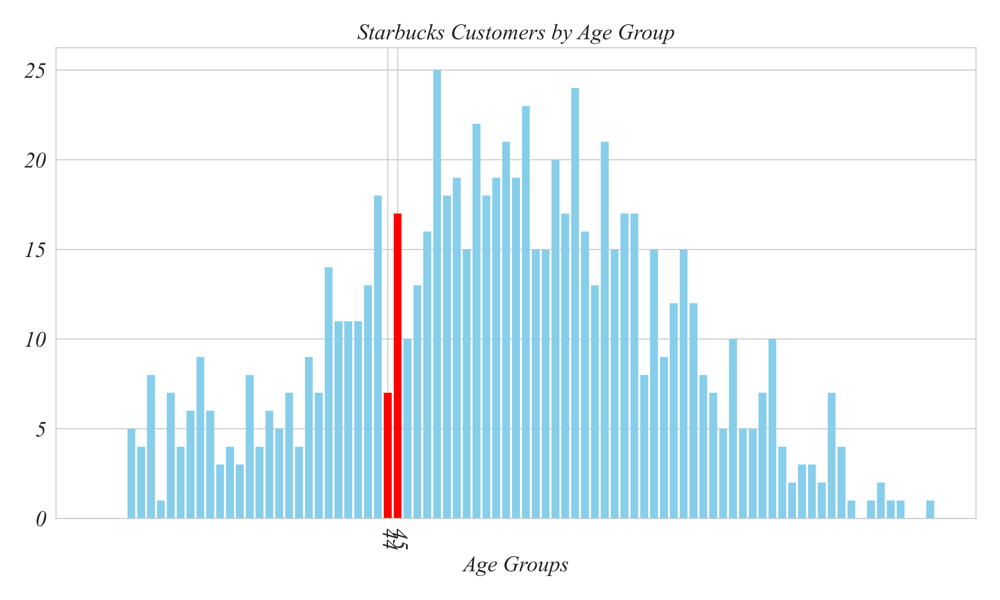
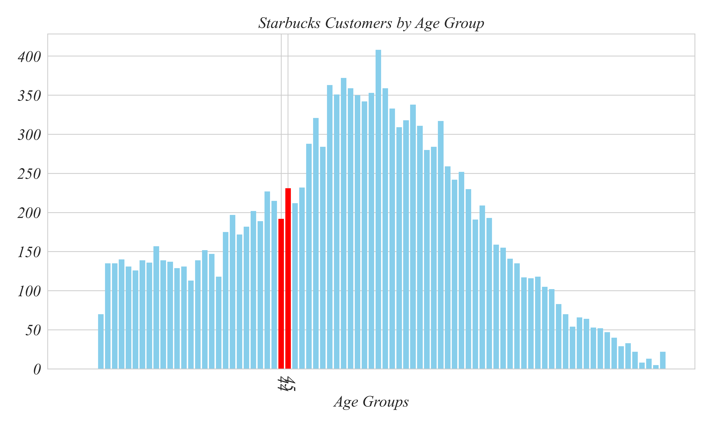

## Concept 1.2 | Visualizaing Continuous Variables

If Starbucks decides to roll out a new product, they would want to understand their customer base before starting the campaign. The dataset Starbucks_Customer_Profiles.csv contains information about Starbucks' customers. How might we determine which age-groups tend to be Starbucks customers? 

A bar chart can give us a good idea of the age distribution of the sample. But since age is a **continuous variable** if we measure it precisely enough, each customer has their own individual age. Even grouping individuals by their age in years would be more categories than would be useful. With data like this, it is useful to group customers into age ranges, or age groups. 

Can you spot anything misleading about this bar chart?

The age groups are different sizes! This difference in age group makes it difficult to answer the original question about which age group is tends more to be Starbucks customers. The way this figure is constructed, it makes it look like the 50-64 age group has the most customers. Upon reflection, this isn't surprising, simply because the range for this age group is wider. When we put continuous variables into categories, the categories should be the same width — this turns our bar chart into a **histogram.**

Starbucks seems to be most popular among the 55 - 64 age group. We can get a more precise estimate of this peak age using a histogram with narrower bin widths. Here's a histogram with age groups containing 5 years. 

Right. Here’s a histogram with a bin width of 5 years. This makes it easier to see more detail of the most common ages in Starbucks. We can take this even further, looking at even a single age year. 

You can see that there are many more 44-year-old customers than 45-year-old customers. Why might this be? There may be a real underlying reason for this difference, but it’s most likely to simply be chance. We've made the bins very narrow, making the categories small, leading to a larger role played by chance. That leads to the graph looking spiky. 

We can reduce the spikiness from statistical noise by increasing the sample size. So fare we've used only 800 customers. When we increase the sample size to be much larger, the histogram becomes smoother. By adding more data we're able to smooth out the noise, making it easier to draw conclusions about Starbucks customers as a whole.

### Summary

- Use **histograms** to visualize continuous variables.
- Make histograms with bins that are equally sized.
- Histograms with bins that are too narrow increase statistical noise, which can obscure underlying relationships.

### Excel Exercise

Lets make some similar histograms of the Starbucks_Customer_Profiles.csv dataset in Excel. Start by selecting the "age" column (click on the column title "C"), go to the Insert tab, hover over the table options until you see the "Statistical" option, or just click around until you find the "Histogram" options. Click on the first option (nothing fancy yet). It should produce a simple histogram. We can change the title by clicking on it and editing it to "Starbucks Customer Ages". We can delete the horizontal grid lines. 

Lastly, we can change the bin sizes. This seems to be slighly different across opperating systems. I'm on Mac. If you're on Windows or Linux, you might need to explore a bit. I click on the bins to highlight them, right click on the bins, select "Format Data Series" to bring up options on the right, change the bins from "Auto" to "Bin width", and change the bin with to 5. This sets the age range to be 5 years. However, since the data starts at 18, the bin intervals don't correspond with nice decade age breaks. To make the age breaks a bit nicer, turn on "Underflow bin" and set it to 20. This bins everyone below 20 into their own bin. This might look like it creates a bin with a different age range than the rest, but in this case that not an issue.
