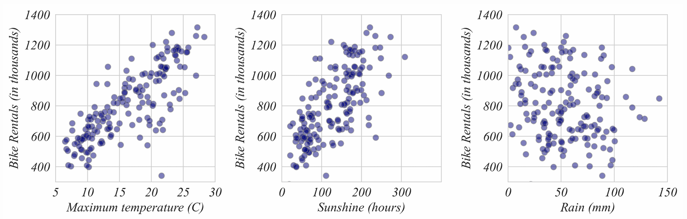

## ECON 0150 | Spring 2025 | Homework 2.1

### Due: 

Homework is designed to both test your knowledge and challenge you to apply familiar concepts in new applications. Answer clearly and completely. You are welcomed and encouraged to work in groups so long as your work is your own. Use the datafile to answer the following questions. Then submit your figures and answers to Gradescope.

#### Q1. Bike Hires and Weather

In the following questions, we'll analyze a data set that includes the monthly number of bike hires in London as well as monthly weather data: minimum and maximum temperature in degrees Celsius, rain in millimeters, and hours of sunshine.

a) From the list below, how much did it rain in the month with the largest number of bike hires?

- 7.6 mm
- 27.6 mm
- 137.6 mm
- 157.6 mm

b) When were bikes most popular?

- In very sunny months
- In moderately sunny months
- In cloudy months
- Sunshine and bike hires were not strongly related

c) In months with what maximum temperatures were bikes most popular?

- Between 5 C and 10 C
- Between 15 C and 20 C
- Between 25 C and 30 C
- Maximum temperature and bike hires were not strongly related

#### Q2. A Relationship Between Variables

The dataset `coffee_prod_agr.csv` provides information on coffee production and employment in agriculture across different countries. Refer to the links below to answer the following question.

- Data source (1): https://ourworldindata.org/grapher/coffee-production-by-region?tab=table
- Data source (2): https://data.worldbank.org/indicator/SL.AGR.EMPL.ZS

a) Who collects the data reported in each source? Briefly describe the role of the organization behind it.

b) Identify one potential limitation in the data. 

c) Using Python in a Colab Notebook and the dataset from the course page, create a visualization of the relationship between two variables of your choice. Upload your figure to Gradescope.

d) Describe the relationship: Is it positive, negative, or unclear?

e) How might this relationship relate to the correlation between coffee production and GDP?

f) Why might economists be interested in studying both of these relationships? What kinds of questions could they answer?

g) Go to the data sources and download the latest available data for the year 2020. Using this updated data, choose two variables and generate a figure. Upload both your figure and the cleaned dataset you used to Gradescope. Briefly describe the steps you followed to retrieve and clean the data.