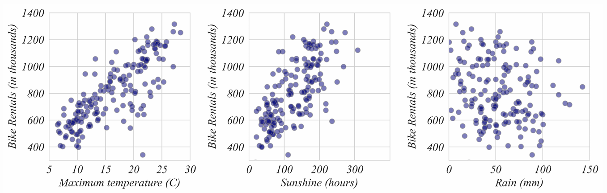

## ECON 0150 | Spring 2025 | Homework 2.1

### Due: Friday, Feb 7, 5PM

Homework is designed to both test your knowledge and challenge you to apply familiar concepts in new applications. Answer clearly and completely. You are welcomed and encouraged to work in groups so long as your work is your own. Use the datafile to answer the following questions. Then submit your figures and answers to Gradescope.

#### Q1. Bike Hires and Weather

In the following questions, we'll analyze a data set that includes the monthly number of bike hires in London as well as monthly weather data: minimum and maximum temperature in degrees Celsius, rain in millimeters, and hours of sunshine.

a) From the list below, how much did it rain in the month with the largest number of bike hires?

- 7.6 mm
- 27.6 mm
- 137.6 mm
- 157.6 mm

b) When were bikes most popular?

- In very sunny months
- In moderately sunny months
- In cloudy months
- Sunshine and bike hires were not strongly related

c) In months with what maximum temperatures were bikes most popular?

- Between 5 C and 10 C
- Between 15 C and 20 C
- Between 25 C and 30 C
- Maximum temperature and bike hires were not strongly related

#### Q2. A Relationship Between Variables

The dataset `coffee_prod_agr.csv` provides information on coffee production and employment in agriculture across different countries. Refer to the links below to answer the following question.

- Data source (1): https://ourworldindata.org/grapher/coffee-production-by-region?tab=table
- Data source (2): https://data.worldbank.org/indicator/SL.AGR.EMPL.ZS

a) Who collects the data reported in each source? Briefly describe the role of the organization behind it.

**answer:**
- Data source (1): **Our World in Data (OWID)**, the data on coffee production is compiled and visualized by Our World in Data, a project of the Global Change Data Lab, a nonprofit research organization based at the University of Oxford. OWID typically sources agricultural data from the Food and Agriculture Organization (FAO) of the United Nations. FAO collects data from member countries' national statistical offices and standardizes it for global comparison.
- Data source (2): **World Bank**, the employment in agriculture data is provided by the World Bank, which compiles it from the International Labour Organization (ILO). Specifically, the variable represents the percentage of total employment in agriculture (including forestry, hunting, and fishing). The ILO gathers labor statistics through national labor force surveys and censuses, and the World Bank curates these indicators as part of its World Development Indicators (WDI) database.

b) Identify one potential limitation in the data.

**answer:**

One potential limitation is that the employment data (from the World Bank / ILO) reflects the share of total employment in agriculture overall, but does not specify employment in coffee production. This makes it difficult to directly assess the labor intensity or employment impact of coffee production alone.

c) Using Python in a Colab Notebook and the dataset from the course page, create a visualization of the relationship between two variables of your choice. Upload your figure to Gradescope.

d) Describe the relationship: Is it positive, negative, or unclear?

**answer:**

The relationship appears unclear. Many countries with high agricultural employment have low coffee production, while some of the highest producers have relatively low agricultural employment shares. This may be because the employment data reflects all agricultural work, not just coffee-related labor, which limits its usefulness for isolating the coffee sector specifically. It could also be due to differences in specialization, efficiency, and agricultural structure.

e) How might this relationship relate to the correlation between coffee production and GDP?

**answer:**

Coffee production may show a stronger correlation with GDP than with agricultural employment. Higher coffee production can contribute directly to GDP, especially in export-oriented economies. In contrast, agricultural employment includes many low-productivity jobs, which may not reflect economic output. Thus, coffee production and GDP are more closely tied through trade revenues, productivity, and investment in the coffee sector.

f) Why might economists be interested in studying both of these relationships? What kinds of questions could they answer?

**answer:**
Economists might study both relationships to understand the economic role of coffee production in terms of both labor and income. The link with agricultural employment helps assess job creation, while the correlation with GDP reveals its macroeconomic contribution. Comparing both can highlight whether coffee is a labor-intensive or capital-intensive sector and how it affects growth, development, and inequality across countries.

g) Go to the data sources and download the latest available data for the year 2020. Using this updated data, choose two variables and generate a figure. Upload both your figure and the cleaned dataset you used to Gradescope. Briefly describe the steps you followed to retrieve and clean the data.