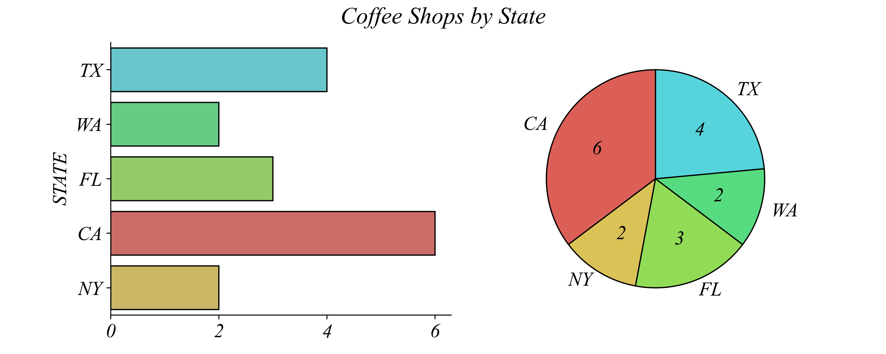
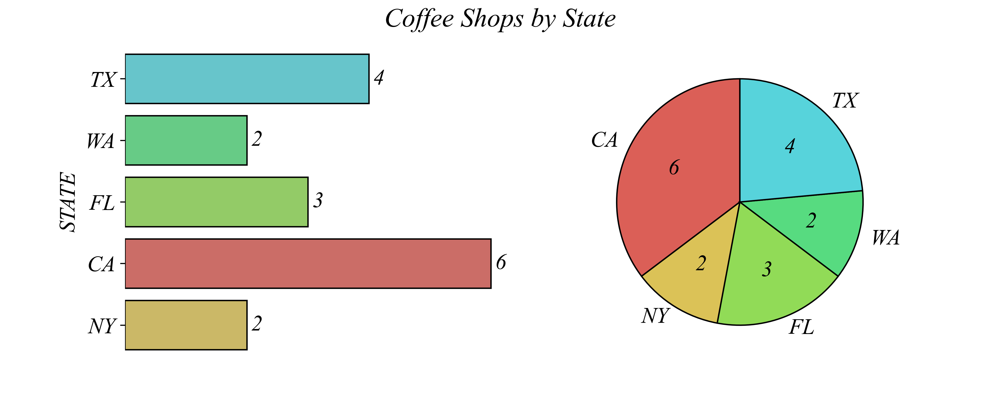
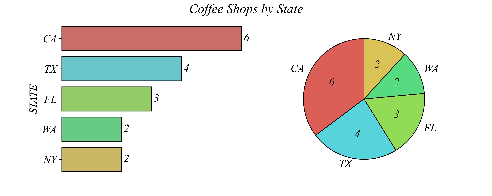
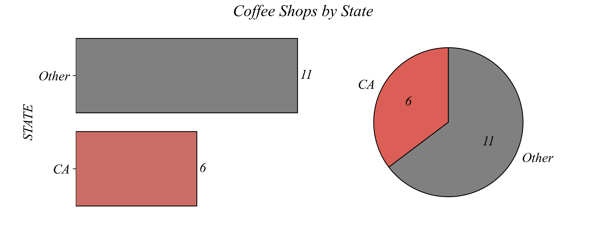
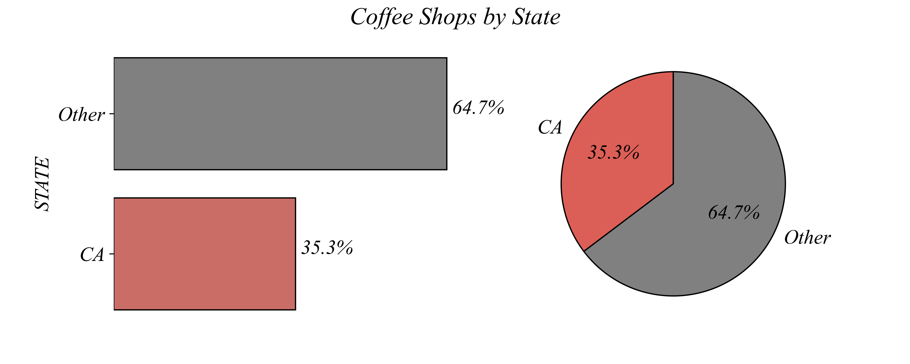

## Concept 1.1 | Visualizing Categorical Variables

Choosing the right visualization is key for understanding and communicating data effectively. Let’s say you are a data analyst advising a small coffee chain on where to start selling a new product. You can find the dataset: Coffee_Shops.csv. This dataset contains a **categorical variable** which indicates the state the shop operates in. Here are two visualizations of the number of chain locations across a few states:  **bar chart** and a **pie chart**.

##### Does FL or WA have more shops?

Which state has the most shops? It's easy to see from either chart that California (CA) has the most cafes, but not every comparison is this straightforward. For example, we might want to know whether Florida (FL) or Washington (WA) has more shops. In this case, the bar chart makes it much easier to see that FL has more shops than WA. 

But we can make the figure better. When you look at the bar graph, you can easily see which of the two states has more shops, but it takes a second to read the exact numbers from the bar graph. We can make the bar graph easier to read by placing the number near the bar.

When asking "How many shops are in the state with the second most locations?", removing clutter guides your eye to the important information. Unnecessary elements like excessive grid lines or decorative features can distract from the key data.

States have no inherent order, but sorting can make comparisons easier. We can arrange the bars from largest to smallest helps viewers quickly identify rankings and make comparisons. This helps us see relative sizes a bit more easily.

##### How does CA compare to the whole?

Sometimes we may want to ask a different kind of question. Instead of looking at all individual states, we might want to compare "CA vs Other". Instead of a nominal categorical variable with many categories, this creates a binary categorical variable (CA / Other). We can answer this question with the original figures, but this question is much easier to see when visualizing just the two categories. Here both a pie chart and a bar chart can communicate the data effectively.

But if we're trying to compare the share of shops that are in CA, a pie chart might work best. If the question is about percentages, a pie chart may work best because it naturally shows parts of a whole.

When presenting data, the best choice of chart depends on the comparison you want your audience to make. 

### Summary

- Binary Categorical Variables: use a **pie chart** or **bar graph**

- Nominal Categorical Variables: use a **bar graph**; maybe order by value
- Ordinal Categorical Variables: use an **ordered bar graph**

- Remove clutter; keep it simple
- Place information near the object it describes

### Exercise 1.1 | Excel

Lets make some similar visualizations of the Coffee_Shops.csv dataset in Excel. The .csv file-type is a universal format which stands for "comma-separated values" and is one of the most used data formats. Open the file in Excel. Excel will likely show you a suggestion to convert the file to an Excel-specific format, xlsx. When working with Excel, it's often helpful to keep the csv file as your starting file and create a second file in the xlsx format. You can do this either by clicking on the notification bar or by going to Home and save as. You'll be propted to select the file format xlsx. Save as Coffee_Shops.xlsx. 

The data is a single column with the title STATE and entries representing the state where the coffee shop is located. Since the data is categorical, before we can do either a bar chart or a pie chart, we need to summarize the frequencies of shops by state. We'll start by getting a list of all states in the sample using Excel's UNIQUE command. Pick a cell (eg. C5) to start a summary table with the column header "STATES". Then we can enter the following code into the cell below (eg. C6).

`=UNIQUE(A2:A18)`

This tells Excel to list out all the unique values contained in the data range between cell A2 and A18. Because we've entered this below the column header "STATES", this will create a nice column of all the unique states with coffee shop locations. 

Next, we're going to count the number of coffee shops in each state. We'll do this with Excel's COUNTIF command. Start a new column next to "STATES" (eg. D5) and label it something like "SHOPS". Then in the cell below, use the COUNTIF command, using the data range and the state contained in the neighboring cell. With the example cell labels so far, enter the following in the cell below "SHOPS" (eg. D6):

`=COUNTIF(A2:A18,C6)`

This tells Excel to look at all the entries in the data range A2 to A18 and count the number of times the value in the cell C6 appears. In this example, earlier we constructed the cell C6 to contain one of the unique entries in the data range. Specifically, in this example it will contain "TX". This means the cell we just made (eg. D6) will tell us the number of coffee shops located in Texas (TX).

Finally, we want to use this command for all of the states in the list. We can do this in two ways. We should go through and write out each command for each row in the list of states. For example, the next cell could look like the following:

`=COUNTIF(A2:A18,C7)`

With a short list like this, it would be easy to do it manually like this. But sometimes lists are long and we might want to copy and paste the commands. The way the command is written, however, if we copy and past, it will move both the data range and the target text down the spreadsheet by one cell, giving the following incorrect command:

`=COUNTIF(A3:A19,C7)`

This misses the first entry in our data range. While in this case doesn't turn out to impact our numbers, it easily could. We can fix this problem by adding the "$" symbol to cell letters numbers we do not wish Excel to change when we copy and paste. So in the first cell in the "SHOPS" column (eg. D6), enter the following command: 

`=COUNTIF($A$2:$A$18,C6)`

First, we'll make a bar chart with this frequency data. There are a couple ways to go about doing this. One way is to highlight the frequency data (including the column titles), go into the Insert tab, click on the bar chart button, and select a 2-d chart. This should produce a bar chart with the title "SHOPS" and bars with labels that correspond to their states. This is nice, but I think the figure looks nicer by reducing the clutter of horizontal grid lines. Simply click on the thing you'd like to remove and then hit delete. You can even rename the figure something like "Coffee Shop Locations" if you wish.

Second, we'll create a pie chart to highlight the share of coffee shops located in CA. To do this, we'll create another table with two rows right below our first frequency table. The first row will contain "CA" in a "STATE" column and a reference to the number of shops in the "SHOPS" column. Then in the second row, we'll count the number of total shops and subtract off the number of shops located in CA using the row above (eg. D13).

`=COUNTIF(A2:A18,"*") - D13`

The "*" in the COUNTIF command simply tells Excel to count all the text entries in the data range. Then we subtract off the number of shops located in CA, which is held in cell D13 in this example. 

Then we can plot this data in a pie chart. Highlight the new frequency table and the column headers, go to the Insert tab, and click on 2-d pie chart. This produces a reasonable pie chart, but you can click on any element to modify it as you'd like.

### Exercise 1.1 | Python

As will be the case over and over again, doing these kinds of things is much simpler in python. Once we import the main packages and load the data, we can create a summary table and a nice figure very easily.

Lets start by creating a summary table using:

`shops.value_counts()`

This should print out a table of the counts by state. But it's easier to see this with a figure, so lets create a horizontal bar chart. We'll use the visualization package called Seaborn. We've nicknamed it sns. We have a bunch of data we want to count up by category, so we'll use the countplot.

`sns.countplot(data=shops, y='STATE')`

This tells python to use the dataset `shops`, count the categories in the column `STATE`, and then create bars coming off the y axis. This is really nice. But maybe we want to use colors to make it easier to visually separate the bars. We can just add a parameter into the function called 'hue' to tell python which column values to base the colors on. 

`sns.countplot(data=shops, y='STATE', hue='STATE')`

There are lots of other things we can do to make this nicer. We have AI built into Google Colab, which can make figures look nicer that the basic figures. 

Now lets make a figure of the binary categorical variable. Again in python this is very simple. Instead of doing a bunch of work in Excel, all we have to do is create a new column in `shops` called ['CA'], and have python enter a 'CA' if that row's 'STATE' value is equal 'CA' and 'Other' if its not equal. We can do this with a numpy function called 'where':

`shops['CA'] = np.where(shops['STATE'] == 'CA', 'CA', 'Other')`

So here we're defining the column `shops['CA']`. The function np.where() goes through every row, asking whether in that row, `shops['STATE'] == 'CA'`. If true, then it sets the value to `CA`. If False, it sets it to `Other`. We can see that this worked by printing out the dataset.

This gives us the binary categorical variable we wanted. You can get the counts using:

`shops['CA'].value_counts()`

If you like Pie Charts, you're out of luck with seaborn. In practice, we never really use them. If you do absolutely wish to, you can use the other plotting package called matplotlib. We can do this by just adding a `.plot(kind='pie')` to the end of value counts.

`shops['CA'].value_counts().plot(kind='pie', autopct='%1.1f%%')`

There's more you can do to make the figure look good. This is how I made the nice figures in the slides. But these are the basics, which is good enough for now. 

Next lets turn to the dataset `employment_status.csv`.