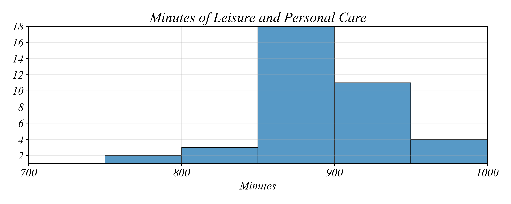

## ECON 0150 | Spring 2026 | Homework 1.2

### Due: Friday, January 30 at 5PM

Homework is designed to both test your knowlege and challenge you to apply familiar concepts in new applications. Answer clearly and completely. You are welcomed and encouraged to work in groups so long as your work is your own. Submit your figures and answers to Gradescope.

Lets continue using the class survey dataset to explore numerical variables in cross-section!

##### Q1. Histograms, Means, and Standard Deviations

Use the class survey dataset to create a histogram of "Approximately how many miles away from Pittsburgh is your hometown?"

a) Create a histogram with bins of width 100 miles.

b) Create a histogram with bins of width 500 miles.

c) Which bin width better shows the distribution? Explain your reasoning in one sentence.

d) Calculate the mean distance from Pittsburgh.

e) Calculate the standard deviation of distance from Pittsburgh.

f) Write a one-sentence interpretation using both values. (Example format: "The average student is about X miles from Pittsburgh; distances typically vary by about Y miles from that average.")

##### Q2. Boxplots and Quartiles

Use the class survey dataset to create a boxplot with stripplot of "Approximately how many miles away from Pittsburgh is your hometown?"

a) Create a boxplot with stripplot.

b) What is the median distance from Pittsburgh?

c) Explain why the mean (from Q1) and the median differ. (Hint: Think about the shape of the distribution.)

##### Q3. Choosing the Right Tool

Use the class survey dataset to visualize "When is your birthyear?"

a) Create a histogram of birthyear.

b) Create a boxplot with stripplot of birthyear.

c) Given the number of students in our class, which visualization better shows the distribution of birthyears? Explain your reasoning in one sentence.

##### Q4. Interpreting Histograms

The following data from the Better Life Index was collected from OECD countries using time-use surveys. This question is aimed at practicing the skill of analyzing continuous variables displayed visually.

a) What is the most common 50 minute range of time spent on leisure?

- 750 - 800
- 800 - 850
- 850 - 900
- 900 - 950
- 950 - 1000

b) In how many countries do people spend between 800 and 850 minutes on leisure and personal care?

c) How many countries spend more than 900 minutes on leisure and personal care?

d) What is the approximate difference in counts between the two most common ranges?
