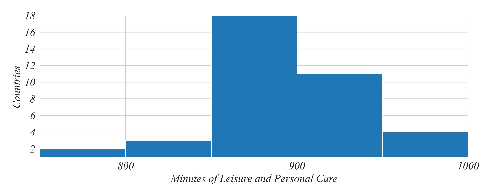

## ECON 0150 | Fall 2025 | Homework 1.2

### Due: Friday, September 5

Homework is designed to both test your knowlege and challenge you to apply familiar concepts in new applications. Answer clearly and completely. You are welcomed and encouraged to work in groups so long as your work is your own. Submit your figures and answers to Gradescope.

##### Q1. Interpreting Histograms

The following data from the Better Life Index was collected from OECD countries use using time-use surveys. This question is aimed at practicing the skill of analyzing continuous variables displayed visually. 

a) What is the most common 50 minute range of time spent on leisure?

- 750 - 800
- 800 - 850
- 850 - 900
- 900 - 950
- 950 - 1000

b) In how many countries do people spend between 800 and 850 minutes on leisure and personal care?

c) How many countries spend more than 900 minutes on leisure and personal care?

d) What is the approximate difference between the two most common ranges?

##### Q2. Summarizing 'When is your birthyear?'

Use the class survey dataset to answer the following questions.

a) Appropriately visualize the variable 'When is your birthyear?'.

b) What is the most common birthyear of students in the class?

##### Q3. Summarizing 'How excited are you for this class?'

Use the class survey dataset to answer the following questions.

a) Appropriately visualize the variable 'How excited are you for this class?'.

b) What is the second most frequent excitement rating for the class?
