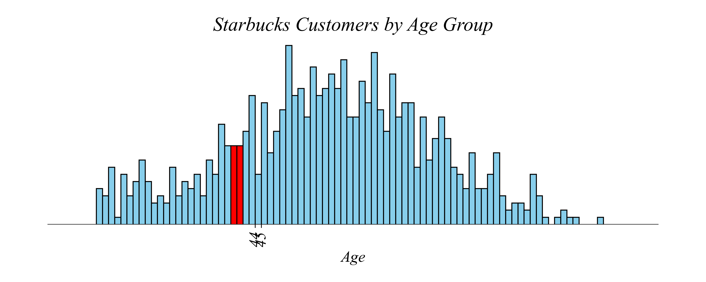
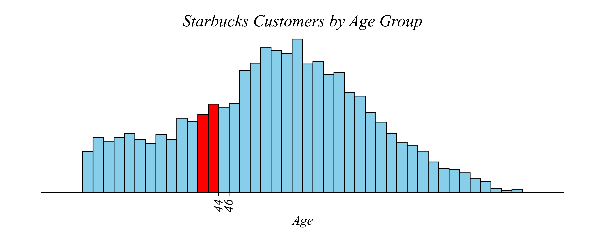
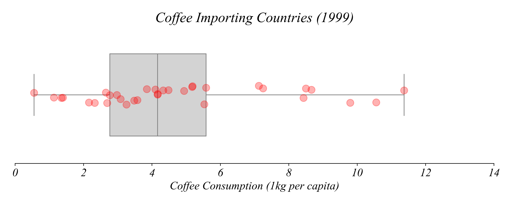
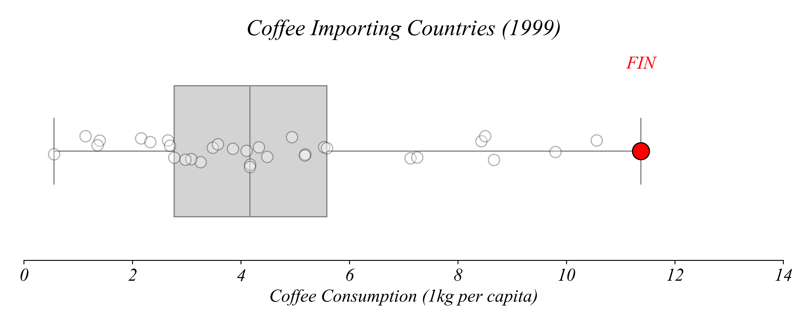
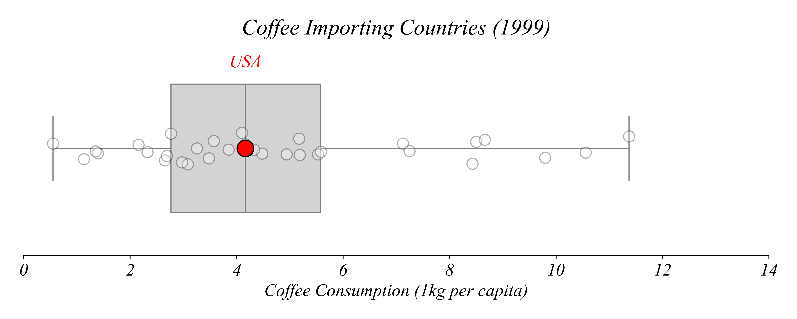
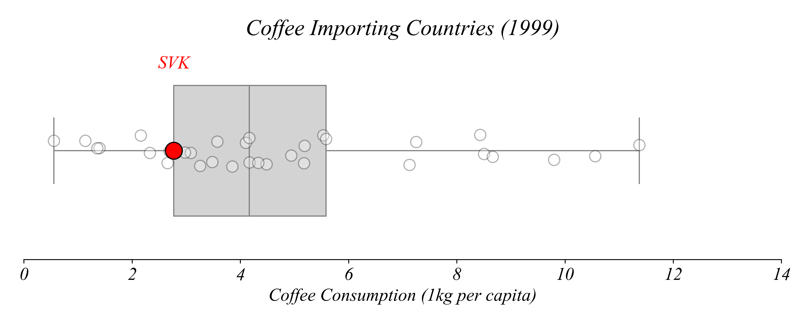
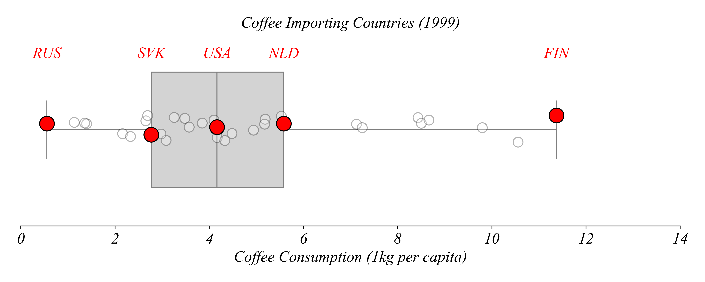

## Concept 1.2 | Cross-Sectional (Numerical) Data

This unit focuses on **cross-sectional numerical data** — many entities measured at one point in time. With numerical variables (values you can do math with, like age, income, or consumption), the key question is: *How is this variable distributed?*

We have two main tools for visualizing numerical distributions:

| Tool | Best for | Shows |
|------|----------|-------|
| Histogram | Many observations | Shape of distribution |
| Boxplot + Stripplot | Fewer observations | Quartiles + individual values |

### Histograms

If Starbucks decides to roll out a new product, they would want to understand their customer base before starting the campaign. The dataset `Starbucks_Customer_Profiles.csv` contains information about Starbucks' customers. How might we determine which age-groups tend to be Starbucks customers? 

A bar chart can give us a good idea of the age distribution of the sample. But since age is a **numerical variable** if we measure it precisely enough, each customer has their own individual age. Even grouping individuals by their age in years would be more categories than would be useful. With data like this, it is useful to group customers into age ranges, or age groups. We call this ***binning***. We count customers based on which bin their age lands in.

Can you spot anything misleading about this bar chart?


The age groups are different sizes! This difference in age group makes it difficult to answer the original question about which age group is tends more to be Starbucks customers. The way this figure is constructed, it makes it look like the 50-64 age group has the most customers. Upon reflection, this isn't surprising, simply because the range for this age group is wider. If we show the bins by how wide they are, it looks pretty strange!


When we put numerical variables into categories, the categories should be the same width — this is what we call a **histogram.**


Starbucks seems to be most popular among the 55 - 64 age group. We can get a more precise estimate of this peak age using a histogram with narrower bin widths. Here's a histogram with age groups containing 5 years. 


These narrower bins make it easier to see more detail of the most common ages in Starbucks. We can take this even further, looking at even a single age year. 



You can see that there are many more 44-year-old customers than 45-year-old customers. Why might this be?

There may be a real underlying reason for this difference, but it’s most likely to simply be chance. We've made the bins very narrow, making the categories small, leading to a larger role played by chance. That leads to the graph looking spiky. 

We can reduce the spikiness from statistical noise by increasing the number of customers that fall into each bin. We can do this in two ways: increasing the sample size or increasing the bin width.

So far we've used only 800 customers. If we increase the sample size to be much larger, the histogram becomes smoother. Each bin catches more customers. By adding more data we're able to smooth out the noise, making it easier to draw conclusions about Starbucks customers as a whole.


We could also increase the width of the bins so that more customers fall into each bin. We can't answer the original question about 44 vs 45, but we can answer a similar question about 44-45 vs 46-47. The larger number of customers now smooths out the noise that we originally had.



### Summary

- Use **histograms** to visualize continuous variables.
- Make histograms with bins that are equally sized.
- Histograms with bins that are too narrow increase statistical noise, which can obscure underlying relationships.

### Describing Center and Spread

Two numbers summarize a histogram: the **mean** (center) and the **standard deviation** (spread).

- **Mean** — the average value
- **Standard Deviation (SD)** — typical distance from the mean

Together, mean and SD tell you where the data is centered and how spread out it is. For the Starbucks age data: Mean ≈ 50 years, SD ≈ 15 years. We'd say: "The average customer is about 50 years old; ages typically vary by about 15 years from that average."

### Exercise 1.2 | Histograms in Excel

Lets make some similar histograms of the `Starbucks_Customer_Profiles_40k.csv` dataset in Excel. Start by selecting the "age" column (click on the column title "C"), go to the Insert tab, hover over the table options until you see the "Statistical" option, or just click around until you find the "Histogram" options. Click on the first option (nothing fancy yet). It should produce a simple histogram. We can change the title by clicking on it and editing it to "Starbucks Customer Ages". We can delete the horizontal grid lines. 

Lastly, we can change the bin sizes. This seems to be slighly different across opperating systems. I'm on Mac. If you're on Windows or Linux, you might need to explore a bit. I click on the bins to highlight them, right click on the bins, select "Format Data Series" to bring up options on the right, change the bins from "Auto" to "Bin width", and change the bin with to 5. This sets the age range to be 5 years. However, since the data starts at 18, the bin intervals don't correspond with nice decade age breaks. To make the age breaks a bit nicer, turn on "Underflow bin" and set it to 20. This bins everyone below 20 into their own bin. This might look like it creates a bin with a different age range than the rest, but in this case that not an issue.

Lastly, we can save the histogram figure as an image file by right clicking on it. 

### Exercise 1.2 | Histograms in Python

Histograms are a little simpler in python. I've already added code to load the dataset in the notebook. So all we need to do is tell seaborn to make use a histplot, tell is the dataset to use, tell it which column we're interested in histogramming, and then tell it the bin width if we'd like. The simplest command is to write:

`sns.histplot(customers, x='age')`

This will make a nice histogram. But we want bins with width of 5 years. So lets add in an option into the histplot telling it which bins we'd like. The function `range` just allows us to create a list of numbers. You can try this out by simply writing into a cell and executing:

`range(20,100,5)`

This creates a list of numbers starting at 20 and ending when hitting 100 with an interval of 5. Now all we need to do is add this as the option `bins` in seaborn:

`sns.histplot(customers, x='age', bins=range(20,100,5))`

Now this gives us a nice histogram! We can make it prettier but this is a good place to start. Lastly, lets save it as an image file. To do this we use matplotlib's `.savefig()` function. I like to save my figure with a descriptive name. So in this case, we're in Exercise 1.2, and this is the first figure. Python doesn't like dots because they mean something different, so I'm going to call this:

`plt.savefig('exercise_1_2_histogram.png')`

Then it should show up for us in our colab folder!

### Exercise 1.2 | Mean and Standard Deviation in Python

Now that we have a histogram, we can summarize the distribution with two numbers. In Python, calculating the mean and standard deviation is simple:

```python
# Calculate the mean
customers['age'].mean()

# Calculate the standard deviation
customers['age'].std()
```

The mean tells us the center of the distribution, and the standard deviation tells us how spread out the data is. For the Starbucks age data, we'd say: "The average customer is about 50 years old; ages typically vary by about 15 years from that average."

### Boxplots

The world seems to be drinking more coffee than ever. But does the data on coffee consumption confirm this? This data contains coffee consumption in kilograms per capita of 34 coffee importers over the span of two decades. **Per capita** refers to a value averaged over the number of people. It's equivalent to 'per person'. Let's plot the histogram of country's coffee consumption for 1999.


This figure shows coffee consumption with a bin of 1kg. This is very nice to give us a general idea about the distribution of coffee consumption across these countries. But it obscures a lot about the data. First, it doesn't show us exact values. All we see are the counts by bin. Second, it doesn't tell us anything precise about the statistical components of the distribution.

What if I were to ask you what was the average coffee consumption per captia? Or how many countries were around the average? It's pretty challenging to see in a histogram. 

And what if I were to ask you about the precise coffee consumption per capita of the highest country? Again it's difficult to see since we're using bins and not exact values. This is what we can do with a **boxplot**.


Lets examine what each part of the boxplot corresponds to and what it tells us about the data. To aid our discussion, I'm adding in the countries scattered across the horizontal with what we call a **stripplot**. Each point corresponds to a country with their coffee consumption on the horizontal. I've jittered the vertical axis to make it easy to see individual countries, which can be clumped together. This type of approach can be helpful when visualizing a distribution of one variable. 



So now we're able to see the distribution directly! And with the boxplot we can see the five quartiles. The minimum is the smallest value, with no other values smaller than it. The median is the middle value, with half of the data below it. The Q1 is halfway between, representing the value with 25% of values below it. Then the maximum is largest value, the value with all the rest of the data below it. Then the Q3 is halfway between the median and the maximum, with 75% of the rest of the data below it.


In addition to these statistics, we can also see the data in a way that makes it easy to answer more specific questions. For example, how many countries consumed more than 8 kg per capita? All we do is look at the line that corresponds to 8 kg per capita and select the points above it. 


Which point corresponds to the maximum coffee per capita? All we do is look at the uppermost point, which corresponds with the upper wisker of the plot. This turns out to be Finland. 



We can do the same thing with minimum values. Which point corresponds to the minimum coffee consumption per capita? We look at the lowest point, which also happens to correspond with the bottom wisker. Country is Russia, which in 1999 consumed just over 0.5 kg coffee per capita. 


Which point corresponds to the median, the middle most, country? We can find this on the box plot by looking at the point that's centered on the middle line in the box. This one is a little more difficult to see because two points are sit on the middle line. But one of them is more centered. This is the US with a coffee consumption of just over 4 kg per capita. 



So the middle line represents the median and the ends of the 'whiskers' mark the minimum and maximum values. Lets focus on the middle box for a second. Just visually, how may countries do you think might sit in the box? About 50%.

If I were to tell you that the box is centered on the median, what does that mean for each side of the box. How many countries sit in each side of the box? Well because the middle of the box is the median, and the box contains 50% of the points, each side of the box contains 25%. 



This means that the Slovak Republic's consumption roughly corresponds to the 25th percentile of the data, and the Netherlands' consumption roughly corresponds to the 75th percentile. 


There are also roughly as many countries between these two values as outside this range. The two wiskers each contain 25%.  The box ranges from the 25th percentile of the data — called the **lower quartile**, or *Q*1 — and the 75th percentile — called the **upper quartile**, or Q3.



The minimum, Q1, median, Q3 and maximum values in the dataset are represented by the Russian Federation, the Slovak Republic, The United States, the Netherlands, and Finland respectively.

### Two Ways to Describe Center and Spread

We now have two approaches for describing center and spread:

| Approach | Center | Spread |
|----------|--------|--------|
| Mean/SD | Mean | Standard Deviation |
| Quartiles | Median | IQR (Q3 − Q1) |

Mean/SD are sensitive to outliers — extreme values pull them up or down. Median/IQR are robust — they only care about positions, not magnitudes. Both are valid; they answer slightly different questions.

Which part of the table represents the **largest range** of coffee consumption levels?

The answer options represented the difference between the minimum and Q1, Q1 and the median, the median and Q3, and Q3 and the maximum. We can see from the boxplot that Q3 to the maximum — the Netherlands to Finland — covers the largest range.

Boxplots visually summarize the data — but their real power lies in the ease of comparisons between distributions. Next class, we’ll use boxplots to analyze the changes through time.

### Exercise 1.2 | Boxplots in Excel

We can make boxplots in Excel. Just select the data, go Insert, click on the 'Statistical' option to the right of 'Recommended Charts' that looks like a histogram, and then click on the Box and Whisker. 

This will give you a nice figure. But it includes outliers by default for some reason. So lets double click on the box to bring up the format options. Then we'll unselect outliers and select show inner points. And that's it!

### Exercise 1.2 | Boxplots + Stripplots in Python

We can also do this in python, which actually makes a nicer figure. I've already added the code to load the dataset in the notebook. So once you do the imports and load the data, all we have to do is have seaborn make a boxplot:

`sns.boxplot(coffee, x='Coffee_2019')`

This has outliers. To remove outliers we want the whiskers to cover all of the data. So we add the option `whis=(0,100)`. 

`sns.boxplot(coffee, x='Coffee_2019', whis=(0,100))`

Then for the strip plot, this is easy too. Just use the stripplot function in seaborn.

`sns.stripplot(coffee, x='Coffee_2019')`

Then we'll save this as a figure.

`plt.savefig('exercise_1_2_boxplot.png')`

That's it!

### Exercise 1.2 | Quartiles in Python

Now that we have a boxplot, we can calculate the five-number summary that defines it. In Python:

```python
# Minimum and Maximum
coffee['Coffee_2019'].min()
coffee['Coffee_2019'].max()

# Quartiles (Q1, Median, Q3)
coffee['Coffee_2019'].quantile(0.25)
coffee['Coffee_2019'].median()
coffee['Coffee_2019'].quantile(0.75)
```

These five numbers — min, Q1, median, Q3, max — define the boxplot and tell us about the spread of the distribution.
