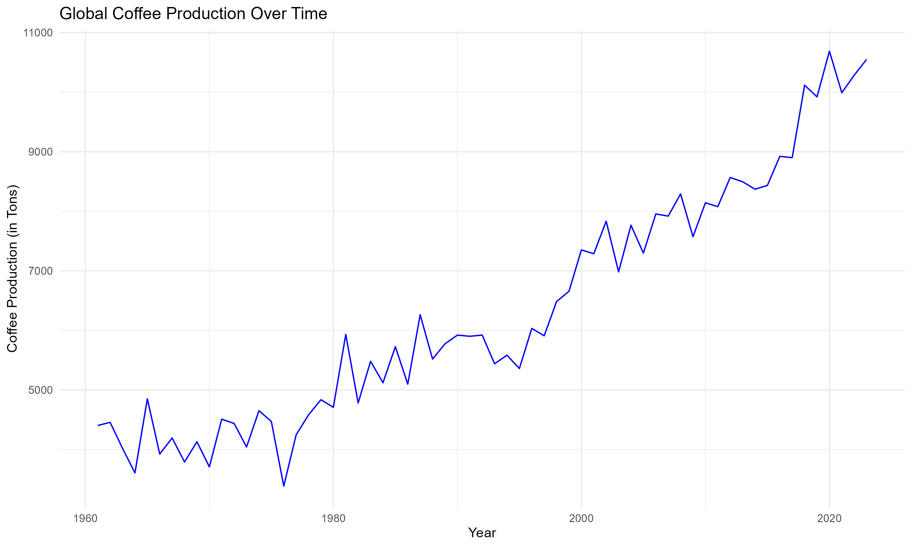
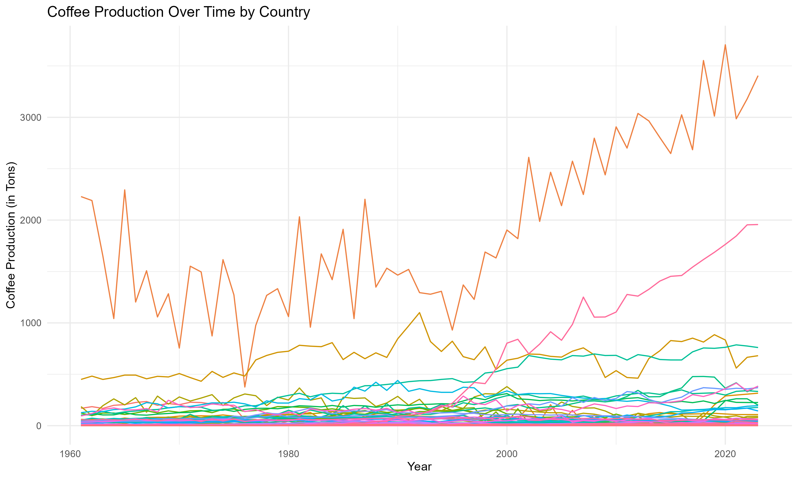
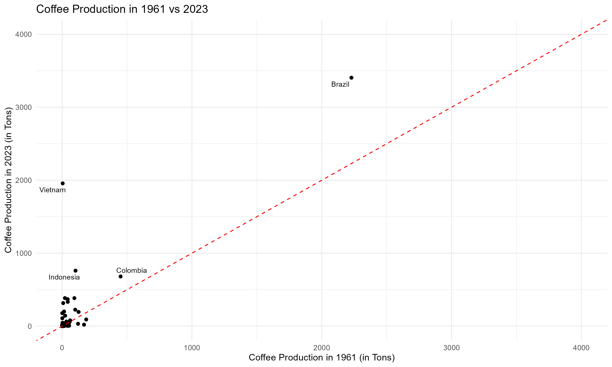
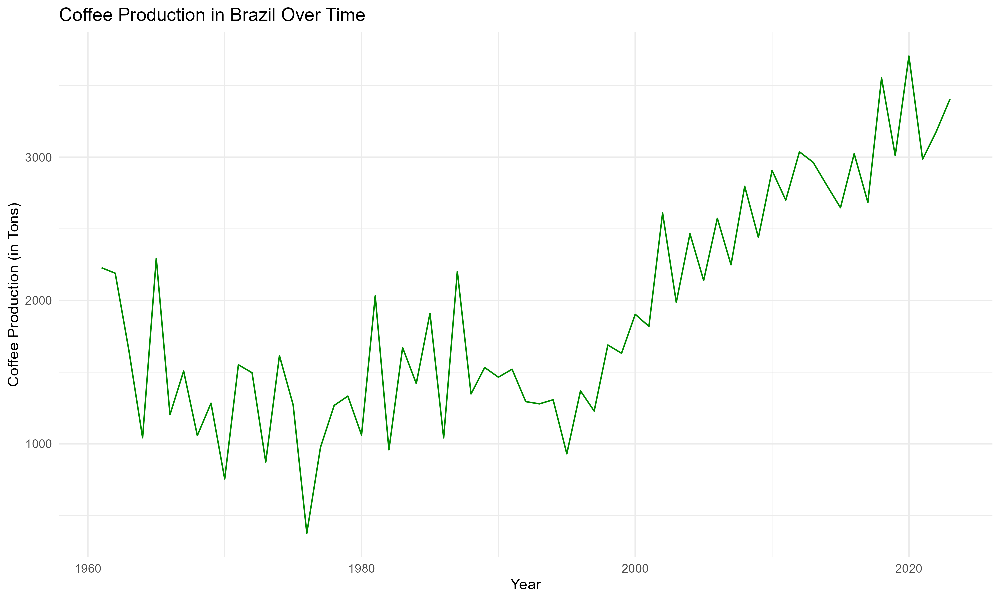

## ECON 0150 | Fall 2025 | Homework 1.3

### Due: Friday, September 12 at 5 PM

Homework is designed to both test your knowlege and challenge you to apply familiar concepts in new applications. Answer clearly and completely. You are welcomed and encouraged to work in groups so long as your work is your own. Submit your figures and answers to Gradescope.

##### Q1. Coffee Sales Reciepts

a) What is the data structure of *`Coffee_Sales_Reciepts.csv`*?

##### Q2. Starbucks Location Hours

a) How was *`Starbucks_Location_Hours.csv`* collected? *(Hint: use the link provided on the course website.)*

b) What is the data structure of *`Starbucks_Location_Hours.csv`*?

##### Q3. Coffee Production Through Time

Using the dataset *`coffee_prod_kenya.csv`*, which provides information on Kenyan coffee production between 1961 and 2023:

a) Who collected *`coffee_prod_kenya.csv`*? *(Hint: use the link provided on the course website.)*

b) What is the data structure of *`coffee_prod_kenya.csv`*?

c) Plot a line graph of Kenyan coffee production over time.

d) Describe the trend.

##### Q3 (Jana). Relationships Through Time

Using the dataset `coffee_prod_in_years.csv`, which provides information on coffee production and employment in agriculture in different countries between 1961 and 2023:

a) Plot a line graph of global coffee production over time (the total across all countries for each year). Describe the trend and discuss potential reasons behind it.

b) Plot a line graph of coffee production for each country over time. Include all countries in a single figure.

c) Generate a scatter plot comparing coffee production in 1961 and 2023 for each country. Include a 45-degree line to help identify which countries increased or decreased production. Are there outlier countries? Briefly suggest why these countries might stand out.

d) Which figure — the country-level time trends (from part b) or the 1961 vs. 2023 comparison (from part c) — better helps you understand patterns in coffee production? Justify your answer.

e) Choose one of the outlier countries you identified in part (c) and plot its coffee production over time. Describe the pattern and propose possible explanations (e.g., conflict, policy changes, new entrants to the market).

#### Q1: Relationships Through Time

Using the dataset `coffee_prod_in_years.csv`, which provides information on coffee production and employment in agriculture in different countries between 1961 and 2023:

a) Plot a line graph of global coffee production over time (the total across all countries for each year). Describe the trend and discuss potential reasons behind it.

**answer:**

The line graph shows a clear upward trend in global coffee production from 1961 to 2023. While production fluctuated during the 1960s and 1970s, the long-term pattern is one of significant growth, especially from the mid-1990s onward. By 2023, global coffee production nearly doubled relative to the early 1960s.

Possible explanations:

- increase in global demand
- technological advances in farming and processing
- globalization 

b) Plot a line graph of coffee production for each country over time. Include all countries in a single figure.

**answer:**

c) Generate a scatter plot comparing coffee production in 1961 and 2023 for each country. Include a 45-degree line to help identify which countries increased or decreased production. Are there outlier countries?

**answer:**

The scatter plot shows most countries above the 45-degree line, indicating an overall increase in coffee production from 1961 to 2023. Vietnam is a major outlier — it had minimal production in 1961 but became one of the top producers by 2023. Brazil also stands out for its high production in both years, with a notable increase. 

d) Which figure — the country-level time trends (from part b) or the 1961 vs. 2023 comparison (from part c) — better helps you understand patterns in coffee production? Justify your answer.

**answer:**

The scatter plot in part (c) better captures the change in relative production levels between countries over time. It allows for a clear comparison of how much each country's production has changed between 1961 and 2023 and highlights outliers more directly. While the line plot in part (b) shows trends over time, it can be hard to interpret due to overlapping lines 

e) Choose one of the outlier countries you identified in part (c) and plot its coffee production over time. Describe the pattern and propose possible explanations (e.g., conflict, policy changes, new entrants to the market).

**answer:**

 

The graph shows a significant increase in Brazil's coffee production starting in the 1990s. While production fluctuated in earlier decades due to weather events (like severe frosts in the 1970s and 1980s) and price volatility, the post-1990 rise reflects major structural changes:

- **Market liberalization** in the early 1990s: Brazil dismantled the state-controlled coffee regulatory agency (Instituto Brasileiro do Café), allowing market forces to drive production decisions.
- **Technological innovation**: Widespread adoption of improved coffee plant varieties, mechanization (especially in flat regions like Minas Gerais), and better farming practices boosted productivity.
- **Expansion of coffee-growing areas** into more suitable climates, reducing vulnerability to frost.

sources for part (e):
https://doi.org/10.1590/S1677-04202007000400014
https://ico.org/market-development-toolkit/page/index/6
https://atrium.lib.uoguelph.ca/items/85dab9ea-b761-4c88-9199-6d2cfaabba8d
https://doi.org/10.1016/S0305-750X(02)00032-3
