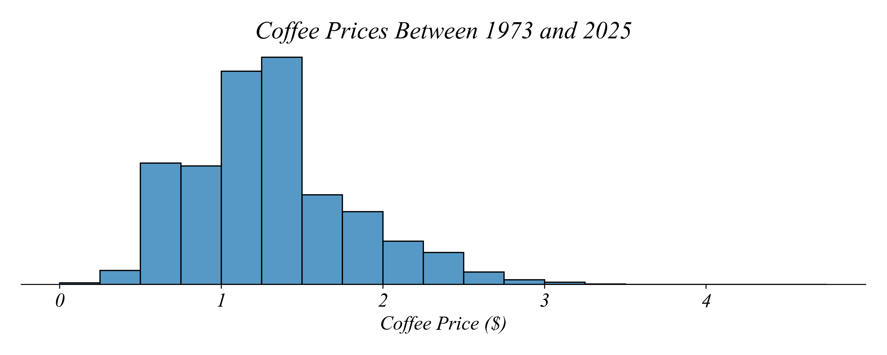
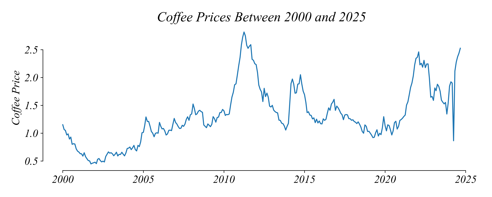
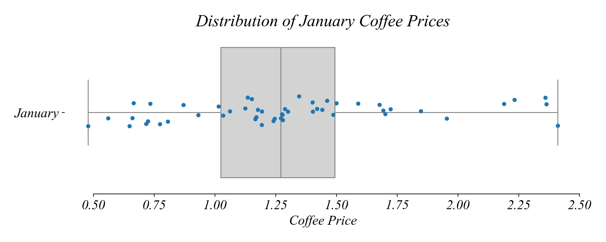
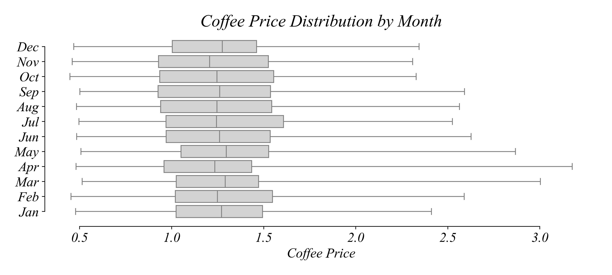
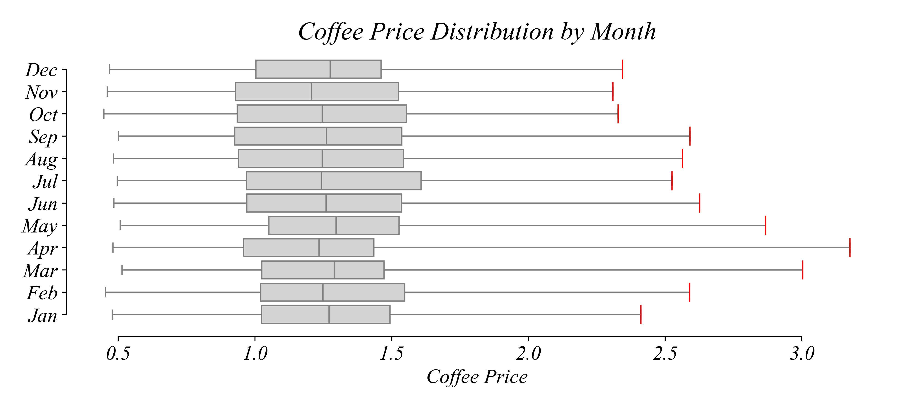
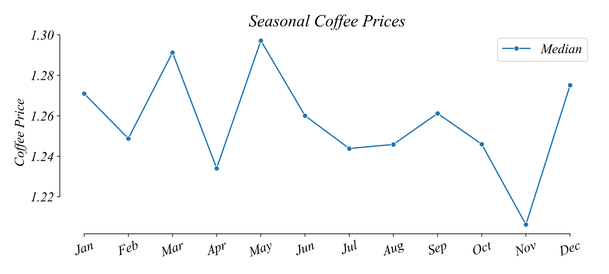

## Part 1.3 | Timeseries

We've focussed on **Crosssectional Data** so far, data that has been collected at one point in time from many units. We classified the variables in **Crossectional Data** as either **Categorical** or **Numerical**. We developed best practices for visualizing Categorical Variables with **Bar Charts**: order the bars; place numers near bars; avoid clutter. We developed best practices for visualizing Numerical Variables with **Histograms**: use equal sized bins; balance resolution against noise; label the horizontal axis. We discussed visualizing Numerical Variables with **Boxplots + Stripplots**, making it easier to see the quantiles and the datapoints directly. But often the insight in our data isn't easy to see through the lense of Crosssectional visualizations.

### Timeseries: Line Graphs

The price of coffee beans is always on the mind of coffee shop owners.  How might you use the historical data on coffee prices to help you plan for coffee prices six months from now?

Opening the dataset, we can see a column with dates and prices per pound in dollar recorded every workday. This is a numerical variable. So far we've used histograms and boxplots as the main summarization tools for cross-sectional numerical variables. A histogram of prices gives us a sense of the frequency of coffee prices. 

But this isn't great for our purposes. More recent prices are more important to us. The prices in the 1970s are not as useful as those from last year. And we might wonder if there are other patterns through time. Sometimes prices can be seasonal. Histograms do not show us any of these patterns in prices *through time*. 

We care about the *sequence* of prices. Lets focus on 2021 for a second. Lets use the horizontal axis to show the sequence through time and the vertical axis to show the price at that point in the sequence. 

This gives us a better picture of prices. We can see that prices are higher later in the year. This is what we call a **scatterplot**, a tool we'll return to when we want to show the relationship between variables.

But how might we improve this figure? These points follow a sequence progressing from left to right. To show this *sequence* directly lets connect the points with **line graph**. The idea is that we visualizing the sequence in it's meaningful order instead of each point as separate from the other points in the sequence. 

The resulting line graph illustrates how coffee prices changed over 2021. An ordered sequence of values taken through time like this is called a **time series**. This kind of visualization is very useful for answering questions about sequences. 

How did coffee prices change during 2021? Although daily prices in 2021 oscillated, the general pattern was increasing. The general increase we see in the line graph is the **trend**. A **trend** is the general, long-term pattern of a time series. A time series can have an increasing or a decreasing trend, or no trend at all. 

We can use any interval of time we like. Let’s zoom out all the way to 2000 to see if the trend over the last 25 years is also increasing. This line graph represents daily coffee prices in US dollars per pound recorded from 2000 to 2025, showing us longer term trends. 

We can see that while there was the substantial upward trend in 2021 that we have been looking at, the overall trend was much weaker. Looking at this longer interval makes it possible to see the shorter trends within the larger trend. And it's easy to see that not every trend was positive within a long term positive trend like this. 

Which intervals was the trend **negative**? We can look at the timeseries directly, or we can add additional elements to make negative subtrends easier to spot. One common tool is to use shading. 

Here I've shaded the quarters which had a negative trend, starting above where they ended. This makes it exceptionally easy to see the time intervals with a negative trend. We could have alternatively shaded the regions with a positive trend, which would have made it easier to answer a question about quarters with a positive trend. 

### Seasonal Variation

As these subtrends show, coffee prices fluctuate a lot throughout the year. If we're trying to set prices for six months from now, what data do you think we should be looking at? 

One approach we could take is to isolate prices by time of year. Before doing this more systematically, lets focus on January using our trusty Boxplot + Stripplot. This visualization tool removes the sequence component between the points (we also not looking at the full sequence anymore) but allows us to observe possible patterns in prices and their quartiles for this specific point on the calendar.

What was the median coffee price per pound across all years in January? Since the vertical line in the box represents the median, the median January price for a pound of coffee was about $1.25.

Our main purpose is to observe potential seasonal patterns. So lets look at Boxplots for each month. Here I'm just showing the Boxplot and not the Stripplot since the figure would get very busy. This seasonalized view makes it possible to ask very different kinds of questions than a Line Graph. 

In which month was the record highest price set? To answer this question, we look for the maximum price. Since the Boxplot shows the maximum price in each month with the upper end of the upper whisker, we simply compare the upper whisker, and find the highest one.

The maximum of these twelve maximum prices occurred in April.

In which season are prices most spread out? To assess the spread, we focus on the range of the whiskers, and find the one with the greatest difference between the upper and lower. 

The minimum prices were similar across months, but spring months had the highest maximum prices. This makes the total lengths of whiskers — or the spread — the largest in spring months. So coffee prices were most volatile in spring months.

What is the difference between the largest and the smallest median price per pound? It’s hard to compare the medians, as they don't change much compared to the full range of the data. 

Instead of using boxplots, each with their own box and wisker, we can take some of the quantiles they represent and plot them on a line graph. This shows the minimum, median, and maximum for each month.

We can remove the other statistics from the plot to see the variation in the median more clearly.

With only the median displayed, we can see its variation more easily. What is the difference between the largest and the smallest median price per pound? The largest and the smallest median prices appeared in May and November, respectively. The approximate difference in dollars between these two prices is `1.30 − 1.21 = 0.09`.

### Summary

The most appropriate visualization is a plot that displays only the necessary information. To show the sequence structure of the data, use a **Line Graph**. When we're interested in subsequences, Boxplots helped us compare the spread of the prices in different months. Then to view the typical prices across different months, we use a Line Graph of just the medians. 

### Excel Exercise

Lets focus on the prices between 2015 and 2025. We'll show the Line Graph and the Boxplots.

### Python Exercise

Lets focus on the prices between 2015 and 2025. We'll show the Line Graph and the Boxplots.