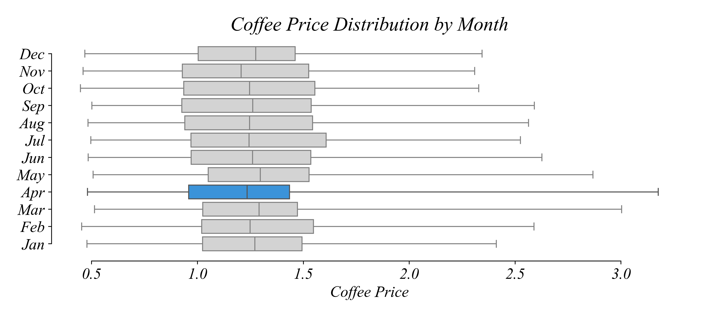
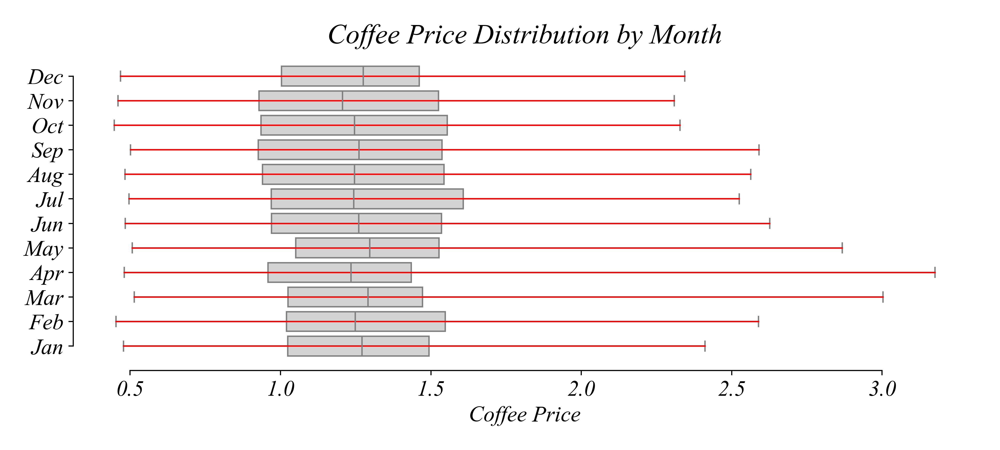
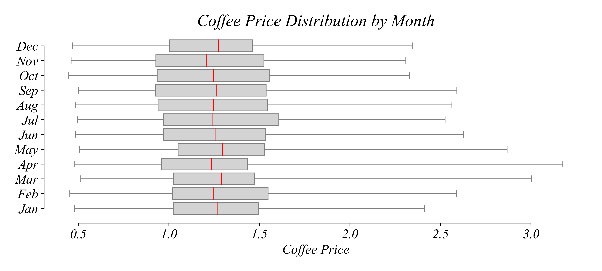

## Notes 1.3 | Day 5 | Timeseries

We've focussed on **Crosssectional Data** so far, data that has been collected at one point in time from many units. We classified the variables in **Crossectional Data** as either **Categorical** or **Numerical**. We developed best practices for visualizing Categorical Variables with **Bar Charts**: order the bars; place numers near bars; avoid clutter. We developed best practices for visualizing Numerical Variables with **Histograms**: use equal sized bins; balance resolution against noise; label the horizontal axis. We discussed visualizing Numerical Variables with **Boxplots + Stripplots**, making it easier to see the quantiles and the datapoints directly. But often the insight in our data isn't easy to see through the lense of Crosssectional visualizations.

### Timeseries and Line Graphs: Coffee Prices

We just looked at locations of coffee shops and ages of Starbucks customers. The price of coffee beans is always on the mind of coffee shop owners. If I give you a dataset with the price of coffee beans, what price should we expect in January 2026? How might you use the historical data on coffee prices to help you plan for coffee prices six months from now?

Opening the dataset, we can see a column with dates and prices per pound in dollar recorded every workday. This is a numerical variable. So far we've used histograms and boxplots as the main summarization tools for cross-sectional numerical variables. A histogram of prices gives us a sense of the frequency of coffee prices.


But this isn't great for our purposes. It's difficult to know what price to expect... do we choose the mode? But more recent prices are more important to us. The prices in the 1970s are not as useful as those from last year. And we might wonder if there are other patterns through time. Sometimes prices can be seasonal. Histograms do not show us any of these patterns in prices *through time*.

What we care about is the *sequence* of prices. Let's focus on 2021 for a second and organize prices by their ordered index, time. We use the horizontal axis to show the sequence through time and the vertical axis to show the price at that point in the sequence.


This gives us a better picture of prices. We can see that prices are higher later in the year. This is what we call a **scatterplot**, a tool we'll return to when we want to show the relationship between variables.

But how might we improve this figure? These points follow a sequence progressing from left to right. To show this *sequence* directly lets connect the points with a **line graph**. The idea is that we're visualizing the sequence in its meaningful order instead of each point as separate from the other points in the sequence.


The resulting line graph illustrates how coffee prices changed over 2021. An ordered sequence of values taken through time like this is called a **time series**. This kind of visualization is very useful for answering questions about sequences.

So how did coffee prices change during 2021? Although daily prices in 2021 varied, the general pattern was increasing. The general increase we see in the line graph is the **trend**. A **trend** is the general, long-term pattern of a time series. A time series can have an increasing or a decreasing trend, or no trend at all.

We can use any interval of time we like. Let's zoom out all the way to 2000 to see if the trend over the last 25 years is also increasing. This line graph represents daily coffee prices in US dollars per pound recorded from 2000 to 2025, showing us longer term trends.


We can see that while there was the substantial upward trend in 2021 that we have been looking at, the overall trend was much weaker. Looking at this longer interval makes it possible to see the shorter trends within the larger trend. And it's easy to see that not every trend was positive within a long term positive trend like this.

Which intervals saw a **negative** trend? We can look at the timeseries directly, or we can add additional elements to make negative subtrends easier to spot. One common tool is to use shading.


Here I've shaded the quarters which had a negative trend, starting above where they ended. This makes it exceptionally easy to see the time intervals with a negative trend. We could have alternatively shaded the regions with a positive trend, which would have made it easier to answer a question about quarters with a positive trend.

### Exercise 1.3 | Timeseries

Let's use a linegraph to examine the trends in coffee prices using the dataset `Coffee_Prices.csv`. 

We'll start in Excel. Download the data from the course website. Then open the csv file in Excel. In the dataset select the price values, go to Insert, select the line graph. Then right click the horizontal axis and select data, then use the 'Horizontal (Category) axis labels' to select the column with the dates.

In this case visualizations in python and Excel have a similar number of steps. For good reproducible science it's important to document every step we perform. While we can write down all our steps in Excel, as our work continues to grow in complexity, it's will become much easier to use code to quickly and easily keep track of our steps. As I've mentioned, besides generally being easier to work with data, code like python makes it very easy to do high quality reproducible science without a lot of hassle. 

Here all we have to do is load the notebook from the course page, save a copy to your Google Drive folder, import the packages, load the data, then use seaborn to create a lineplot. 

### S-T-E for Line Graphs

| Step | Action |
|------|--------|
| SELECT | Coffee prices 2015-2025 |
| TRANSFORM | Order by date |
| ENCODE | Date → x-position; Price → y-position; Sequence → connected line |

The ENCODE step uses position for both time and value — the line shows sequence.

### Real Coffee Prices

The trend is negative when the prices generally fall over a given period. We can see that parts of the time series have negative trends even while the overall trend of the time series is positive. Lets zoom out even futher, going back to the 70s.


What do you notice about this figure? First, we might recognize that the upward trend in prices looks somewhat specific to the period after 2000. Prices seem to vary, as shown by the positive and negative subtrends, but the decadeslong trend in prices looks relatively flat. Second, we can see that we're comparing prices in 1970's dollars to prices in 2020's dollars, which doesn't give us a consistent price level. Was coffee about as expensive in 1980 as it is today? A dollar in 1980 is not equal to a dollar in 2025. So while this long term figure gives us a long term view, this isn't particularly useful in helping us understand how prices have evolved since the 1970s.

Lets plot the value of a 1970 dollar over this period.


This makes it very clear how a dollar today is worth much less than a dollar in 1970. A dollar in 1970 is worth almost 8 dollars today. This means the nominal price of coffee in the 1970s is not comparable to the nominal price of coffee in the 2020s. We need to adjust for inflation to compare across time.

We can resolve this issue using what we call a **data transformation**. To adjust for inflation, we divide the nominal price by the value of today's dollar in that year. This gives us the real price.


The real price tells a very different picture than the nominal price. Prices of coffee were falling between the 1970s and the 1990s but have remained relatively stable since 2000.

### Exercise 1.3 | Real Price Adjustment

Lets visualize the real price of coffee between the 1970s and today using the dataset `Coffee_Prices_CPI.csv`.

This dataset has a column `date`, which gives us a formatted date for the recorded price in the column `price`. There's a column `cpi` showing the consumer price index for that year. I've made your life easy by giving you a column `today` which gives us the value of a dollar today in the given year. So the first row shows us that today's dollar would have been worth about 14 cents in 1973.

To get the real price at any given year, all we need to do is divide the nominal price `price` by the value of a dollar in that year `today` giving us a column of real prices we can call `real`.

**Excel:** Create a new column with the formula `=price/today`, then create a line graph as before.

**Python:**
```python
# Create real price column
data['real'] = data['price'] / data['today']

# Lineplot of real prices
sns.lineplot(data, x='date', y='real')
```

### S-T-E for Real Price Adjustment

| Step | Action |
|------|--------|
| SELECT | Coffee prices 1980-2025 with CPI data |
| TRANSFORM | Divide nominal price by CPI adjustment factor |
| ENCODE | Date → x-position; Real price → y-position; Sequence → connected line |

The TRANSFORM step converts nominal dollars to real (inflation-adjusted) dollars.

### Seasonality: Coffee Prices

Let's return to our original question: **What price should we expect in January 2026?**


Timeseries lineplots show us about the trends but is there something specific about January?

As these subtrends show, coffee prices fluctuate a lot throughout the year. If we're trying to set prices for six months from now, what data do you think we should be looking at?

One approach we could take is to isolate prices by time of year. Before doing this more systematically, lets focus on January using our trusty Boxplot. This visualization tool removes the sequence component between the points (we're also not looking at the full sequence anymore) but allows us to observe possible patterns in prices and their quartiles for this specific point on the calendar.


What was the median coffee price per pound across all years in January? Since the vertical line in the box represents the median, the median January price for a pound of coffee was about $1.25. But lets compare this to other months.

Our main purpose is to observe potential seasonal patterns. So lets look at Boxplots for each month. Here I'm just showing the Boxplot and not the Stripplot since the figure would get very busy. This seasonalized view makes it possible to ask very different kinds of questions than a Line Graph.


**In which month was the record highest price set?** To answer this question, we look for the maximum price. Since the Boxplot shows the maximum price in each month with the upper end of the upper whisker, we simply compare the upper whiskers, and find the highest one.


The maximum of these twelve maximum prices occurred in April.



**In which season are prices most spread out?** To assess the spread, we focus on the range of the whiskers, and find the one with the greatest difference between the upper and lower.



The minimum prices were similar across months, but spring months had the highest maximum prices. This makes the total lengths of whiskers — or the spread — the largest in spring months. So coffee prices were most volatile in spring months.


**What is the difference between the largest and the smallest median price per pound?** It's hard to compare the medians, as they don't change much compared to the full range of the data.



Instead of using boxplots, each with their own box and whisker, we can take some of the quantiles they represent and plot them on a line graph. This shows the minimum, median, and maximum for each month.


We can remove the other statistics from the plot to see the variation in the median more clearly.


With only the median displayed, we can see its variation more easily. What is the difference between the largest and the smallest median price per pound? The largest and the smallest median prices appeared in May and November, respectively. The approximate difference in dollars between these two prices is `1.30 − 1.21 = 0.09`.

### Exercise 1.3 | Seasonality

Lets use a multi-boxplot to examine the seasonal patterns of coffee prices using the dataset `Coffee_Prices.csv`.

**Excel:** Create a pivot table grouping by month, then create a box and whisker chart.

**Python:**
```python
# Multi-Boxplot
sns.boxplot(prices, y='month', x='price', whis=(0,100))
```

### S-T-E for Multi-Boxplots

| Step | Action |
|------|--------|
| SELECT | Coffee prices 2000-2025 |
| TRANSFORM | Group by month; calculate quartiles within each group |
| ENCODE | Month → y-position; Price quartiles → box elements |

The TRANSFORM step groups by time period, then summarizes within each group.

### Summary

The most appropriate visualization is a plot that displays only the necessary information:
- To show the **sequence structure** of the data, use a **Line Graph**
- When we're interested in **subsequences**, Boxplots help us compare the spread of prices in different months
- To view **typical prices** across different periods, use a Line Graph of just the medians
- Use **shading** to highlight changes in a linegraph

### Building Blocks

| Block | Part 1.3 |
|-------|----------|
| Variables | Numerical |
| Structures | Timeseries |
| Operations | Real price transformation; group by period |
| Visualizations | Line plot; Multi-boxplot |

*Next: Panel Data with both entity and time indexes!*
