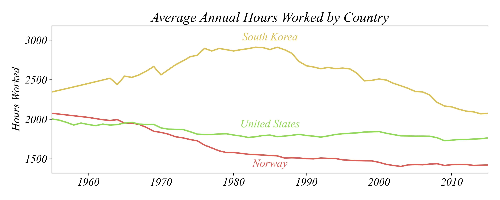

## ECON 0150 | Spring 2026 | Homework 1.4

### Due: Friday, February 6 at 5PM

Homework is designed to both test your knowlege and challenge you to apply familiar concepts in new applications. Answer clearly and completely. You are welcomed and encouraged to work in groups so long as your work is your own. Submit your figures and answers to Gradescope.

##### Q1. Numerical Variables in Panel

The following data on hours worked is available from Our World in Data. This question is aimed at practicing the skill of making comparisons of continuous variables displayed visually. 

a) In which country did people work the most on average?

- South Korea
- United States
- Norway

b) When did Norwegians work less than Americans?

- Before 1963
- During 1963
- After 1963
- Never

c) When was the largest difference between the longest and the shortest annual working time?

- 1960s
- 1980s
- 2000s
- 2010s

d) In the 1980s, roughly how many times more did an average South Korean work than an average Norwegian?

- 2x
- 3x
- 4x
- 5x

e) Use `working_north_america.csv` to create a multiple line plot showing the average annual hours worked by country for the United States, Canada, and Mexico between 1955 and 2015.

##### Q2. Transforming Marriage Rates

The following questions are based on **crude marriage rates** in `marriage_rates.csv` — numbers of marriages per one thousand inhabitants — in 1990 and 2019. Each row represents a different European country.

a) Create a new column of absolute change in marriage rates from 1990 to 2019. Compute the **absolute change** in the marriage rate by subtracting the old value from the new value. Which country in this dataset has the largest absolute change between these years? (*Hint: do not take an absolute value; treat 1 as larger than -2.*)

b) Create a new column of relative change in marriage rates from 1990 to 2019. Compute the **relative change** as the ratio resulting from dividing the absolute change by the old value. Which country in this dataset has the largest relative change between these years?

##### Q3. Multi-Country Coffee Production

Using the dataset `coffee_prod_in_years.csv`, which provides information on coffee production in different countries between 1961 and 2023:

a) Plot a line graph of global coffee production over time (the total across all countries for each year). Describe the trend and discuss potential reasons behind it.

b) Plot a line graph of coffee production for each country over time. Include all countries in a single figure.

c) Generate a scatter plot comparing coffee production in 1961 and 2023 for each country. Include a 45-degree line to help identify which countries increased or decreased production. Are there outlier countries? Briefly suggest why these countries might stand out.

d) Which figure — the country-level time trends (from part b) or the 1961 vs. 2023 comparison (from part c) — better helps you understand patterns in coffee production? Justify your answer.

e) Choose one of the outlier countries you identified in part (c) and plot its coffee production over time. Describe the pattern and propose possible explanations (e.g., conflict, policy changes, new entrants to the market).
