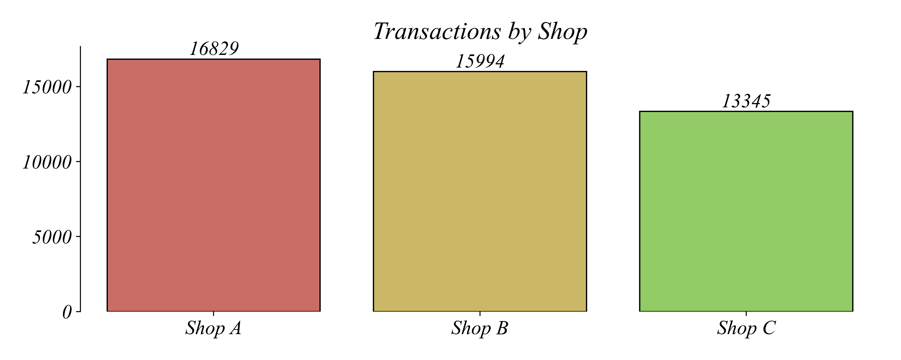
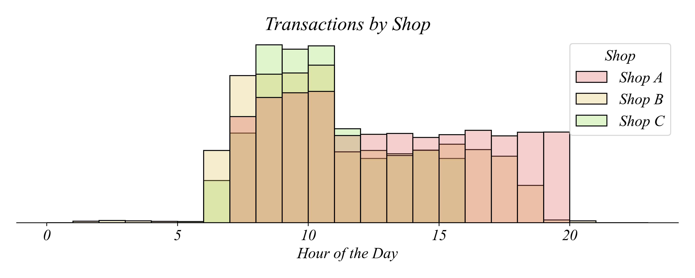
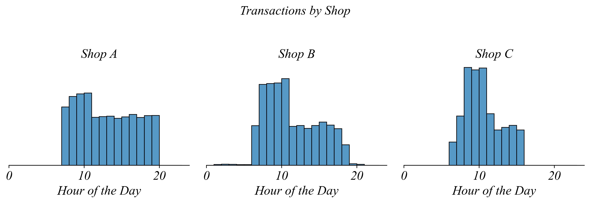
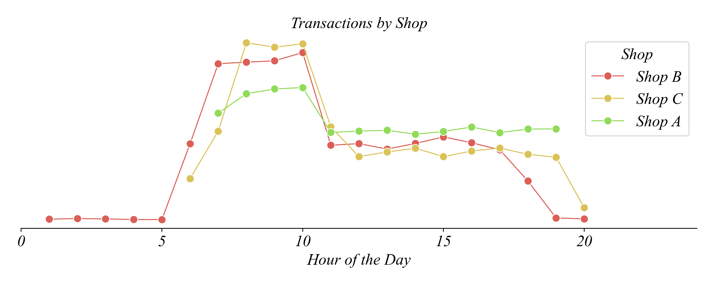

## Part 1.4 | Panel Data (Long Format)

So far we've looked at cross-sectional data (many entities at one point in time) and time series data (one entity across many points in time). **Panel data** combines both — it tracks the same units (people, countries, stores) over time. This is also called longitudinal data or time series cross-sectional data. Examples include GDP by country by year, or sales by store by hour.

Panel data can be stored in two formats: **Long** or **Wide**. In this unit we focus on long format, where each observation is a separate row and a column identifies which group each row belongs to. Wide format, where each time period gets its own column, is covered in Part 1.5.

### The Busiest Shop

The owners of a chain of coffee shops is trying to respond to their staff feeling stressed and overworked by hiring one more barista, and are trying to use transaction data to decide where to assign the new staffmember. Lets start by visualizing the total number of transactions at each shop. What kind of visualization would be most useful?

Well since this is categorical data, a histogram won't work. This isn't a great application for pie charts, since we'd like to understand how transations are spread across the three locations, not comparing one shop to the whole. A bar chart is a great place to start.



---

### The Busiest Time

Simply looking at which shop is busiest, Shop A might benefit most from the extra hire. But since demand for coffee is not constant throughout the day, it might be most helpful to examine when demand spikes the most during the day. Looking at variation over time like this is a great application for a histogram to visualize transations, and since time is a continuous variable we can't use a pie chart or bar chart. Lets start by combining transations together across all three shops and group into equally sized bins.


This type of data can tell us which time of day we should be hiring for. From this it looks like the morning shift is most busy, so it might be a good time of day to add another barista.

---

### The Busiest Shift

So far we've found that Shop A is the busiest shop and that mornings are the busiest time. Does this mean we should hire an extra barista for the morning shift at Shop A?

It could be, but we don't yet know enough. To learn a little more, we could separate out demand throughout the day separately by shop. Then we can plot all three shops on the same graph.



What do you think of this view? To me it looks a bit hard to read. It's hard to tell where one bar starts and another one ends. Stacking bars like this works sometimes but is typically too busy.

---

### Faceting: Separate Panels for Each Group

One solution is **faceting** — giving each shop its own panel. Instead of overlaying all three histograms on top of each other, we separate them into side-by-side plots.



This is the same data, but now each shop has its own histogram. Faceting makes it much easier to compare the shape of each distribution. Which shop has the most consistent traffic throughout the day? Shop A — the distribution is relatively flat. Which shop is busiest during the morning rush? Shop C — compare the 8-10am peaks across panels.

Faceting is a powerful tool when you want to compare distributions across groups without the visual clutter of overlaying them.

---

### Line Graphs: Another Approach

Fortunately, there's another visualization tool, the **line graph**, which connects the top of each bar. By removing the fill under the lines, we get a clean view of traffic patterns across all three shops.



A line graph is much easier to compare across shops through time. The morning shift at Shop C has the highest peak sales. Many things could explain this, such as higher demand at Shop C, faster baristas at Shop C, simpler orders at Shop C, or many other reasons. The data available can tell us a lot about where hiring a new barista might be most helpful, but data on its own often cannot paint a complete picture.

---

### Summary

- **Panel data** tracks repeated observations across groups or time.
- **Long format:** Each observation is a row; a column identifies the group.
- **Faceting** separates each group into its own panel for easier comparison.
- **Line graphs** help simplify the visualization of multiple categories on a single plot.
- Use `hue='Group'` and `col='Group'` in seaborn for multi-group visualizations.

Categorical variables and continuous variables can give us different views of the same data. Often we can visualize both views on the same graph using visualization techniques for continuous variables within the category.

### S-T-E for Panel Data (Long Format)

| Step | Action |
|------|--------|
| SELECT | All transactions from three coffee shops |
| TRANSFORM | Group by shop and hour; count transactions |
| ENCODE | Hour → x-position; Count → y-position; Shop → color/facet |

The TRANSFORM step groups by multiple variables. The ENCODE step uses color or faceting to show groups.

---

### Python Exercise 1.4 | Multi-Line Graphs

There are two ways to create multi-line graphs in Python. The first approach builds the count table explicitly using `groupby`. The second is a shortcut that lets seaborn handle the counting behind the scenes.

#### The Groupby Approach

We can have Python group each value in `Shop`, and within that group also group by `Hours`. This means every element of a group is a transaction that happens at the same shop in the same hour:

```python
sales.groupby(['Shop', 'Hours'])
```

Then we find how many transactions are in each group by getting the size:

```python
sales.groupby(['Shop', 'Hours']).size()
```

This gives us a count by hour at each coffee shop, but it's not in the right shape. To turn it into a dataframe that seaborn can work with, we reset the index:

```python
counts = sales.groupby(['Shop', 'Hours']).size().reset_index(name='Count')
```

Now we can use seaborn as normal. Give it the dataset `counts`, use `Hours` on the horizontal, `Count` on the vertical, and break it out by `Shop`:

```python
sns.lineplot(counts, x='Hours', y='Count', hue='Shop')
```

#### The Shortcut

If all we care about is the figure, we can have seaborn do all the grouping work for us. We use `histplot` to count things up, but tell it to treat the top of each histogram as a point on a line using `element='poly'`. We also remove the shading under the line using `fill=False`.

```python
sns.histplot(sales, x='Hours', hue='Shop', bins=range(0,24,1), element='poly', fill=False)
```

This saves us work if we aren't interested in the count table. Python is very good at saving us work.
