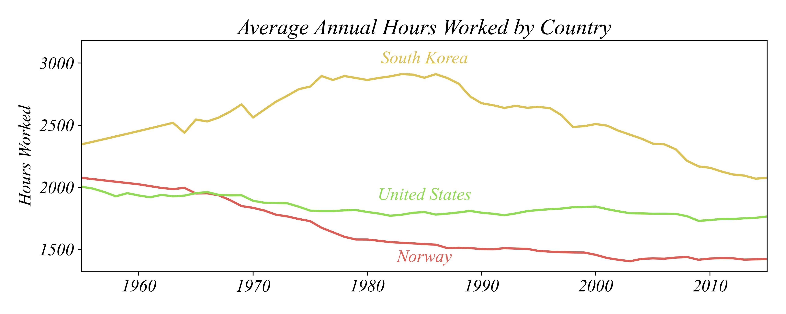

## ECON 0150 | Spring 2026 | Homework 1.4

### Due: Friday, February 6 at 5PM

Homework is designed to both test your knowlege and challenge you to apply familiar concepts in new applications. Answer clearly and completely. You are welcomed and encouraged to work in groups so long as your work is your own. Submit your figures and answers to Gradescope.

##### Q1. Numerical Variables in Panel

The following data on hours worked is available from Our World in Data. This question is aimed at practicing the skill of making comparisons of numerical timeseries variables displayed visually.

a) In which country did people work the most on average?

- South Korea
- United States
- Norway

b) When did Norwegians work less than Americans?

- Before 1963
- During 1963
- After 1963
- Never

c) When was the largest difference between the longest and the shortest annual working time?

- 1960s
- 1980s
- 2000s
- 2010s

d) In the 1980s, roughly how many times more did an average South Korean work than an average Norwegian?

- 2x
- 3x
- 4x
- 5x

e) Use `working_north_america.csv` to create a multiple line plot showing the average annual hours worked by country for the United States, Canada, and Mexico between 1955 and 2015.

##### Q2. Multi-Country Coffee Production

Using the dataset `selected_coffee_prod_in_years.csv`, which provides information on coffee production in different countries between 1961 and 2023:

a) Plot a line graph of global coffee production over time (the total across all countries for each year). 

b) Plot a line graph of coffee production for each country over time. Include all countries in a single figure.

c) Create a faceted line plot showing coffee production over time, with each country in its own panel. (*Hint: use `sns.relplot()` with `col='Entity'` and `col_wrap=4` and `kind='line'`.*)

d) Compare your multi-line plot from (b) with your faceted plot from (c). Which visualization makes it easier to see individual country trends? Which makes it easier to compare countries to each other?
