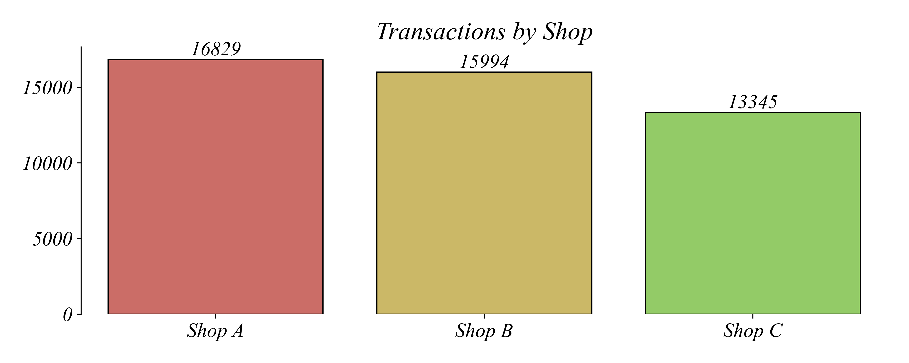
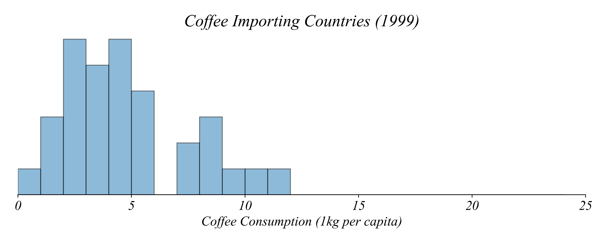
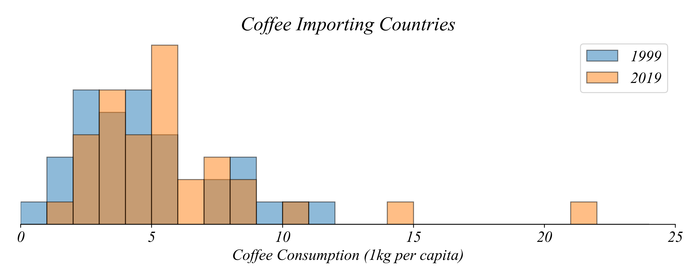

## Part 1.4 | Transformations

### Adjusting for Inflation

Last time we talked about timeseries and the price of coffee. Coffee shop owners are always interested in the price of coffee in the future. We saw that **line graphs** are great tools for showing **trends** in a squence of data. We used a linegraph to see that the price of coffee in 2021 had an increasing trend. 


Then we zoomed out all the way to 2000 to see if the trend over the last 25 years is also increasing. 


This line graph represents daily coffee prices in US dollars per pound recorded from 2001 to 2025. This showed us some longer term trends. We saw that while there was an upward trend in 2021, the overall trend was much weaker. This longer interval makes it possible to see shorter trends within the larger trend. But not every trend was positive. Used this longer view and highlighted the subintervals with negative trends in price.


The trend is negative when the prices generally fall over a given period. We can see that parts of the time series have negative trends even while the overall trend of the time series is positive. Lets zoom out even futher, going back to the 70s. 


What do you notice about this figure? First, we might recognize that the upward trend in prices looks somewhat specific to the period after 2000. Prices seem to vary, as shown by the positive and negative subtrends, but the decadeslong trend in prices looks relatively flat. Second, we can see that we're comparing prices in 1970's dollars to prices in 2020's dollars, which doesn't give us a consistent price level. So while this long term figure gives us a long term view, this isn't particularly useful in helping us understand how prices have evolved since the 1970s.

Lets plot the value of a 1970 dollar over this period. 


This makes it very clear how a dollar today is worth much less than a dollar in 1970. The nominal price of coffee in the 1970s is not comparable to the nominal price of coffee in the 2020s. We can resolve this issue using what we call a **data transformation**. To adjust for inflation, we divide the value of today's dollar yesterday by the price yesterday. This is what we call the real price. 


The real price tells a very different picture than the nomainal price. Prices of coffee were falling between the 1970s and the 1990s but have remained relatively stable since 2000. 

### Monthly Changes

Scatterplot with lagged monthly prices. Maybe save this for Part 2.1.

### Percent Change in Price

Use an elasticity to measure how prices change. 

### Timeszones

Actually, lets just focus on when Starbucks OPEN. We'll say something like we want to know when the most coffee shops are opening. 


Starbucks doesn't just think about the price of coffee. With cafes on six continents, there is always someone having their morning coffee at Starbucks. We might wonder how many Starbucks cafes are open at any given time. Just looking at the opening and closing hours for every Starbucks cafe in the world gives us a picture of when the locations are opening in their local time, but doesn't allow us to compare across timezones. 



On a given day, is the cafe with the earliest opening time the first to open? No. A cafe opening at 9 AM in East Asia will still be open before a cafe in Europe that opens at 5 AM. 

To find how many Starbucks are open at any hour, lets convert opening and closing times to a common timezone. We'll use Greenwich Mean Time (GMT), which is called "timezone" in the dataset. 

What time is it in GMT when a cafe opens in Canada (GMT - 7) at 8 AM? To convert from local time to GMT we subtract the time difference. The timezone for a location in Canada is GMT - 7, so we must subtract negative 7 hours from the opening time.

```
8 − ( − 7 GMT) = 15
```

This tells us that when the Canadian Starbucks is a midnight local time, it's 7 AM in Greenwich. So then when it's 8 AM at this Canadian Starbucks, it's 15 hours, or 3 PM in Greenwich. 

We can convert the opening times to GMT by subtracting the time difference. I've saved us a step and converted the times to numbers in the table so we have a uniform format. Create a new column of opening and closing hours in GMT: openGMT, closeGMT. In the table, both opening and closing times have been converted to GMT by subtracting timezone. Let's plot these values and see what's going on. 


Looking at the opening times, we can see that some cafes now have a negative value. **How should we interpret an opening time of - 1 hours?** The cafe opens 60 minutes before midnight GMT. But 60 minutes before midnight is also 23 hours after midnight. **How might we convert a negative opening time into “time after midnight”?** Add 24 hours to the values that are negative. 

**How might we do this?** We have to use a conditional to only add 24 to values that are negative. Once we've done this, here is our updated table - all our opening and closing times are in the same 24 hour period.


Closing times have the same problem. Here's a figure of the unnormalized closing times. 


You can see many of the closing times are listed as negative. We have to apply a conditional transformation like before. A value of -8 means that they are opening up 8 hours before midnight GMT, which is equivalent to 16 hours before midnight GMT. Once we've made this data transformation, we can produce a histogram of all the closing times, normalized to GMT. 


Now that we've performted this normalization, we have a consistent measure of the opening and closing times of Starbucks locations worldwide and we don’t need to worry about timezones any more. Now we can compare opening and closing times across a consisten axis.



Our main question is how many cafes are open at each time of day. To answering this question we will need to filter and count the number of cafes that have opened at every hour in the day. For example, at 10 AM, we want to know how many locations have opened up before 10 AM. If the opening time is before 10 AM then the opening time number will be **less than** 10. We can count the number of cafes opening before 10 GMT by selecting:

```
OpenUTC < 10
```

We can use this method to populate a new table where the first column is the time of day in hours. The other columns show the count of cafes that have opened or closed before that time. Then we can plot this information using a line graph.



We are not really interested in how many cafes have opened or closed though. What we actually care about is the change in the number that are open — the net increase. **How might we find this?**

Lets create a new column showing the increase in the number of open cafes. Every cafe that opens **increases** the total number that are open by one. Every cafe that closes **decreases** the total number open by one. The net increase is given by:

```
Open Count - Close Count
```

We can plot the different as 'Net Increase'.


For much of the day “Net Increase” is negative. **How is that possible?**

Many cafes were already open at midnight GMT. Midnight GMT is 4pm in California, so a lot of Starbucks were open at the time we started counting. To fix this problem, we need to know how many locations are already open at midnight and add them to the total opened locations. **How might we find this value?**

Lets select the rows that represent cafes already open at midnight GMT. Cafes that are open at midnight GMT must have an opening time equal to or later than their closing time, so should match the expression:

```
OpenUTC >= CloseUTC
```

There are roughly 18,094 cafes that have an opening time that is the same or later than their closing time, indicating that they are open at midnight GMT. We can find the total number open at any time from.

```
18,094 + OpenCount − CloseCount
```

We can then plot this using a histogram or line graph if we like.


It looks like Starbucks never completely sleeps. **What time of day is the quietest for Starbucks globally?**

Right around 0600 GMT. The line dips lowest, indicating fewest cafes are open, at 0600 GMT.

