## Part 1.4 | Panel Data (*formats: long and wide*)

### The Busiest Shop

The owners of a chain of coffee shops is trying to respond to their staff feeling stressed and overworked by hiring one more barista, and are trying to use transaction data to decide where to assign the new staffmember. Lets start by visualizing the total number of transactions at each shop. What kind of visualization would be most useful?

Well since this is categorical data, a histogram won't work. This isn't a great application for pie charts, since we'd like to understand how transations are spread across the three locations, not comparing one shop to the whole. A bar chart is a great place to start.


### The Busiest Time

Simply looking at which shop is busiest, Shop A might benefit most from the extra hire. But since demand for coffee is not constant throughout the day, it might be most helpful to examine when demand spikes the most during the day. Looking at variation over time like this is a great application for a histogram to visualize transations, and since time is a continuous variable we can't use a pie chart or bar chart. Lets start by combining transations together across all three shops and group into equally sized bins. 


This type of data can tell us which time of day we should be hiring for. From this it looks like the morning shift is most busy, so it might be a good time of day to add another barista. 

### The Busiest Shift

So far we've found that Shop A is the busiest shop and that mornings are the busiest time. Does this mean we should hire an extra barista for the morning shift at Shop A?

It could be, but we don't yet know enough. To learn a little more, we could separate out demand throughout the day separately by shop. Then we can plot all three shops on the same graph. 


What do you think of this view? To me it looks a bit hard to read. It's hard to tell where one bar starts and another one ends. Staking bars like this works sometimes but is typically too busy. Fortunately, there's another visualization tool, the **line graph**, which connects the top of each bar.


A line graph is much easier to compare across shops by through time. The morning shift at Shop C has the highest peak sales. Many things could explain this, such as higher demand at Shop C, faster baristas at Shop C, simpler orders at Shop C, or many other reasons. The data available can tell us a lot about where hiring a new barista might be most helpful, but data on it's own often cannot paint a complete picture. 

### Summary

- Categorical variables and continuous variables can give us different views of the same data.
- Often we can visualize both views on the same graph using visualization techniques for continuous variables within the category.
- Line graphs help simplify the visualization of multiple categories. 

### Excel 1.4 Exercise | Multi-Linegraphs

Lets build some similar figures with this dataset in Excel. We've already worked with bar charts and histograms so I'll include them in the example spreadsheet but won't go into detail on how to construct them. Lets focus on creating a line graph for all sales using the FREQUENCY command and a line graph with the three shops separately using a **Pivot Table**.

First, lets use the FREQUENCY command to create a line graph. Create a new sheet by clicking the "+" button at the bottom. You can rename it "sales_frequency" if you'd like. We need to define the bins the FREQUENCY command will use. Create a column label "BINS" in the top cell (eg. A1). Then fill in the column with bin edges starting with 1:00:00 (a format represeting the hour:minute:section) and ending with 23:00:00. There's a little drag trick you might be able to figure out. :) Then in the next column, create a header "FREQUENCY" and enter the following command in the cell below. 

`=FREQUENCY(Coffee_Sales_Reciepts!C:C,A2:A25)`

This command is a little more involved, so lets walk through each part. The command "FREQUENCY" takes in a data range and bins it according to the bins it takes in. We have the data range for reciepts in the first sheet in column C. So to tell the function where to look for the data, we have to tell it to look in column C (selecting all values in the column by "C:C") in the sheet labeled "Coffee_Sales_Reciepts" (selected by "Coffee_Sales_Reciepts!"). The Excel syntax for this is the following:

`Coffee_Sales_Reciepts!C:C`

To tell the function where to look for the bins, we simply add the bin range in second entry of the function as the following:

`A2:A25`

One last note here. You're more than welcome to create the frequency data in the first sheet to skip the need to reference another sheet, creating a second sheet like we've done is best practice for keeping your work readable (both for you at a later time and for others).

Once you've hit enter, you should see the frequencies of transactions show up next to the hour in which they occured. To plot this data, select both columns, go to the Insert tab, and click around until you find the 2-d line graph. This will give you a nice place to start making the graph look nice.

This approach is nice when we have a considerable amount of data bins and only one category. But in our example, we would like to know the frequency of transactions by shop. One approach would be to separate the data by shop and perform the approach we just used on all three shop's data. A less involved approach uses a **pivot table**. 

A pivot table is a powerful tool to summarize and change the structure of data. Start by selecting the two columns that contain the data we need: "sales_outlet_id" and "transaction_time". Then click on the tab Insert, then pivot table. This will bring up a menu with the highlighted data as the input range. Make sure the option to create the output in a new sheet, which we'll later label "pivot_table".

Once you hit enter, you'll be taken to the new sheet with the "PivotTable Fields" right side bar. There's a lot going on here. For now, what we need to do is summarize the data by shop: drag the "sales_outlet_id" field name from "FIELD NAME" into the "Columns" box. This organizes the data by shop. Then we can bin the transactions by hour: drag the "transaction_time" field name into the "Rows" box and make sure Minutes and Seconds are not selected. This should produce a frequency table for each shop and a grand total. To plot this on one line graph, select the data and one row of headers, click into Insert, then line graph, then select the 2-d line graph. From here, you can make the graph look as pretty as you'd like. :)

### Python 1.4 Exercise | Multi-Linegraphs

The approach in python is similar. We can create a frequency table and then use that with a line graph. Or we can simply have seaborn do that for us behind the scences.

The approach with the frequency table is simply to have python do a grouping for us. We'll do more of this later, but for now we can just think of python as group each value in `Shop`, and within that group we're also grouping each value on `Hour`. So we've grouped based on two values `Shop` and `Hour`, meaning every element of a group is a transaction that happens at the same shop in the same hour:

```python
sales.groupby(['Shop', 'Hours'])
```

Then we want to find how many transactions are in each group. We can do this by finding the size of each group, simply adding the dot function at the end:

```python
sales.groupby(['Shop', 'Hours']).size()
```

This gives us a nice count by hour of the day at each coffee shop. But it's not in the right shape. To turn it into a more normal looking dataframe we need to set the index to use `Count`.

```python
counts = sales.groupby(['Shop', 'Hours']).size().reset_index(name='Count')
```

This gives us the kind of dataframe that seaborn can work with. Then we just use seaborn as normal. Give it the dataset `counts`, tell it to use `Hours` on the horizontal, `Count` on the vertical, and break it out by `Shop`. 

```python
sns.lineplot(counts, x='Hours', y='Count', hue='Shop')
```

And we're done.

If all we care about is the figure, we can actually have seaborn do all the grouping work for us. We just use a histplot to have it count things up, but then tell it to treat the top of each histogram as a point on the line using the `element` parameter and setting it equal to `poly`. We can also remove the shading in the area under the line using `fill=False`.

```python
sns.histplot(data=sales, x='Hours', hue='Shop', bins=range(0,24,1), element='poly')
```

This saves us work if we aren't interested in the count table. Python is very good at saving us work.


### Scatterplots in Panel

The world seems to be drinking more coffee than ever. But does the data on coffee consumption confirm this? This data contains coffee consumption in kilograms per capita of 34 coffee importers over the span of two decades. **Per capita** refers to a value averaged over the number of people. It's equivalent to 'per person'. Here's the dataset. 

Let's plot the histogram of country's coffee consumption for 1999.


This figure shows coffee consumption with a bin of 1kg. How did the consumption change between 1999 and 2019? To start the investigation, we can add 2019 coffee consumption per capita to this histogram.


What can we conclude from the histograms? 

- Some countries increased their per capita coffee consumption. 
- No country exceeded 20 kg per capita in 1999, and one country exceeded 20 kg per capita in 2019. 
- We don’t know which country is represented by which bar, some countries might have decreased their coffee consumption, although we can’t say for sure.

What was the most common range of coffee consumption per capita in 2019? 

- Between 5 kg and 6 kg. The tallest bar covers values between 5 kg and 6 kg, which makes it the most common range.
- The **mode** is the most common value (or values) in a dataset.
- In a continuous distribution, it's likely that no values repeat. In this case, we approximate the mode with the histogram’s tallest bar.

Which year was the mode a higher coffee consumption?

- In 1999, the mode was between 4 kg and 5 kg. In 2019, the mode was between 4 kg and 5 kg. So, the mode was larger in 2019.

- The mode consumption per capita increased.

Would you say that between 1999 and 2019, people started drinking more coffee?

- It depends on what we mean by ‘people started drinking more coffee’. 

Are we talking about the mean? The median? The mode?

- The histograms suggest a general increase in coffee consumption. 
- In 2019, two large values appeared and the two smallest disappeared, while the two tallest bars didn’t change much.

### Boxplots

The histograms showed that the per capita coffee consumption increased from 1999 to 2019 — but what happened in between? A visualization type useful for comparing multiple distributions is a **box and whisker plot**, or **boxplot**. The dataset shows the coffee consumption in every year, 1999 for example. The boxplot can represent the same data by summarizing it. 

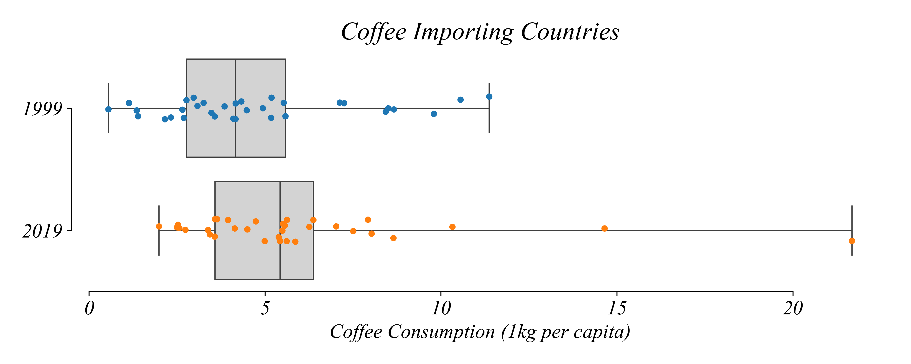

Lets examine what each part of the boxplot corresponds to and what it tells us about the data. To aid our discussion, I'm adding in the countries scattered across the horizontal. Each point corresponds to a country and their coffee consumption on the horizontal. The vertical axis is 'jittered' to make it easy to see countries which are clumped together. This type of approach can be helpful when visualizing a distribution of one variable. 

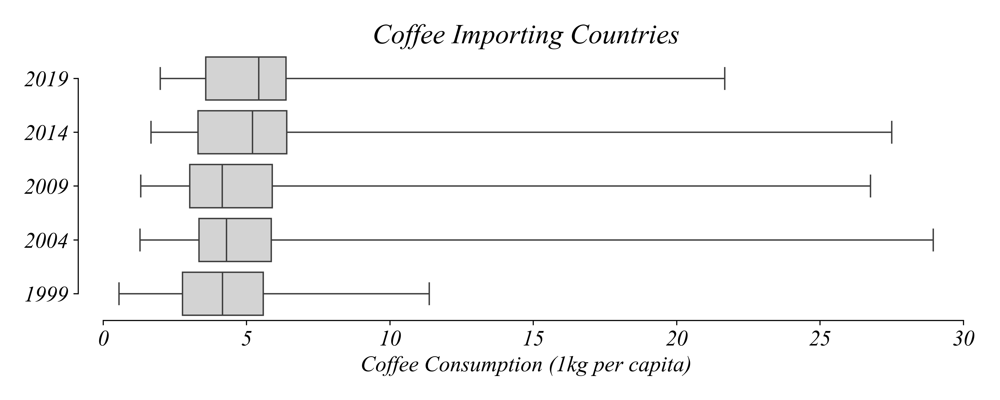

Boxplots visually summarize the data — but their real power lies in the ease of comparisons between distributions. Next, we’ll use boxplots to analyze the changes in coffee consumption between 1999 and 2019.

### Comparing Boxplots

Now that we understand what boxplots represent, we'll analyze coffee consumption data in smaller time increments. Each boxplot represents data from a single year. For convenience, we'll use vertical boxplots.


Based on the boxplots, when did the typical coffee consumption (median) increase the most? 

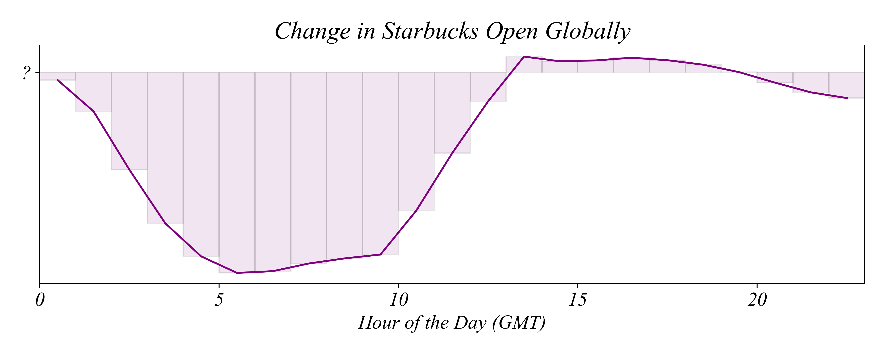

Between 2009 and 2014. The median consumption per capita — represented by the middle line in the box — stayed just below 5 kg until 2009, and then increased to above 5 kg.

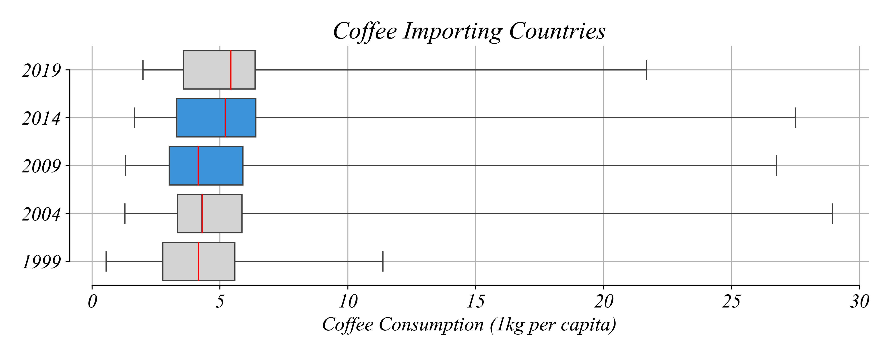

The boxplots show that median consumption was more or less stable between 1999 and 2009, and then suddenly shifted by over 1 kg per capita. This would be much harder to notice by comparing five histograms.

What happened between **all** the visualized years in the box plot? The minimum consumption increased.

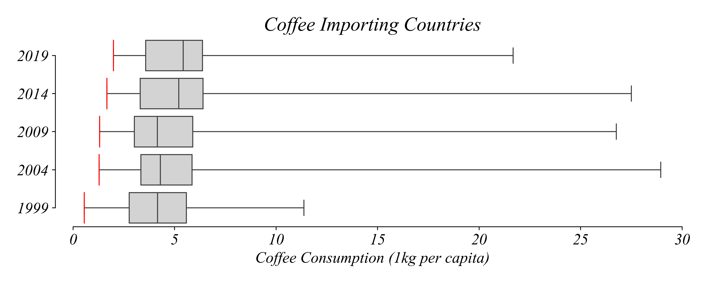

In each barplot, the minimum consumption is slightly larger than in the previous barplot. The pattern of maximum consumption isn’t as clear. 

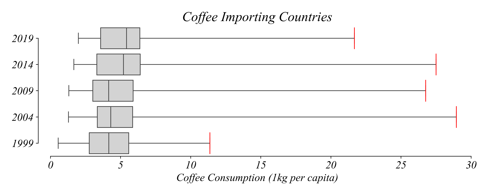

For example, it increased between 1999 and 2004 but decreased between 2004 and 2009. The typical consumption hovered around 5 kg per person, so let’s explore this value in more detail. 


Which years show **at least** half of the countries consuming **less** than 5 kg of coffee per capita?

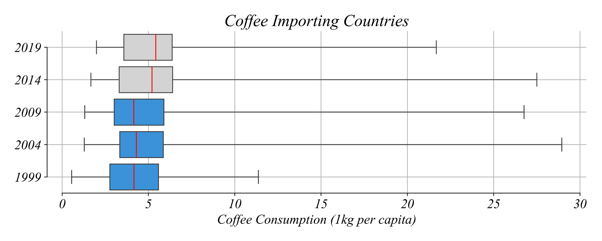

In each boxplot, half of the countries consume more than the median, and half less than the median. In 1999, 2004, and 2009, the median was smaller than 5 kg, so at least half of the countries consumed less than 5 kg per capita.

In which years are **more** than 25% of the countries consuming **less** than 5 kg of coffee per capita?

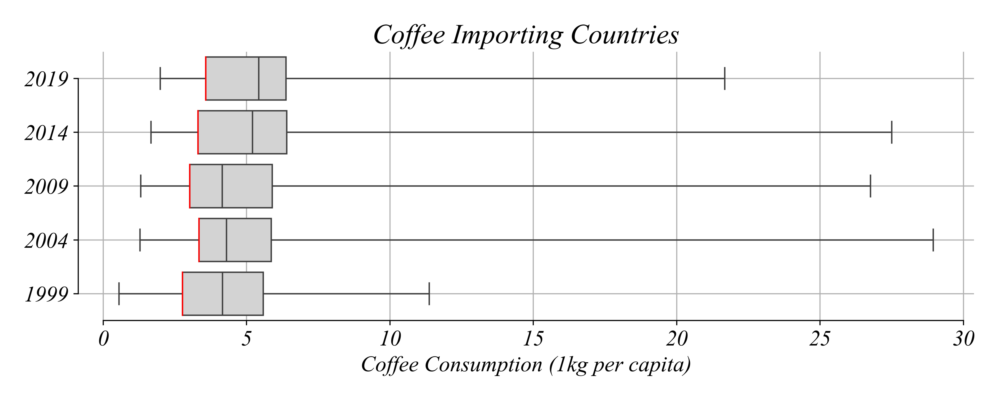

In all five years, *Q*1 was smaller than 5 kg, so more than 25% of the countries consumed less than 5 kg.

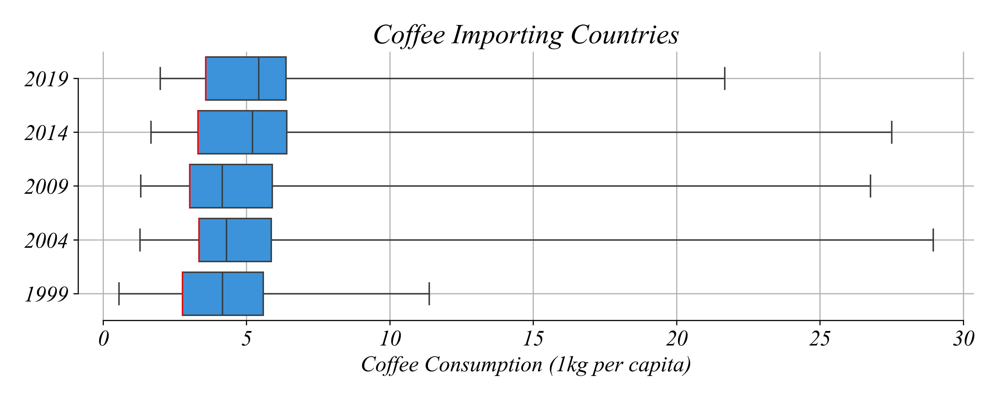

Which year has the greatest range of consumption values?

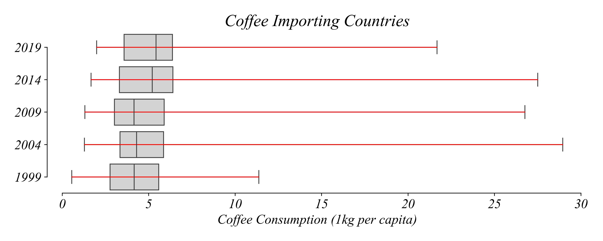

The minimum consumption didn't differ much between years. The maximum consumption, however, was the largest in 2004, which makes the range of values the largest that year.

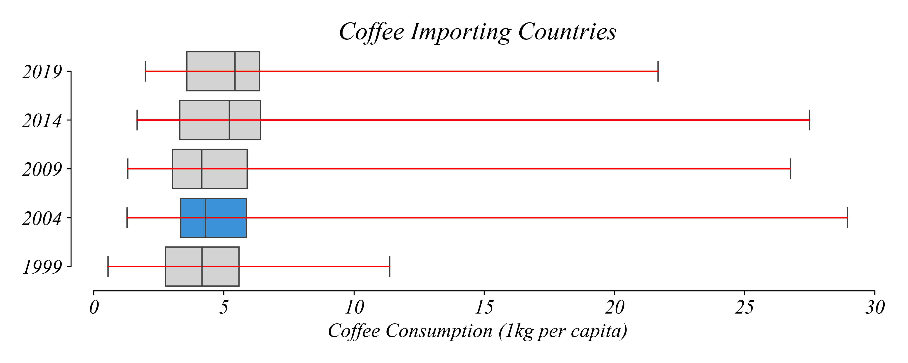

Thanks to boxplots, we saw that while coffee consumption increased between 1999 and 2019, the increase wasn't uniform over the years.

### Scatterplot Changes

When aggregating data like this we can see what's going on overall. But we also might want to get a better view of individual changes. We've seen that coffee consumption has gone up overall, but does that mean all contries have increased their coffee consumption during these years? We don't have the right view to answer that question yet.

Before exploring time series data, we're going to go back to our trusty scatter plot. We have multiple years to examine, which gives us the ability to explore the relationship between coffee consumption in each country between any two years. Let's focus on 1999 and 2019. 

UNFINISHED