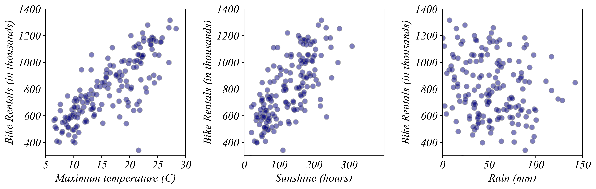

## ECON 0150 | Fall 2025 | Homework 1.5

### Due: Friday, September 19 at 5PM

Homework is designed to both test your knowlege and challenge you to apply familiar concepts in new applications. Answer clearly and completely. You are welcomed and encouraged to work in groups so long as your work is your own. Submit your figures and answers to Gradescope.

##### Q1. Bike Hires and Weather

In the following questions, we'll analyze a data set that includes the monthly number of bike hires in London as well as monthly weather data: minimum and maximum temperature in degrees Celsius, rain in millimeters, and hours of sunshine.

a) From the list below, how much did it rain in the month with the largest number of bike hires?

- 7.6 mm
- 27.6 mm
- 137.6 mm
- 157.6 mm

b) When were bikes most popular?

- In very sunny months
- In moderately sunny months
- In cloudy months
- Sunshine and bike hires were not strongly related

c) In months with what maximum temperatures were bikes most popular?

- Between 5 C and 10 C
- Between 15 C and 20 C
- Between 25 C and 30 C
- Maximum temperature and bike hires were not strongly related

##### Q2. Coffee Production and Agricultural Employment

The dataset `coffee_prod_agr.csv` provides information on coffee production and employment in agriculture across different countries, merged from data available at [Our World In Data](https://ourworldindata.org/grapher/coffee-production-by-region?tab=table) and [The World Bank](https://data.worldbank.org/indicator/SL.AGR.EMPL.ZS). 

a) Briefly describe the organizations that collected the data reported in each source.

b) Identify one potential limitation in the data. 

c) Visualize the relationship between `Employment_in_agriculture` and `Coffee_Prod` using the tool of your choice.

d) Describe the relationship: positive, negative, unclear.

e) What does your figure tell us about the relationship between coffee production and GDP?
