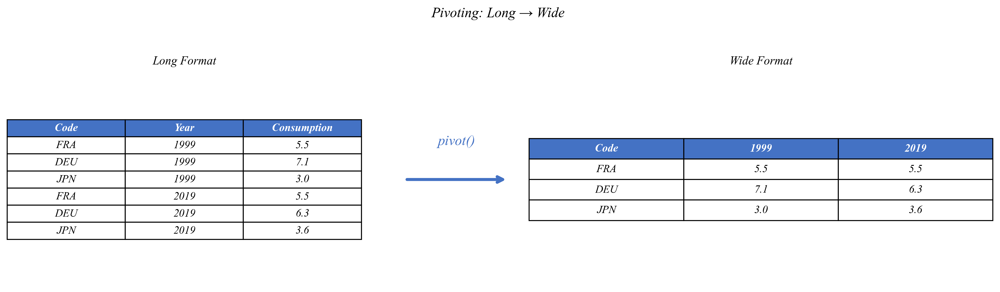
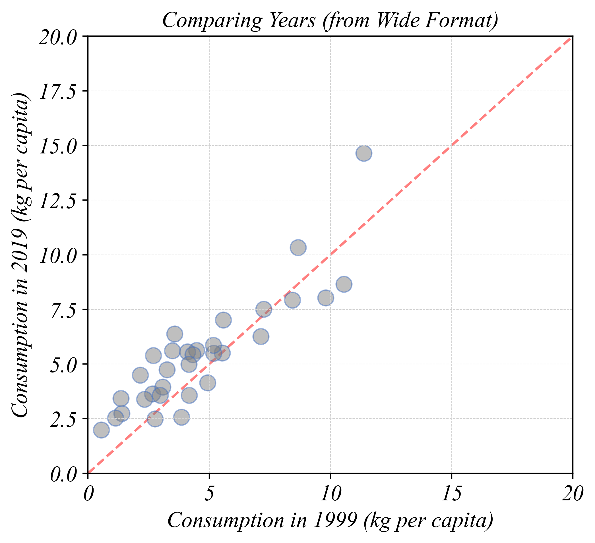
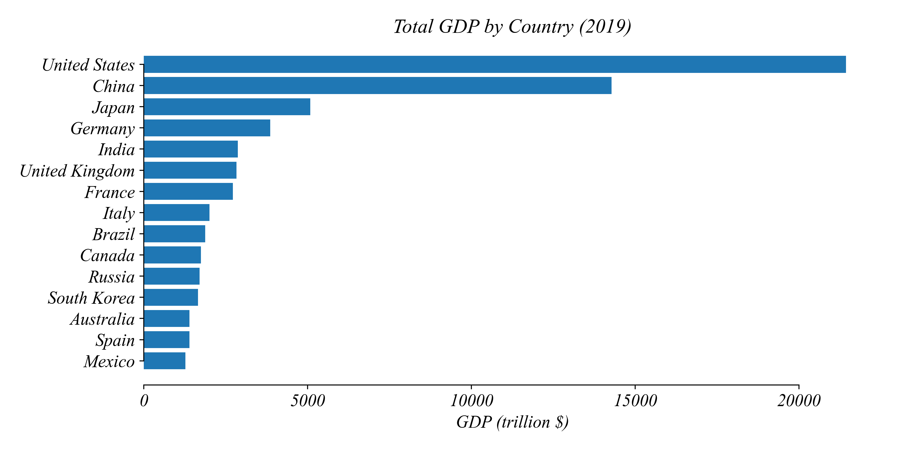
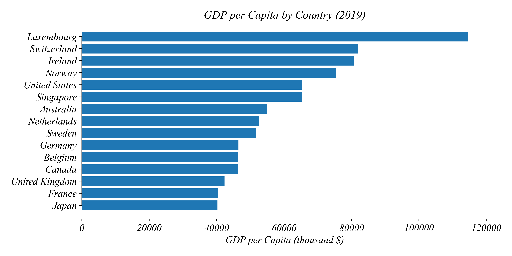

## Part 1.5 | Panel Data (Wide Format)

### Two Formats, Same Data

Panel data can be stored in two ways:

- **Long format:** Each observation is a separate row, with a column identifying the group
- **Wide format:** Each time period is a separate column

Same information, different shapes. Different shapes make different tasks easier.


In long format, years are *values* in a column. In wide format, years become *column names*.


---

### Reshaping: Wide to Long

We can convert between formats. Going from wide to long is called "melting" or "unpivoting."


In Python pandas, use `melt()`:

```python
# Wide to Long
long_df = wide_df.melt(
    id_vars=['Code'],        # Keep as identifier columns
    var_name='Year',         # Name for the former column headers
    value_name='Consumption' # Name for the values
)
```

`id_vars` specifies columns to keep as identifiers. Everything else gets "melted" into rows. Each year column becomes rows in a new "Year" column.


---

### Reshaping: Long to Wide

Going from long to wide is called "pivoting" or "spreading."



In Python pandas, use `pivot()`:

```python
# Long to Wide
wide_df = long_df.pivot(
    index='Code',            # What becomes rows
    columns='Year',          # What becomes columns
    values='Consumption'     # What fills the cells
)
```

Each unique Year value becomes its own column.



---

### When to Use Which Format

Choose based on what you're trying to do:

| Task | Better Format |
|------|---------------|
| Line plot over time | Long |
| Faceted plots by group | Long |
| Compare two specific years | Wide |
| Scatterplot (Year1 vs Year2) | Wide |

**Key insight:**
- **Long format:** Good when you want to *group by* or *color by* a variable
- **Wide format:** Good when you want to *compare* or *correlate* specific columns
- Neither is "better" — it depends on your task

---

### Per Capita Transformations

When comparing countries, raw totals can be misleading. Which country has the largest economy? Looking at total GDP, the US and China dominate — their economies are massive.



But is "largest economy" the same as "richest"? Not necessarily. A country can have a large total GDP simply because it has a lot of people. To understand how well off the typical person is, we need to adjust for population size.

**Per capita** means "per person" — we divide the total by population. When we transform GDP to GDP per capita, the picture changes completely.



Now Luxembourg, Switzerland, and Norway top the list. These are small countries with high living standards. The US and China, despite their massive economies, fall in the rankings because their populations are so large.

This transformation is essential when comparing across countries of different sizes.

---

### Scatterplots in Panel

The world seems to be drinking more coffee than ever. But does the data on coffee consumption confirm this? This data contains coffee consumption in kilograms per capita of 34 coffee importers over the span of two decades. **Per capita** refers to a value averaged over the number of people. It's equivalent to 'per person'.

Let's plot the histogram of country's coffee consumption for 1999.


This figure shows coffee consumption with a bin of 1kg. How did the consumption change between 1999 and 2019? To start the investigation, we can add 2019 coffee consumption per capita to this histogram.


What can we conclude from the histograms?

- Some countries increased their per capita coffee consumption.
- No country exceeded 20 kg per capita in 1999, and one country exceeded 20 kg per capita in 2019.
- We don't know which country is represented by which bar, some countries might have decreased their coffee consumption, although we can't say for sure.

What was the most common range of coffee consumption per capita in 2019?

- Between 5 kg and 6 kg. The tallest bar covers values between 5 kg and 6 kg, which makes it the most common range.
- The **mode** is the most common value (or values) in a dataset.
- In a continuous distribution, it's likely that no values repeat. In this case, we approximate the mode with the histogram's tallest bar.

Which year was the mode a higher coffee consumption?

- In 1999, the mode was between 4 kg and 5 kg. In 2019, the mode was between 5 kg and 6 kg. So, the mode was larger in 2019.
- The mode consumption per capita increased.

Would you say that between 1999 and 2019, people started drinking more coffee?

- It depends on what we mean by 'people started drinking more coffee'.
- Are we talking about the mean? The median? The mode?
- The histograms suggest a general increase in coffee consumption.
- In 2019, two large values appeared and the two smallest disappeared, while the two tallest bars didn't change much.

---

### Boxplots

The histograms showed that the per capita coffee consumption increased from 1999 to 2019 — but what happened in between? A visualization type useful for comparing multiple distributions is a **box and whisker plot**, or **boxplot**. The dataset shows the coffee consumption in every year, 1999 for example. The boxplot can represent the same data by summarizing it.


Lets examine what each part of the boxplot corresponds to and what it tells us about the data. To aid our discussion, I'm adding in the countries scattered across the horizontal. Each point corresponds to a country and their coffee consumption on the horizontal. The vertical axis is 'jittered' to make it easy to see countries which are clumped together. This type of approach can be helpful when visualizing a distribution of one variable.

Boxplots visually summarize the data — but their real power lies in the ease of comparisons between distributions. Next, we'll use boxplots to analyze the changes in coffee consumption between 1999 and 2019.

---

### Comparing Boxplots

Now that we understand what boxplots represent, we'll analyze coffee consumption data in smaller time increments. Each boxplot represents data from a single year. For convenience, we'll use horizontal boxplots.


Based on the boxplots, when did the typical coffee consumption (median) increase the most?


Between 2009 and 2014. The median consumption per capita — represented by the middle line in the box — stayed just below 5 kg until 2009, and then increased to above 5 kg.

The boxplots show that median consumption was more or less stable between 1999 and 2009, and then suddenly shifted by over 1 kg per capita. This would be much harder to notice by comparing five histograms.

What happened between all the visualized years in the box plot? The minimum consumption increased.


In each boxplot, the minimum consumption is slightly larger than in the previous boxplot. The pattern of maximum consumption isn't as clear.


For example, it increased between 1999 and 2004 but decreased between 2004 and 2009. The typical consumption hovered around 5 kg per person, so let's explore this value in more detail.

Which years show at least half of the countries consuming less than 5 kg of coffee per capita?


In each boxplot, half of the countries consume more than the median, and half less than the median. In 1999, 2004, and 2009, the median was smaller than 5 kg, so at least half of the countries consumed less than 5 kg per capita.

In which years are more than 25% of the countries consuming less than 5 kg of coffee per capita?


In all five years, Q1 was smaller than 5 kg, so more than 25% of the countries consumed less than 5 kg.

Which year has the greatest range of consumption values?


The minimum consumption didn't differ much between years. The maximum consumption, however, was the largest in 2004, which makes the range of values the largest that year.


Thanks to boxplots, we saw that while coffee consumption increased between 1999 and 2019, the increase wasn't uniform over the years.

---

### Scatterplot Changes

When aggregating data like this we can see what's going on overall. But we also might want to get a better view of individual changes. We've seen that coffee consumption has gone up overall, but does that mean all countries have increased their coffee consumption during these years? We don't have the right view to answer that question yet.

Before exploring time series data, we're going to go back to our trusty scatter plot. We have multiple years to examine, which gives us the ability to explore the relationship between coffee consumption in each country between any two years. Let's focus on 1999 and 2019.


Each point represents a country. The horizontal axis shows that country's coffee consumption in 1999, and the vertical axis shows consumption in 2019.

### The 45-Degree Line

If a country drank the same amount in both years, where would it appear? We can add a 45-degree line. Any point on this line represents a country with identical consumption in both years.


- Countries **above** the line increased their consumption
- Countries **below** the line decreased their consumption


We can count points above and below the line to see how many countries increased vs decreased. We can use color to make this even clearer.


This view gives us something the boxplots couldn't: we can track individual countries across time. The boxplots showed that the overall distribution shifted upward, but they couldn't tell us whether *every* country increased or just some. The scatter plot reveals that while most countries increased consumption, a few actually decreased.

---

### Python Exercise 1.5 | Wide Format Visualizations

**Per Capita Transformation:**

```python
# Calculate GDP per capita
gdp_pop['GDP_per_capita'] = gdp_pop['GDP'] * 1e6 / gdp_pop['Population']

# Sort to see top countries
gdp_pop.sort_values('GDP_per_capita', ascending=False).head(10)
```

**Multi-Boxplots with Wide Format:**

With wide-format panel data, we can pass multiple columns directly to seaborn:

```python
# Wide Format Multi-Boxplot
sns.boxplot(percap[['1999','2004','2009','2014','2019']], orient='h', whis=(0, 100))
plt.xlabel('Coffee Consumption (kg per capita)')
plt.title('Coffee Importing Countries')
```

**Scatterplot Comparing Years:**

In Python with wide-format data, we can directly plot two columns against each other:

```python
# Wide Format Scatterplot
sns.scatterplot(percap, x='1999', y='2019')
plt.xlabel('1999 Coffee Consumption (kg per capita)')
plt.ylabel('2019 Coffee Consumption (kg per capita)')
```

To add a 45-degree line:

```python
# Scatterplot with 45-degree line
sns.scatterplot(percap, x='1999', y='2019')
plt.plot([0, 25], [0, 25], color='red', linestyle='--', label='No change')
plt.xlim(0, 25)
plt.ylim(0, 25)
plt.grid(True)
plt.legend()
```

---

### Summary

Part 1.5 covered wide format panel data and its applications:

- **Wide format:** Each time period is a column
- **melt()** converts wide → long (columns become rows)
- **pivot()** converts long → wide (rows become columns)
- **Per capita** transformations divide by population for fair comparisons
- **Multi-boxplots** compare distributions across time periods
- **Scatterplots with 45° lines** track individual changes between two time points
