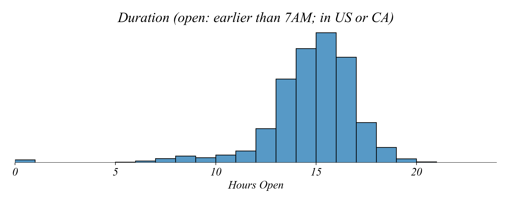

## Part 1.5 | Day 7 | Panel Data (Wide Format)

### A Question Long Format Can't Easily Answer

In Part 1.4 we worked with panel data in long format. Each row was an observation of one country at one point in time. We had many counties and many points in time for each country, so each country showed up in many rows. Long format was great for line plots and histograms. Here's a dataset on coffee consumption per capita for 34 countries, every year from 1990 to 2019. In long format it looks like this:

| Code | Year | Consumption |
| ---- | ---- | ----------- |
| AUT  | 1990 | 10.47       |
| AUT  | 1991 | 10.07       |
| AUT  | 1992 | 9.27        |
| AUT  | 1993 | 10.13       |
| AUT  | 1994 | 8.21        |
| ...  | ...  | ...         |

What if I asked you to visualize an answer to the question: **Are counties drinking more coffee in 2019 than in 1999?** How would you visualize this? 

Try to answer the question. Did Austria increase its coffee consumption between 1999 and 2019? You'd need to find Austria's 1999 row, find Austria's 2019 row, and subtract. Now do that for all 34 countries. It's doable but awkward. The information we need is spread across different rows.

Another tool we already have is to use a timeseries linegraph, using one color by country and see how each one's coffee consumption evolved over 30 years. This gives us a nice picture of the evolution of each country's coffee consumption per capita. Do you think this figure effectively visualizes an answer our question? Are countries drinking more coffee in 2019 than in 1999? 


This is readable. But it's not great. To answer the question we have to somehow determine the overall trend using all the lines all at once. 

### Comparing Distributions: Histograms

The world seems to be drinking more coffee than ever. Maybe one way to check this is to look at the distributions in the two years we're considering. Let's plot the histogram of country's coffee consumption for 1999.


This figure shows coffee consumption with a bin of 1kg. How did the consumption change between 1999 and 2019? To start the investigation, we can add 2019 coffee consumption per capita to this histogram.


Do you like this figure? It's better than when we used an overlayed histogram comparing the transations by coffee shop. There we had three shops, here we have to years, so there's only one color for overlap. What can we conclude from the histograms?

- Some countries increased their per capita coffee consumption.
- No country exceeded 20 kg per capita in 1999, and one country exceeded 20 kg per capita in 2019.
- We don't know which country is represented by which bar, some countries might have decreased their coffee consumption, although we can't say for sure.

The histograms suggest a general increase in coffee consumption. But it's hard to make clear comparisons. 

What other tool in our toolkit might we use? Let's use a multi-boxplot!

### Boxplots

The other visualization type we've used to compare multiple distributions is a **box and whisker plot**, or **boxplot**. To aid our discussion, I'm adding in the countries scattered across the horizontal. Each point corresponds to a country and their coffee consumption on the horizontal. The vertical axis is 'jittered' to make it easy to see countries which are clumped together. Let's start by comparing just two years.


It looks like the distribution shifted higher! Let's examine the years in between to see how the distribution evolved.


Boxplots visually summarize the data. But their real power lies in the ease of comparisons between distributions. Let's ask some smaller, more focused questions.

### Comparing Boxplots

Lets analyze coffee consumption data in smaller time increments. Each boxplot represents data from a single year. For convenience, we'll use horizontal boxplots.


Which years show at least half of the countries consuming less than 5 kg of coffee per capita?


In each boxplot, half of the countries consume more than the median, and half less than the median. In 1999, 2004, and 2009, the median was smaller than 5 kg, so at least half of the countries consumed less than 5 kg per capita.

Based on the boxplots, when did the typical coffee consumption (median) increase the most?



Between 2009 and 2014. The median consumption per capita — represented by the middle line in the box — stayed just below 5 kg until 2009, and then increased to above 5 kg. This would be much harder to notice by comparing five histograms.

Is the country with the lowest consumption consuming more today? The minimum consumption increased.


In each boxplot, the minimum consumption is slightly larger than in the previous boxplot. The pattern of maximum consumption isn't as clear.


For example, it increased between 1999 and 2004 but decreased between 2004 and 2009.

In which years are more than 25% of the countries consuming less than 5 kg of coffee per capita?


In all five years, Q1 was smaller than 5 kg, so more than 25% of the countries consumed less than 5 kg.

Which year has the greatest range of consumption values?


The minimum consumption didn't differ much between years. The maximum consumption, however, was the largest in 2004, which makes the range of values the largest that year.


Thanks to boxplots, we saw that while coffee consumption increased between 1999 and 2019, the increase wasn't uniform over the years. 

When visualizing the data like this we can see what's going on with the distributions. But we also might want to get a better view of individual changes. We've seen that coffee consumption has gone up overall, but does that mean most countries have increased their coffee consumption during these years? 

Think about whether we know the answer to that question. Even if the median were to go up, we could still see *most* countries decreasing their consumption. To while this kind of distributional summary is very useful, we don't have the right view to answer that question yet.

Part of the problem is that we don't have a nice way to show changes between our two years in a systematic way. I want to compare for every country the *change* between their consumption in the two years. But like we mentioned at the beginning, this is hard to do in long format panel data. I have to look at two different rows and compare them. 

### Two Formats, Same Data

What if we rearranged the data so that each year was its own column? Then comparing 1999 to 2019 is just comparing two columns side by side.

| Code | 1999 | 2004 | 2009 | 2014 | 2019 |
| ---- | ---- | ---- | ---- | ---- | ---- |
| AUT  | 8.43 | 7.31 | 6.37 | 7.97 | 7.93 |
| BGR  | 2.65 | 2.83 | 3.30 | 3.12 | 3.64 |
| HRV  | 4.48 | 5.16 | 5.10 | 5.21 | 5.62 |
| CYP  | 3.48 | 3.53 | 4.05 | 4.13 | 5.62 |
| CZE  | 3.26 | 3.56 | 3.02 | 5.69 | 4.74 |
| ...  | ...  | ...  | ...  | ...  | ...  |

Now comparing 1999 vs 2019 is just comparing two columns. This is **wide format panel data**: each time period gets its own column, and each row is one entity. We still have every country's coffee consumption for every year. The data is the same it's just shaped differently. Panel data is unique in this way. We don't need to do reshaping with other data structures (*like cross-section and timeseries*) because they only have one meaningful index. 

### Scatterplot Changes


In long format, years are *values* in a column. In wide format, years become *column names*. Now all we have to do is compare the column `1999` to the column `2019`. How might we do this? 

Lets use what we call a **scatter plot**. Each datapoint represents one row. We place the datapoint on a two dimensional plane, with the position on the horizontal axis representing the value in one column and the position on the vertical axis representing the value of another. While we have multiple years to examine, lets focus on the relationship between coffee consumption in each country between 1999 and 2019.


Each point represents a country. The horizontal axis shows that country's coffee consumption in 1999, and the vertical axis shows consumption in 2019. This is *much* better. We can systematically see changes in coffee consumption per capita between these two points in time for *all* countries in our dataset. 

If a country drank the same amount in both years, where would it appear? We can add a 45-degree line. Any point on this line represents a country with identical consumption in both years.


Countries **above** the line increased their consumption. Countries **below** the line decreased their consumption.


We can count points above and below the line to see how many countries increased vs decreased.


We can use color to make this even clearer.


This view gives us something the boxplots couldn't: we can track individual countries across time. The boxplots showed that the overall distribution shifted upward, but they couldn't tell us whether *every* country increased or just some. The scatter plot reveals that while most countries increased consumption, a few actually decreased.

---

### Filtering: Counting Changes

We can see visually that most points are above the 45-degree line. But how do we count exactly how many countries increased or decreased?

First, we create a column that calculates the change for each country:

```python
# Create a change column
percap['change'] = percap['2019'] - percap['1999']
```

Now we can filter to count how many increased (change > 0) and how many decreased (change < 0):

```python
# Count countries that increased
increased = percap[percap['change'] > 0]
len(increased)

# Count countries that decreased
decreased = percap[percap['change'] < 0]
len(decreased)
```

Filtering uses square brackets with a condition inside. The expression `percap['change'] > 0` returns True or False for each row, and putting it inside brackets keeps only the rows where it's True.

We'll explore filtering more systematically in Part 2.3, but this basic pattern — create a column, then filter by a condition — is useful for answering "how many" questions.

---

### When to Use Which Format

Choose based on what you're trying to do:

| Task | Better Format |
|------|---------------|
| Line plot over time | Long |
| Faceted plots by group | Long |
| Compare two specific years | Wide |
| Scatterplot (Year1 vs Year2) | Wide |
| Multi-boxplot across years | Wide |

**Key insight:**
- **Long format:** Good when you want to *group by* or *color by* a variable
- **Wide format:** Good when you want to *compare* or *correlate* specific columns
- Neither is "better" — it depends on your task

---

### Python Exercise 1.5 | Wide Format Visualizations

**Multi-Boxplots with Wide Format:**

With wide-format panel data, we can pass multiple columns directly to seaborn:

```python
# Wide Format Multi-Boxplot
sns.boxplot(percap[['1999','2009','2019']], orient='h', whis=(0, 100))
```

**Scatterplot Comparing Years:**

In Python with wide-format data, we can directly plot two columns against each other:

```python
# Wide Format Scatterplot
sns.scatterplot(percap, x='1999', y='2019')
```

To add a 45-degree line:

```python
# Scatterplot with 45-degree line
sns.scatterplot(percap, x='1999', y='2019')
plt.plot([0, 15], [0, 15], color='red', linestyle='--', label='No change')
plt.legend()
```

**Filtering to Count Changes:**

```python
# Create a change column
percap['change'] = percap['2019'] - percap['1999']

# Count increases and decreases
increased = percap[percap['change'] > 0]
decreased = percap[percap['change'] < 0]
print(f"Increased: {len(increased)}, Decreased: {len(decreased)}")
```

---

### Summary

Part 1.5 covered wide format panel data and its applications:

- **Wide format:** Each time period is a column
- **Multi-boxplots** compare distributions across time periods
- **Scatterplots with 45° lines** track individual changes between two time points
- **Filtering** with `df[df['col'] > 0]` counts subsets

---

### Building Blocks

| Block | Part 1.5 |
|-------|----------|
| Variables | Numerical |
| Structures | Panel (wide format) |
| Operations | Filter |
| Visualizations | Multi-boxplot, Scatterplot with 45° line |
