## Part 2.1 |Relationships

### Scatterplots in Cross-Section

Coffee is consumed globally, but grown in just a few countries. Is there any pattern in the relationship between coffee production and gross domestic product (GDP)? **Gross domestic product (GDP)** measures the value of goods and services produced in a country over a defined period. This dataset has coffee production (in billion kilograms) and GDP (in trillion US dollars). I've dropped very large GDP countries (US and China and India) to focus on smaller countries with higher coffee production. Lets find a useful way to visualize the data. The first thing we might do is create histograms of the two variables. 

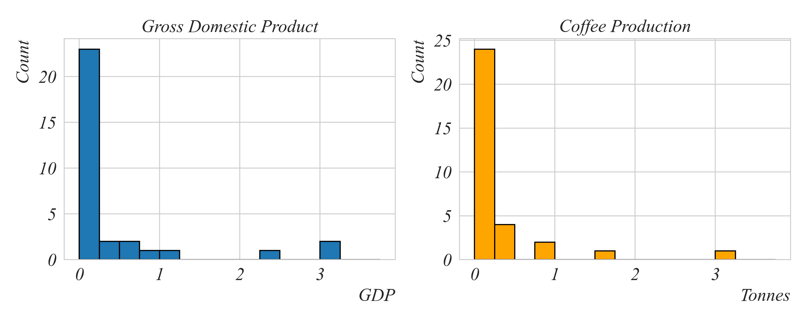

But maybe we want to understand the relationships between the variables. A line graph can plot one variable against the other but isn't going to work in this case. Line graphs are used to measure relationships between individual points, which is not what we're trying to do here. 

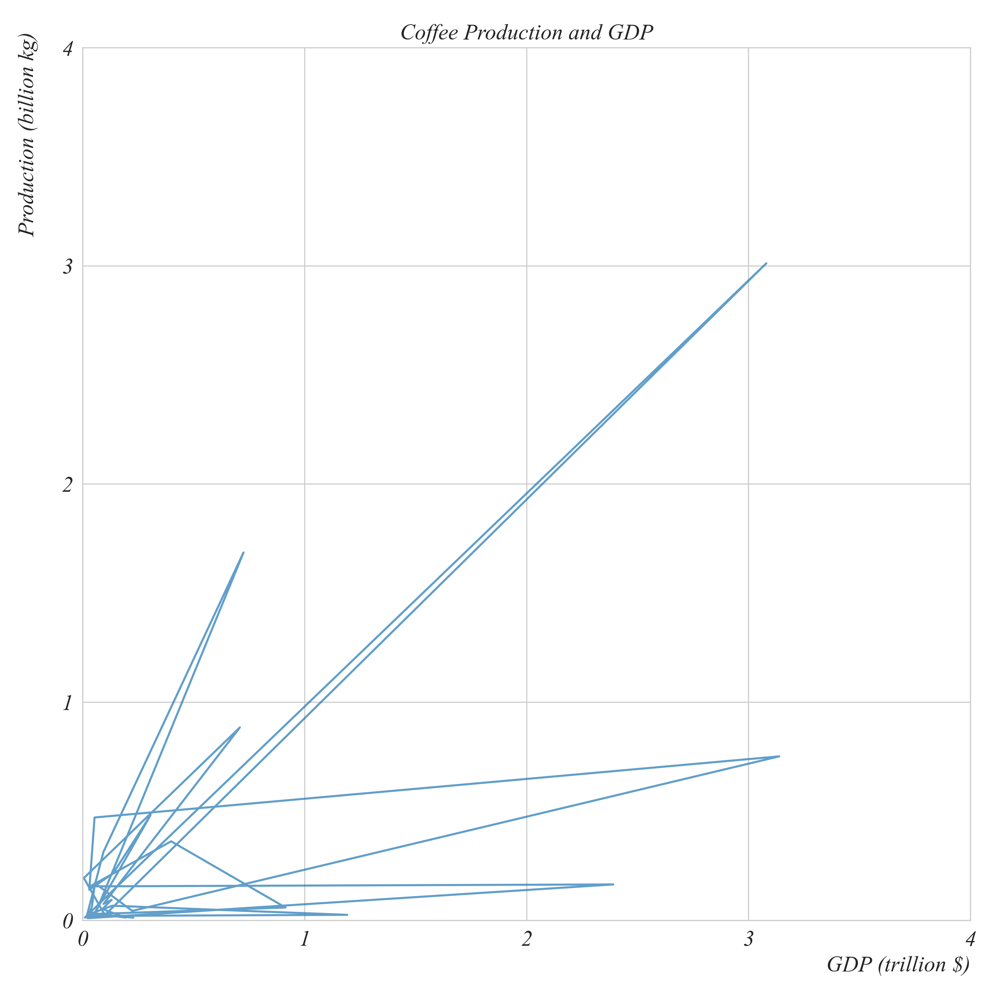

We want to measure a systematic relationship between the two variables not the individual points. A scatter plot allows us to explore the systematic relationship between two variables. Here we can use coffee production and GDP with a scatter plot to show the relationship between the two variables. 

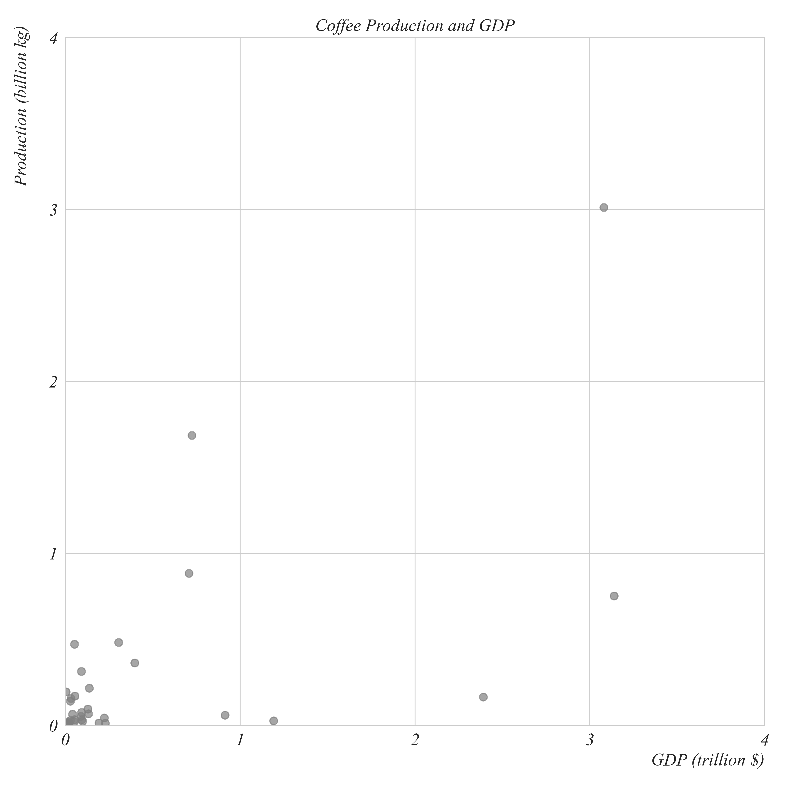

First, lets see what it can tell us about each of the variables individually. Which countries have a GDP above 2 trillion USD? The four highlighted countries — India, Brazil, Mexico, and Indonesia — have a GDP larger than 2.5 trillion USD. This can be seen from their position along the GDP axis.

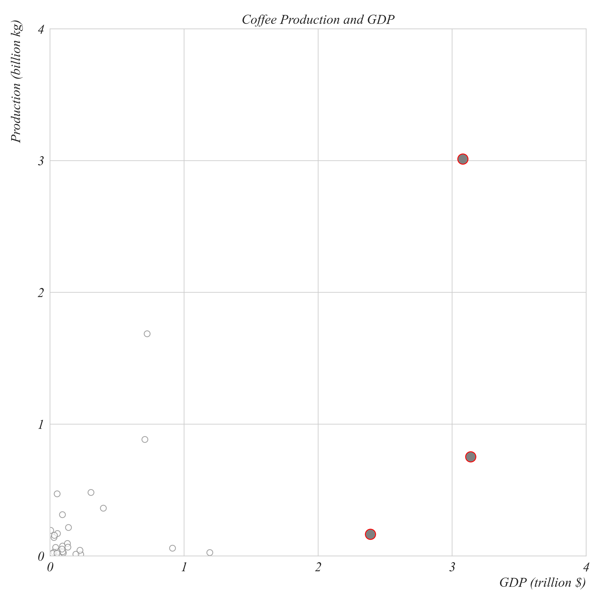

In our scatter plot, the more to the right a country is, the larger its GDP, and the more to the top, the larger its coffee production. Which points represent an production greater than 0.5 Billion kg per year? Brazil, Colombia, Indonesia, and Vietnam. These are not the same countries as those with high GDP. The vertical axis tells us different information than the horizontal axis, which is the main point of scatter plots.

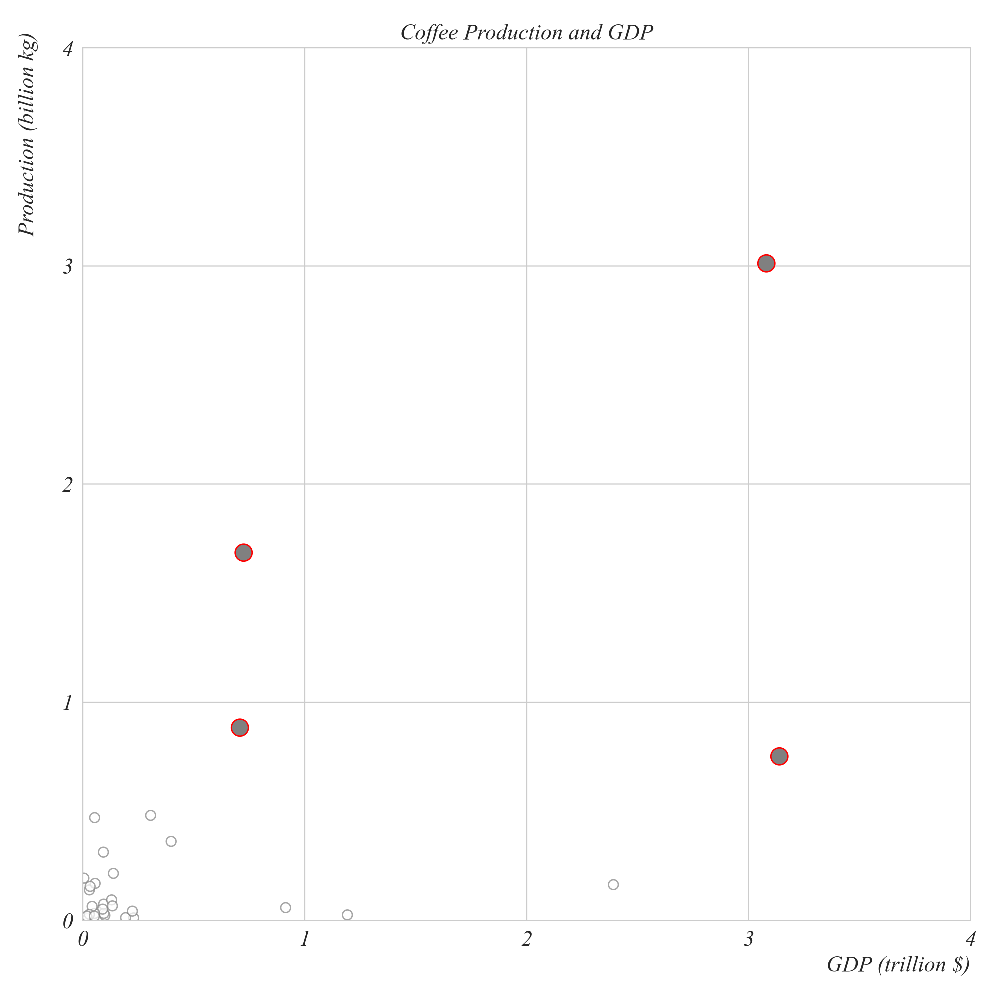

With this view we can examine relationships *between* the two variables. Let's consider a subset of coffee producers. I've drawn a line between the origin and Brazil's point. Any country *on* the red line would produce exactly as much coffee per dollar of GDP as the largest coffee producer — Brazil. Which countries produce **less** coffee per dollar of GDP than Brazil?

Countries below the red line produce less coffee per dollar of GDP than Brazil, and countries above the red line produce more coffee per dollar of GDP than Brazil.

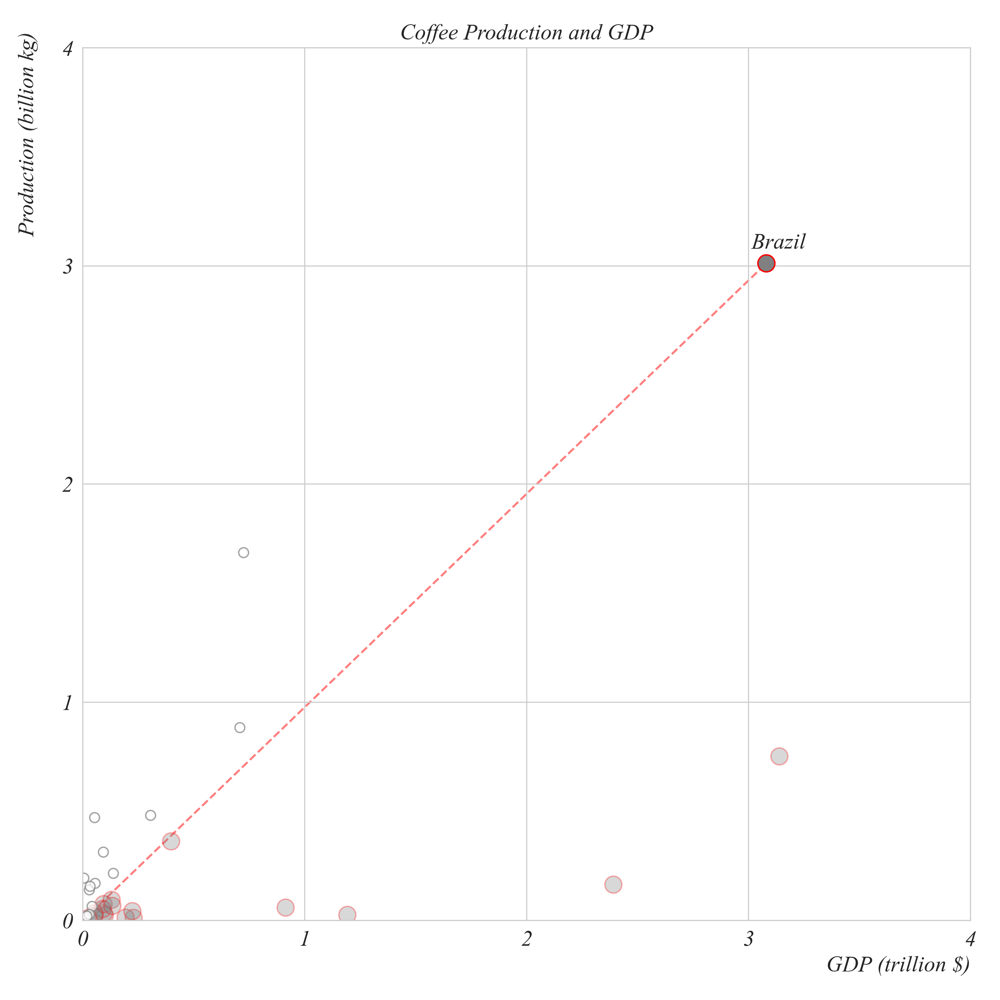

What generalization can you make from this chart? It seems that larger GDP and coffee production tend to go hand in hand, but the plot isn’t clear. Lets transform the data to get a clearer picture.

### Adjusting The Axes

Our scatter plot provided some insights into the GDP — coffee production relationship for a handful of countries, but we're still seeking a clear overall pattern. Let’s look at the GDPs of four countries: Brazil, Malawi, Cameroon, and Thailand.

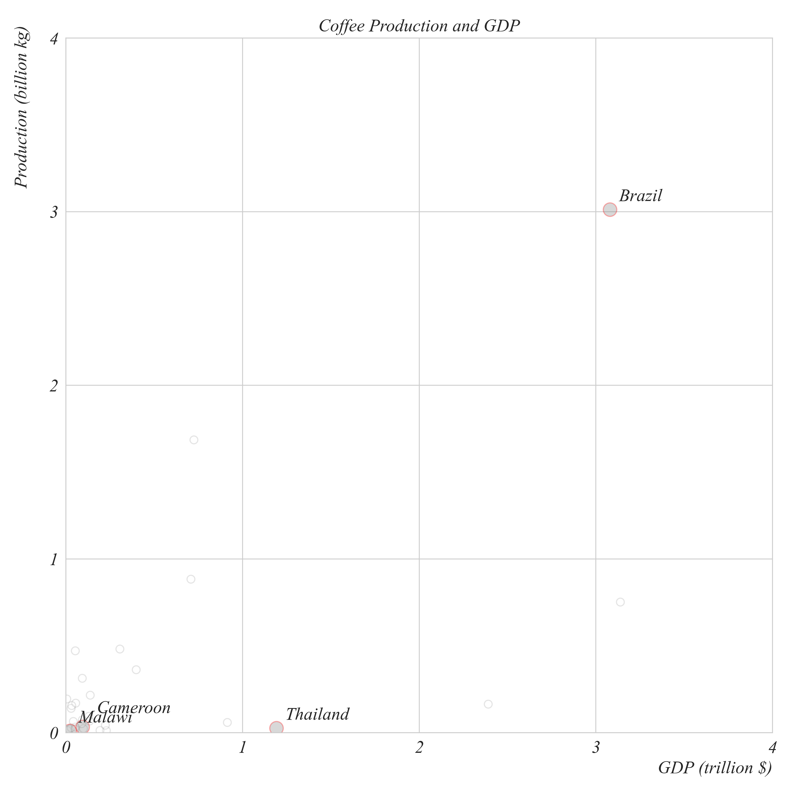

The GDPs of which pair differ by a larger amount?

- Brazil and Thailand
- Cameroon and Malawi

By comparing their position on the *x*-axis, we can see that the GDPs of Brazil and Thailand differ by almost 2 trillion dollars. The difference between Malawi and Cameroon is very small on this plot. So, the first difference is much bigger. Now consider the ratios of GDPs: Brazil's to Thailand's, and Cameroon's to Malawi's. Which ratio is larger?

In our scatter plot, each unit on the *x*-axis represents the same difference between GDPs. This means that Malawi and Cameroon are placed almost on top of each other, while there’s a large empty space between Thailand and Brazil. To make the plot less crowded, we’ll transform it so that each unit on the *x*-axis represents the same **ratio** between GDPs, using a **logarithmic** scale.

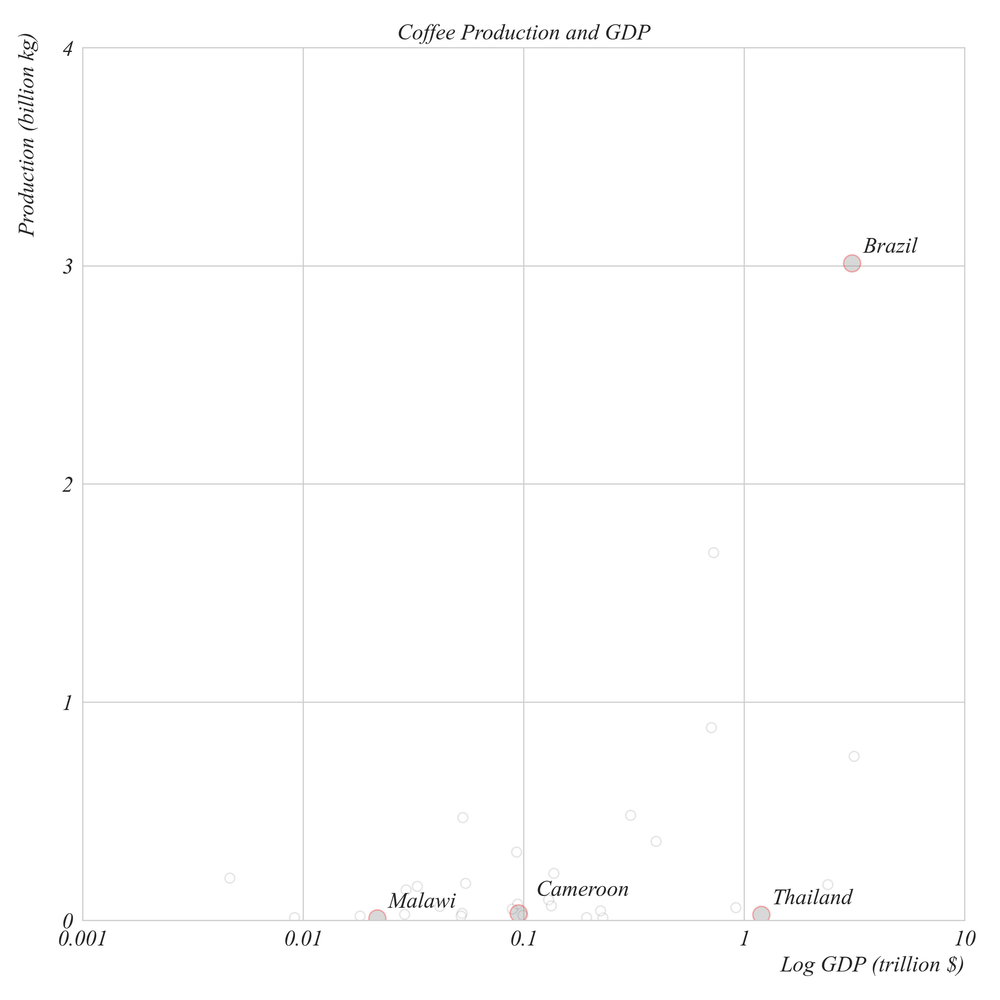

On a **linear scale**, each unit corresponds to adding the same amount. On a **logarithmic scale**, each unit corresponds to multiplying by the same amount.

A base-10 **logarithm** tells us how many times we need to multiply 10 to get another number. For example, it takes 3 multiplications to get 1000 from 10, so log⁡(1000) = 3. A base-10 logarithm gives us roughly the number of digits in a number, or its order of magnitude. 

Thanks to the logarithmic *x*-axis, we can clearly see the GDPs of all four countries. Excluding Brazil, which of these countries produced the largest amount of coffee? 

All three countries are very close to the same horizontal line, so it’s difficult to tell visually. To answer this question, we need to adjust the plot. We can perform this same ratio-scaling operation, adjusting the vertical axis from linear to logarithmic. 

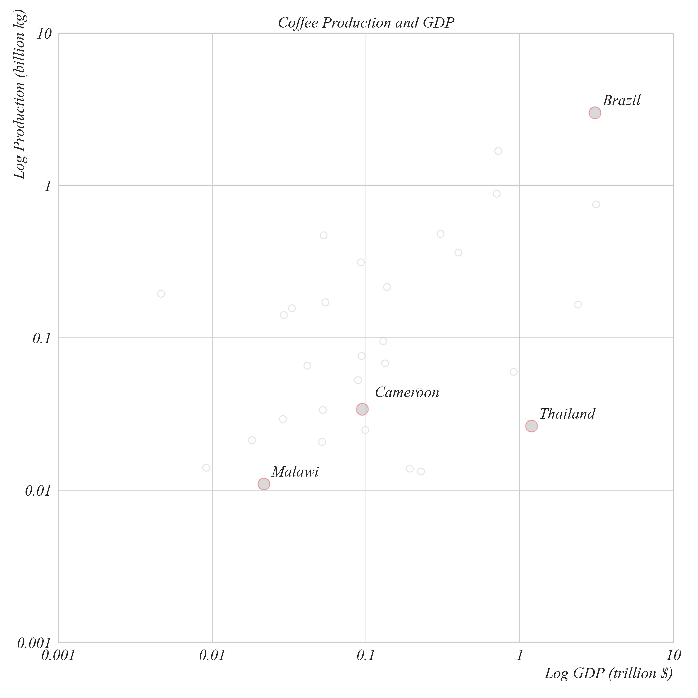

Which of these three countries produced the largest amount of coffee? By changing the *y*-axis from linear to logarithmic it's much easier to see that Cameroon produced more coffee than both Malawi and Thailand.

Now we’re ready to explore the relationship between coffee production and GDP.

### Coffee Production vs. GDP

The new tool — logarithmic scales — will help us describe the relationship between coffee production and GDP. The original data presented in a **log-log scale** makes it much easier to see general relationships between coffee production and the GDP. 

In the log-log plot we can see that in general, countries with larger GDP tend to produce more coffee, and vice versa. On the whole, larger GDP indicates larger coffee production. But is it always true?

Let's zoom in on one of the world's regions. How might we focus on countries in the Americas? We can do this by filtering by region. Here we've filtered for countries in the Americas.

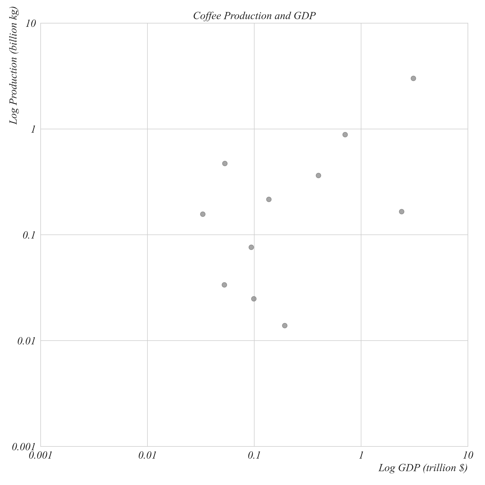

The log-log scatter plot of American coffee producers will let us understand how production levels differ for American countries with similar GDPs. We can find the country in the Americas that produces the most coffee. 

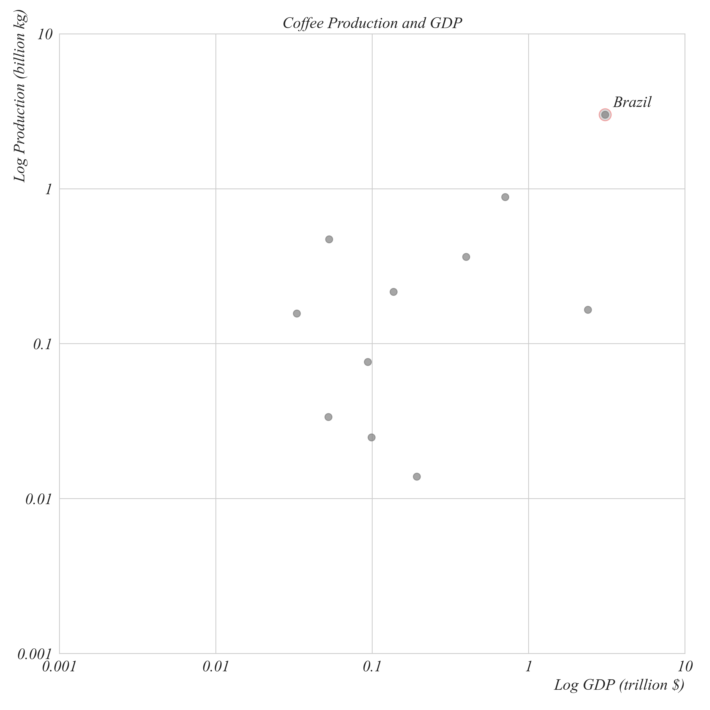

Brazil is the highest along the *y*-axis than any other coffee producer in the Americas, so its production is the largest. Which country's GDP is clostest to Brazil's?

If we draw a vertical line through Brazil, Mexio will come closest to it, which means it is the country with the most similar GDP to Brazil.

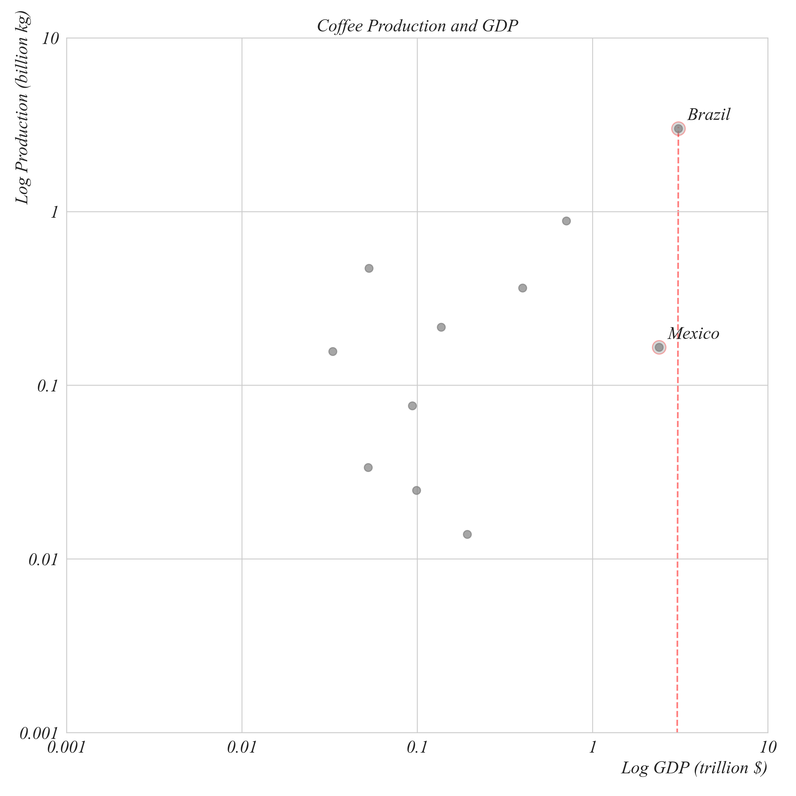

What can we conclude from the plot? Although countries with higher GDPs tend to produce more coffee, this relationship isn’t a rule. For example, two countries with similar GDPs — Brazil and Mexico — have a production ratio of 10. We could see it clearly thanks to logarithmic axes.

### Scatterplots in Panel

The world seems to be drinking more coffee than ever. But does the data on coffee consumption confirm this? This data contains coffee consumption in kilograms per capita of 34 coffee importers over the span of two decades. **Per capita** refers to a value averaged over the number of people. It's equivalent to 'per person'. Here's the dataset. 

Let's plot the histogram of country's coffee consumption for 1999.

This figure shows coffee consumption with a bin of 1kg. How did the consumption change between 1999 and 2019? To start the investigation, we can add 2019 coffee consumption per capita to this histogram.

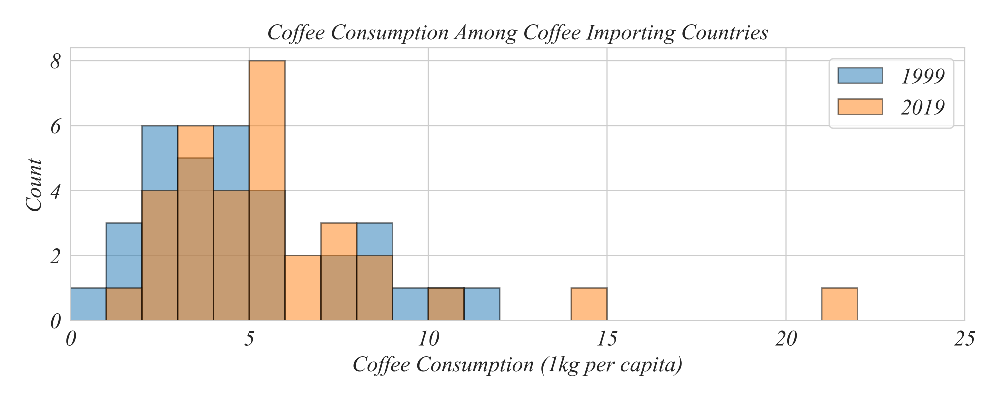

What can we conclude from the histograms? 

- Some countries increased their per capita coffee consumption. 
- No country exceeded 20 kg per capita in 1999, and one country exceeded 20 kg per capita in 2019. 
- We don’t know which country is represented by which bar, some countries might have decreased their coffee consumption, although we can’t say for sure.

What was the most common range of coffee consumption per capita in 2019? 

- Between 5 kg and 6 kg. The tallest bar covers values between 5 kg and 6 kg, which makes it the most common range.
- The **mode** is the most common value (or values) in a dataset.
- In a continuous distribution, it's likely that no values repeat. In this case, we approximate the mode with the histogram’s tallest bar.

Which year was the mode a higher coffee consumption?

- In 1999, the mode was between 4 kg and 5 kg. In 2019, the mode was between 4 kg and 5 kg. So, the mode was larger in 2019.

- The mode consumption per capita increased.

Would you say that between 1999 and 2019, people started drinking more coffee?

- It depends on what we mean by ‘people started drinking more coffee’. 

Are we talking about the mean? The median? The mode?

- The histograms suggest a general increase in coffee consumption. 
- In 2019, two large values appeared and the two smallest disappeared, while the two tallest bars didn’t change much.

### Boxplots

The histograms showed that the per capita coffee consumption increased from 1999 to 2019 — but what happened in between? A visualization type useful for comparing multiple distributions is a **box and whisker plot**, or **boxplot**. The dataset shows the coffee consumption in every year, 1999 for example. The boxplot can represent the same data by summarizing it. 

Lets examine what each part of the boxplot corresponds to and what it tells us about the data. To aid our discussion, I'm adding in the countries scattered across the horizontal. Each point corresponds to a country and their coffee consumption on the horizontal. The vertical axis is 'jittered' to make it easy to see countries which are clumped together. This type of approach can be helpful when visualizing a distribution of one variable. 

Boxplots visually summarize the data — but their real power lies in the ease of comparisons between distributions. Next, we’ll use boxplots to analyze the changes in coffee consumption between 1999 and 2019.

### Comparing Boxplots

Now that we understand what boxplots represent, we'll analyze coffee consumption data in smaller time increments. Each boxplot represents data from a single year. For convenience, we'll use vertical boxplots.

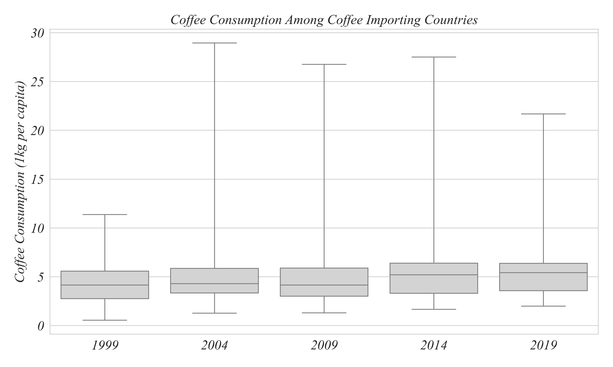

Based on the boxplots, when did the typical coffee consumption (median) increase the most? 

Between 2009 and 2014. The median consumption per capita — represented by the middle line in the box — stayed just below 5 kg until 2009, and then increased to above 5 kg.

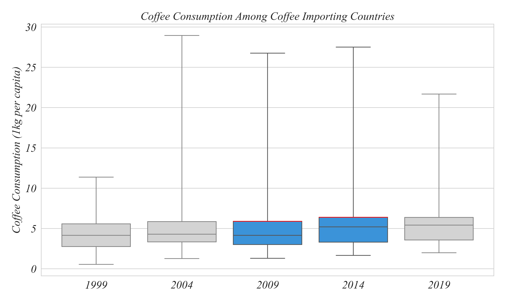

The boxplots show that median consumption was more or less stable between 1999 and 2009, and then suddenly shifted by over 1 kg per capita. This would be much harder to notice by comparing five histograms.

What happened between **all** the visualized years in the box plot? The minimum consumption increased.

In each barplot, the minimum consumption is slightly larger than in the previous barplot. The pattern of maximum consumption isn’t as clear. 

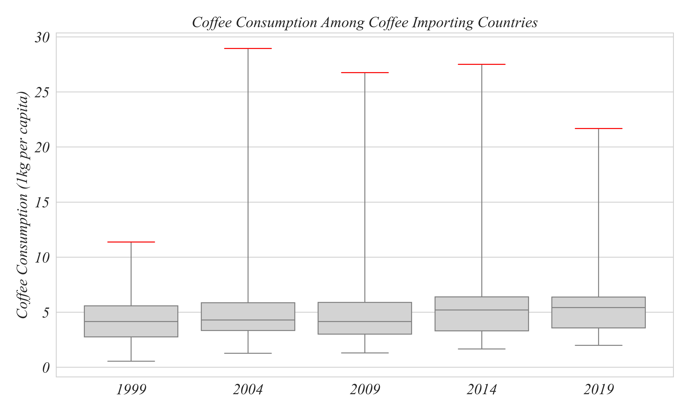

For example, it increased between 1999 and 2004 but decreased between 2004 and 2009. The typical consumption hovered around 5 kg per person, so let’s explore this value in more detail. 

Which years show **at least** half of the countries consuming **less** than 5 kg of coffee per capita?

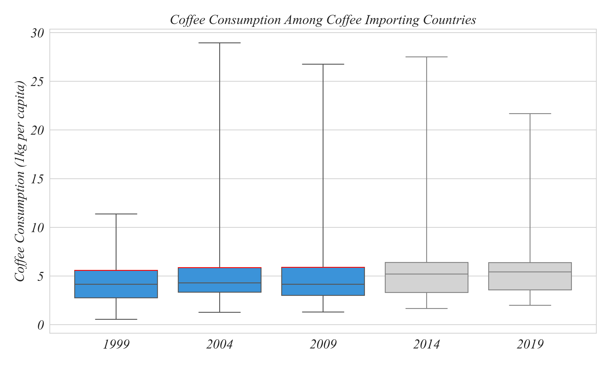

In each boxplot, half of the countries consume more than the median, and half less than the median. In 1999, 2004, and 2009, the median was smaller than 5 kg, so at least half of the countries consumed less than 5 kg per capita.

In which years are **more** than 25% of the countries consuming **less** than 5 kg of coffee per capita?

In all five years, *Q*1 was smaller than 5 kg, so more than 25% of the countries consumed less than 5 kg.

Which year has the greatest range of consumption values?

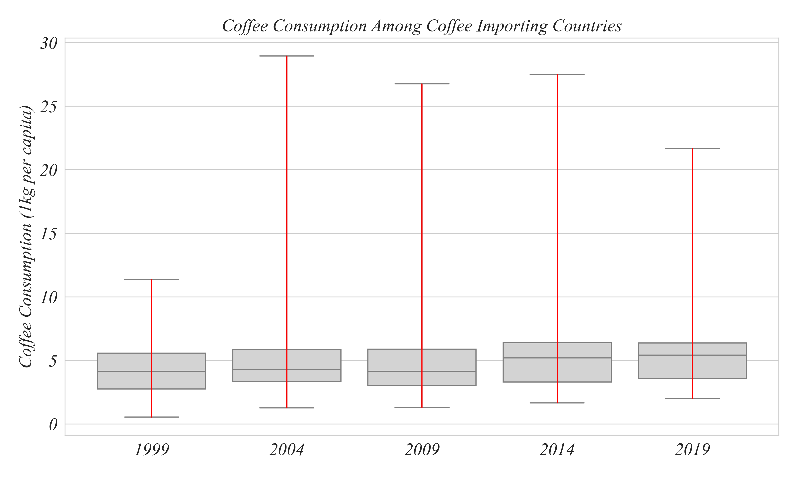

The minimum consumption didn't differ much between years. The maximum consumption, however, was the largest in 2004, which makes the range of values the largest that year.

Thanks to boxplots, we saw that while coffee consumption increased between 1999 and 2019, the increase wasn't uniform over the years.

### Scatterplot Changes

When aggregating data like this we can see what's going on overall. But we also might want to get a better view of individual changes. We've seen that coffee consumption has gone up overall, but does that mean all contries have increased their coffee consumption during these years? We don't have the right view to answer that question yet.

Before exploring time series data, we're going to go back to our trusty scatter plot. We have multiple years to examine, which gives us the ability to explore the relationship between coffee consumption in each country between any two years. Let's focus on 1999 and 2019. 

NEED TO WRITE OUT

### Scatterplots and Timeseries Relationships

### Coffee vs. Oil

Next, we’ll compare coffee prices with the prices of another commodity: oil. A **commodity** is a product that can be traded or sold, such as coffee or oil.

Coffee and oil prices depend on many factors, from transportation costs to geopolitical events to economic conditions. Let’s see how the prices of these two commodities relate to each other.

To focus on the bigger picture, we’ll consider the average yearly prices of coffee (in US dollars per pound) and crude oil (in US dollars per cubic meter).

We can see that oil is much more expensive in these units. We can see this because the crude oil line is consistently higher the coffee line, indicating a higher unit price.

What can be inferred about the two time series? It's difficult to tell. The unit of oil is always much more expensive than the unit of coffee making the variations in coffee prices negligible when compared to oil prices. So, we can't use this graph to analyze the patterns of coffee prices.

Because the values of the two time series differ in orders of magnitude, the previous graph didn't show the comparatively small variations in coffee prices. We can fix this graph by adding a separate *y*-axis.

Most of the time, when the price of oil increased, so did the price of coffee, and vice versa. Which years did oil and coffee prices move in **opposite** directions?

In 2001 coffee decreased and oil increased. In 2002, 2003, and 2004, both prices increased. In 2005 oil increased and coffee decreased. ....

This is one way of understanding the relationships between prices. But we've already talked about another one: we can think of each year's price as a separate point in a scatter plot.

The line graph shows that in general, lower coffee prices corresponded to lower oil prices. This is reflected in the scatter plot.

What do you think is true?

- Coffee price determines oil price.
- Oil price determines coffee price.
- Coffee and oil prices are related.

Coffee prices could impact oil prices, oil prices could impact coffee prices, they both could be influenced by a different, unknown process, or their graphs could look similar by chance.

We need to be careful with drawing too many conclusions from the data! We'll talk about how we might disentangle correlation from causation later in the semester.  But we always need to be careful.

Next, we’ll look closer at seasonal changes in coffee prices.

### Excel Exercise

We'll look at 1999 and 2019. The data needs to be adjacent. So to do this we'll create a new sheet, copy over all the day, and delete the data we don't want. We have to be careful with the label. If we accidentally select the title, because it's a number, it will add it as a point. So only select the data.

Then go to insert, insert scatter plot, and it should be good. Add a title. We want to be a little careful with which axis is which. So we can go to "Select Data" and make sure we know which column is the x and which is the y. 

That's about it. But we might want to be careful with logs. This one doesn't matter so much, but many data examples will be best with logs. So lets create a log version. We can use the excel function

`=LOG(CELL, BASE)`

Then we can plot this one with a scatter.