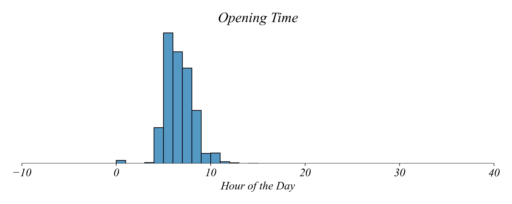
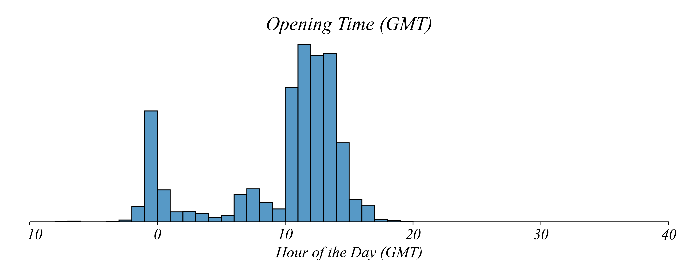

## Part 1.4 | Transformations

### Real Coffee Prices

Last time we talked about timeseries and the price of coffee. Coffee shop owners are always interested in the price of coffee in the future. We saw that **line graphs** are great tools for showing **trends** in a squence of data. We used a linegraph to see that the price of coffee in 2021 had an increasing trend. 


Then we zoomed out all the way to 2000 to see if the trend over the last 25 years is also increasing. 


This line graph represents daily coffee prices in US dollars per pound recorded from 2001 to 2025. This showed us some longer term trends. We saw that while there was an upward trend in 2021, the overall trend was much weaker. This longer interval makes it possible to see shorter subtrends within the larger trend. But not every trend was positive. We used this longer view and highlighted the subintervals with negative trends in price.


The trend is negative when the prices generally fall over a given period. We can see that parts of the time series have negative trends even while the overall trend of the time series is positive. Lets zoom out even futher, going back to the 70s. 


What do you notice about this figure? First, we might recognize that the upward trend in prices looks somewhat specific to the period after 2000. Prices seem to vary, as shown by the positive and negative subtrends, but the decadeslong trend in prices looks relatively flat. Second, we can see that we're comparing prices in 1970's dollars to prices in 2020's dollars, which doesn't give us a consistent price level. So while this long term figure gives us a long term view, this isn't particularly useful in helping us understand how prices have evolved since the 1970s.

Lets plot the value of a 1970 dollar over this period. 


This makes it very clear how a dollar today is worth much less than a dollar in 1970. A dollar in 1970 is worth almost 8 dollars today. This means the nominal price of coffee in the 1970s is not comparable to the nominal price of coffee in the 2020s. We can resolve this issue using what we call a **data transformation**. To adjust for inflation, we divide the value of today's dollar yesterday by the price yesterday. This is what we call the real price. 


The real price tells a very different picture than the nomainal price. Prices of coffee were falling between the 1970s and the 1990s but have remained relatively stable since 2000. 

### Excel Exercise 1.4 | Real Coffee Prices

Lets visualize the real price of coffee between the 1970s and today using the dataset `Coffee_Prices_CPI.csv`.

This dataset has a column `date`, which gives us a formatted date for the recorded price in the column `price`. There's a column `cpi` showing the consumer price index for that year. If you're a macroeconomist you may be familiar with CPI conversions. But I've made your life easy by giving you a column `today` which gives us the value of a dollar today in the given year. So the first row shows us that today's dollar would have been worth about 14 cents in 1973. 

To get the real price at any given year, all we need to do is divide the nominal price `price` by the value of a dollar in that year `today` giving us a column of real prices we can call `real`.

Then to visualize these real prices all we have to do is select the column, go up to Insert, click on the Line option, and select the simple option. This will give us a figure we can then style, label, and save. 

### Python Exercise 1.4 | Real Coffee Prices

We can perform the same operations in python. Except that instead of needing to write down the step, perform it ourselves by clicking around in Excel, we can just write down the steps in code for a computer to perform on our behalf.

To do this we'll simply open the notebook, import our packages, and load the data. Then we can simply construct a new column from two existing columns like we did in Excel:

```python
data['real'] = data['price'] / data['today']
```

Then we'll plot this using Seaborn. The syntax may be familiar at this point. We tell Seaborn to use the lineplot using data with `real` on the y axis and `date` on the x axis.

```
sns.lineplot(data, x='date', y='price')
```

### Percent Change in Coffee Prices

Use an elasticity to measure how prices change. 

### Global Location Openings

Starbucks doesn't just think about the price of coffee. With cafes on six continents, there is always someone having their morning coffee at Starbucks. Starbucks has a massive operation to make sure their shops are able to open every morning. They need all the building for the shop, the utilities to be on, the staff to be on site, and the computer servers to be up and running. This is a huge undertaking and requires considerable resources. Starbucks is very interested in the resource load these shop openings have throughout the world on their infrastructure. And we can use Starbucks shop openings to give us a picture of when the global workforce is coming online. We might wonder how many Starbucks cafes are openning at any given hour of the day. 

We can notice from the dataset that we have a column for the shop ID, another for the country, and another called `open`, which tells us the time the shop opens. Lets create a histogram of the open times for the shops in the dataset.



What do we notice about opening times? We can see some shops open at midnight, shown by the count at 0. We also see that most shops open between 5 AM and 7 AM, with a few opening even after 10.

On a given day, is the cafe with the earliest opening time the first to open? No. A cafe opening at 5 AM in East Asia will still have opened before a cafe in Europe that opens at 5 AM. 

To find how many Starbucks open at any hour, lets convert opening and closing times to a common timezone. The most common universal time zone is called Greenwich Mean Time (GMT), which tells us the time of day for the coffee shop when it's midnight in Greenwich UK. This GMT adjustment is called `GMT` in the dataset. 

What time is it in GMT when a cafe opens in Canada (GMT - 7) at 8 AM? To convert from local time to GMT we subtract the time difference. The timezone for a location in Canada is GMT - 7, so we must subtract negative 7 hours from the opening time: `8 − ( − 7 GMT) = 15`.

This tells us that when the Canadian Starbucks is a midnight local time, it's 7 AM in Greenwich. So then when it's 8 AM at this Canadian Starbucks, it's 15 hours, or 3 PM in Greenwich. 

Lets perform a transformation to convert local opening times to GMT. All we have to do is subtracting `GMT` from `open`, creating `OpenGMT`. Doing this gives us a histogram of opening times in GMT. 



What does this histogram communicate to us? First, it tells us that many Starbucks shops open later in the day, Greenwich time. This makes some sense. Many Starbucks shops are in the US. Even the locations that open very early in their local time will have opened later in the day in European time. Second, we see something strange. There's a large collection of opening times that are negative. 

How should we interpret an opening time of - 1 hours? The cafe opens 1 hour before midnight GMT. But 1 hour before midnight is also 23 hours *after* midnight. 

What do we do here? Well for example, lets take the -1 hours and turn them into 23 hours. We can do this systematically by simply subtracting 24 from all negative values, creating a column `OpenGMTNorm`. This turns `OpenGMT` into a measure of 'hours after midnight'. This is a histogram of those times.


This gives us a consistent measure of the opening times for Starbucks locations worldwide. We no longer need to worry about timezones. 

What does this tell us? First, we can see a small bump during morning hours in the UK. But it's not a large bump. Second, the largest bump starts in the late morning UK time. This is the morning rush in North America. Third, as morning begins over the Pacific we see very few Starbucks are opening. This makes sense, since the Pacific is not nearly as populated as North America. Laslty, we can see another spike as morning hits Asia. And it looks like the Asian spike is actually much larger than the European spike. 

### Excel Exercise 1.4 | Global Location Openings


### Python Exercise 1.4 | Global Location Openings
