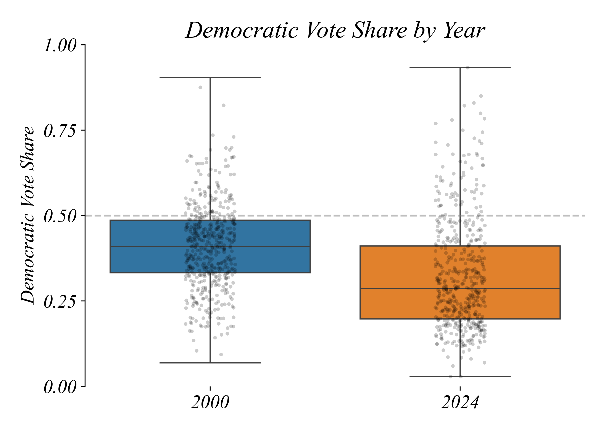
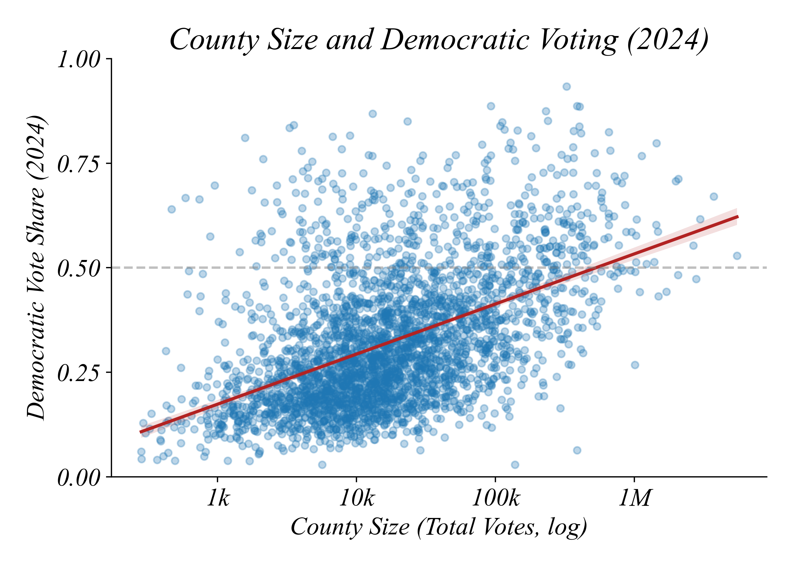

## Part 2.3 | Bivariate Relationships by Category

### A Research Question

Has American politics become more divided along economic lines? Do wealthy and poor counties vote differently now than they did twenty years ago?

This is the kind of question you might explore in a final project. It requires combining data from multiple sources and using tools from across the course. Let's work through it step by step.

### The Data

We have two datasets:

**Dataset 1: Income by County**
- Median household income for each U.S. county (from the Census)

**Dataset 2: Elections by County**
- Democratic vote share for each county in presidential elections
- Multiple years: 2000, 2004, ..., 2024
- Includes total votes cast (a proxy for county size)

Each dataset can answer certain questions on its own. But the most interesting questions require both.

### Question 1: Has County-Level Voting Changed?

Let's start with a simple question: has the overall distribution of county-level voting changed between 2000 and 2024?

This is a Part 2.2 question — a numerical variable (Democratic share) compared across categories (year). A boxplot is the right tool.

```python
sns.boxplot(data=data_long, x='Year', y='dem_share')
```



Counties shifted Republican on average. The median dropped from about 41% to 29% Democratic. That's a dramatic shift.

But wait — if counties shifted this much toward Republicans, why were recent elections still close? Something doesn't add up.

### Question 2: Do Large Counties Vote Differently?

The key insight: counties aren't equal in population. There are thousands of small rural counties and only hundreds of large urban ones. If we count each county equally (as the boxplot does), small counties dominate.

Let's check: do larger counties vote differently than smaller ones?

```python
data['log_votes'] = np.log(data['total_votes_2024'])
sns.lmplot(data=data, x='log_votes', y='dem_share')
```



Yes. Larger counties vote much more Democratic. The correlation is 0.49 — quite strong. This explains the paradox: small rural counties (numerous but small) shifted Republican, while large urban counties (fewer but populous) lean Democratic. The county average moved right, but most *people* live in places that vote Democratic.

### Question 3: Is This Related to Income?

Large counties tend to be richer. Is the Democratic lean about size, or about income?

```python
data['log_income'] = np.log(data['income'])
sns.lmplot(data=data, x='log_income', y='dem_share')
```


Richer counties also vote more Democratic (correlation: 0.25). This fits what you hear in the news about wealthy suburbs shifting toward Democrats.

But here's the puzzle: this relationship feels new. Did wealthy counties always vote Democratic?

### Question 4: Has the Relationship Changed?

To answer this, we need to see both years at once. This requires a new tool: **scatter by category**.

```python
sns.lmplot(data=data_long, x='log_income', y='dem_share', hue='Year')
```


Now we see the full story. In 2000, the relationship between income and Democratic voting was slightly *negative* (correlation: -0.11) — richer counties leaned slightly Republican. By 2024, the relationship is *positive* (correlation: +0.25) — richer counties now vote much more Democratic.

The relationship completely flipped. This is economic realignment.

### The Insight

Each question built on the previous:

- **Q1** showed *that* counties shifted Republican on average
- **Q2** explained the paradox: large counties vote Democratic
- **Q3** connected size to income: richer counties vote Democratic
- **Q4** revealed the change: this relationship flipped since 2000

Poor rural counties (numerous but small) shifted Republican. Rich urban counties (fewer but larger) shifted Democratic. The county-level average moved right, but the underlying pattern completely reversed.

### Merging Datasets

To answer Q2-Q4, we needed data from multiple sources: income from the Census, elections from election returns. We combined them using a **merge**:

```python
data = pd.merge(income, elections, on='county_fips')
```

The merge matches 3,106 of ~3,200 counties — about 97% success. Some counties don't match because of different coding schemes or missing data. This is typical when combining real-world datasets from different sources. For our analysis, 97% coverage is excellent.

### The Workflow

Let's step back and see what we did:

1. **Q1 (Part 2.2):** Boxplot by year — counties shifted Republican
2. **Q2 (Part 2.1):** Scatter of size vs. voting — large counties vote Democratic
3. **Q3 (Part 2.1):** Scatter of income vs. voting — richer counties vote Democratic
4. **Q4 (Part 2.3):** Scatter by category — the relationship flipped

This is a template for final projects. Start with simpler questions, build understanding layer by layer, then reveal deeper patterns.

### Summary

- **Part 2.1 tools** (scatter) show relationships between two numerical variables
- **Part 2.2 tools** (boxplot) show how a numerical variable differs by category
- **Part 2.3 tools** (scatter by category) show how a *relationship* differs by category
- **Merging** combines datasets when your question requires variables from both
- **The best insights** often come from building questions that connect to each other
