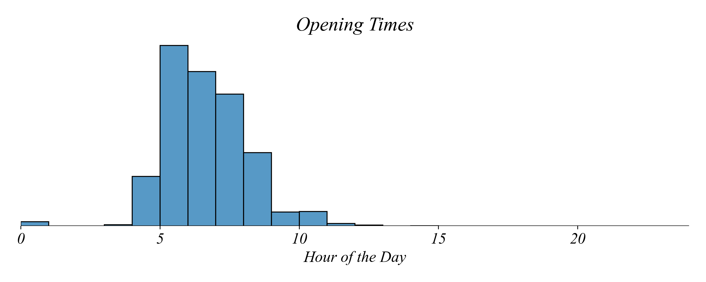

## Part 2.3 | Filtering Data

When opening a new cafe, one of the many decisions to make is which hours it should operate. Lets consider a new location in upstate New York, near the border of Canada. When should the shop open? And how long should it stay open?

The operating hours of existing cafes can help inform this decision. 

#### Categorical Filters

Just looking at the table, what opperating hours are the most common? As usual, tables aren't easy to summarize.Instead, lets set up a histogram. 

Plotting opening time, it's easier to see that the most common opening time is 5AM.

*Does this mean that 5 AM is the best time for us to open?* No necessarily. Some locations may operate in areas that might not need the same hours of opperation. Upstate New York is very different from New York City. And locations in the US are very different than those in other areas of the world. So using a reference group that contains many different kinds of locations might lead us in the wrong direction. 

We can select subsets of the locations by **filtering** our dataset, using **logical expressions** — statements that are either true or false. Only rows which satisfy the condition are kept in the dataset.

Lets start by selecting locations that are in the US. This will let us explore whether there is something specific to US locations. 

Once we've filtered for US locations, it seems the distribution has shifted earlier. The US seems to have earlier opening times than the global average. This could be for a number of reasons, one of which is some error with the way times are written in the data. But it could be that other countries have different waking patterns that the US. 

#### Combining Filters

Filters can be used on their own or can be combined to look at subsets of subsets of the data. Logical expressions are combined using logical operators like AND and OR. The idea here is that the condition is being applied to each location. This is the idea you may know from Venn Diagrams. 

Let's use a logical operator to see cafes from both the US and Canada in one histogram.

If a cafe is in Canada but not the US, we would say that it's in the US or Canada. If we wanted to return records that meet *both* conditions at the same time, we would look for locations that are in the US *and* Canada. You check whether the location satisfies the condition. Since cafes can't be in both countries at the same time, no rows are returned.

We can also use a negative to see the opening times for locations in countries that are not CA or the US.

### Excel Exercise 2.3 | Categorical Filters

The first thing to do is to turn this data into a table. Select the data by hitting Command-D on Mac or maybe Control-D on Windows. This should select all the data. Then hit Control-T to create a table. Since you've already selected the data, it's already selected in the table window, so just hit create. 

The first thing to do is translate the time into an hour. **Tables** are super nice. We just need to right click to create a new column. Excel sometimes has control issues, so you'll need to create the column to the left of the time columns for some reason. When working with Excel tables, it automatically applies your work to all cells in the column. Apply to one cell using the following:

`=HOUR(cell)`

Then rename the column `OPENING HOUR`. Then do the same thing for `CLOSING HOUR`. We can create duration by taking the difference between the columns. 

To create a **histogram** of opening times, all we need to do is select the column, then insert our histogram. We'll need to change the bins to make it look nice. Give it a nice title. Then double click on the table and go to **"Add Chart Element"**, add a Primary Horizontal Axis Title, maybe called Time of Day.

We can save this figure by right clicking on the upper corners of the figure and selecting **"Save as Picture"**. I would urge you to create a folder titled "In Class Figures" in your Data folder. Then maybe call this figure "Starbucks_Opening_Times_All.png".

Then we want to filter data. Excel tables make this nice. All we have to do is click on the column we wish to filter and choose filter options. 

To select only the locations in the US, choose `countryCode`, filer as `Equals`, then enter US. We automatically see the table update. This takes away the rows for locations that aren't in the US, which also hides our table. To fix this we'll create a new Sheet, call it Figures, and copy and paste our figure there. We have to unfilter our data to do this. But once we're done we can move it over, then refilter our data. Save this figure as maybe "Starbucks_Opening_Times_US.png"

We can also use multiple filters. Lets filter on the US and Canada. We go in, filter on the US, and hit enter. This filters the data and brings up another option for filtering. If we choose equals and CA and hit enter, we get no entries. This is because the automatic filtering option is AND, which means we're selecting all the locations that are in both the US and Canada, which is zero. So we have to switch from AND to OR. Going back to the figure, we can retitle it and save it as "Starbucks_Opening_Times_US_CA.png".

Now we want to create a figure showing opening times for all countries not in the US or Canada. Lets go into the `countryCode` column and clear filters to start over. We can choose to filter on `Does not equal` and enter US. This is all the locations not in the US. What might we do next?

We should also choose "Does not equal" and enter CA. But do we use AND or OR?

If we choose OR like last time, it will give us all the locations that are not in the US OR not in Canada. So if a location is in Canada it will definitely not be in the US, so will be included. 

But if we use AND, then it's saying that it must not be in the US and also not in Canada. This is all the locations outside both the US and Canada, which is what we're looking for.

### Python Exercise 2.3 | Categorical Filters

Filtering is very similar in python. Except instead of clicking on things like we did in Excel, we write out the logic in code. As always, this can be a little tricky to remember, but it makes it easy to keep track of what we've done and rerun our steps later.

How would you write a logical expression that keeps only the locations that are inside the US? We would use COUNTRY_CODE = US. 

COUNTRY_CODE==US OR COUNTRY_CODE==CA returns records that meet either one of those conditions, which is what we want. 

If we wanted to return records that meet *both* conditions at the same time, we would use COUNTRY_CODE==US AND COUNTRY_CODE==CA. AND tells us all records that meet both conditions. 

#### Filter by Inequality

In addition to opening time, cafes also need to decide how long to stay open every day. The dataset includes how long each store is open in addition to when it opens. Lets plot duration as a histogram. 

*What do you think the median operating duration is?* Although it's a little difficult to see it the median in this type of figure, the median duration — the middle value — is 14 hours a day.

*Does this mean our new location should stay open for 14 hours a day?* Maybe. But like before, we're using all the data. We might want to filter for locations that are similar to ours. We know a few things about our location now. First, we're in the US near Canada. Second, we open before 7 AM. Lets start by filtering on the second condition.

Just like we filtered on categories, we can filter the data is using inequalities, allowing us to see if shops that open earlier tend to stay open longer. Unlike filtering on categories, filtering on inequalities uses logical expressions based on **inequalities** like < (less than) or ≥ (greater than or equal to). Each of these relationships functions similar to the English language definition.

| Symbol | Meaning                  |
| ------ | ------------------------ |
| =      | Equal to                 |
| $\neq$ | Not equal to             |
| >      | Greater than             |
| $\geq$ | Greater than or equal to |
| <      | Less than                |
| $\leq$ | Less than or equal to    |

Suppose we want all of the cafes that open at 7 AM or later. *How might we construct a logical fiter to select these cafes?* Filter on `open` less than 7! This would keep cafes that open before than 7 AM. 

*Is there a difference in the operating hours of stores that open at 7 AM or later vs. stores that open earlier?* It seems like it. This filter shows us stores that open before 7 AM. They tend to stay open for around 15 hours a day. Stores that open later tend to have shorter hours than a typical Starbucks cafe.

We can also filter for locations that open at 7 AM or later, which tend to stay open 13 hours a day — fewer hours than the early opening shops.

#### Combining Categorical and Inequality Filters

We can also combine a filter on opening time with other filters to explore the operating hours of other particular segments. This figure shows the duration of shops opening before 7 AM in the US and Canada.

### Excel Exercise 2.3 | Inequality Filters

### Python Exercise 2.3 | Inequality Filters