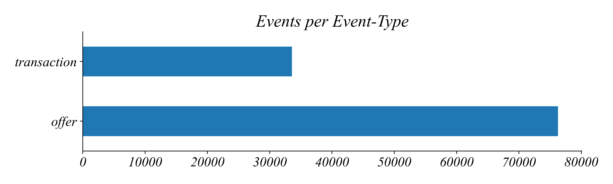
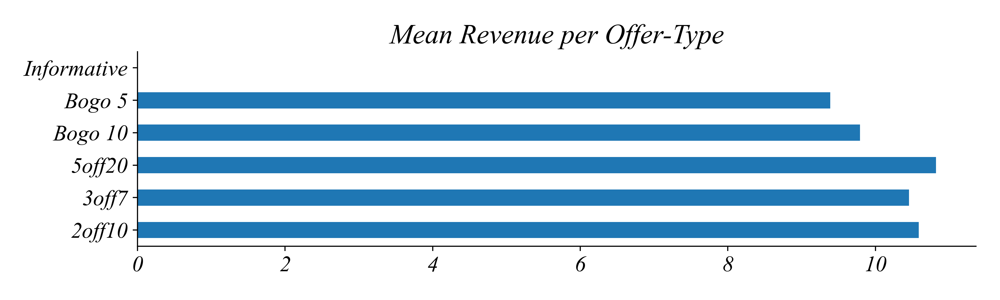
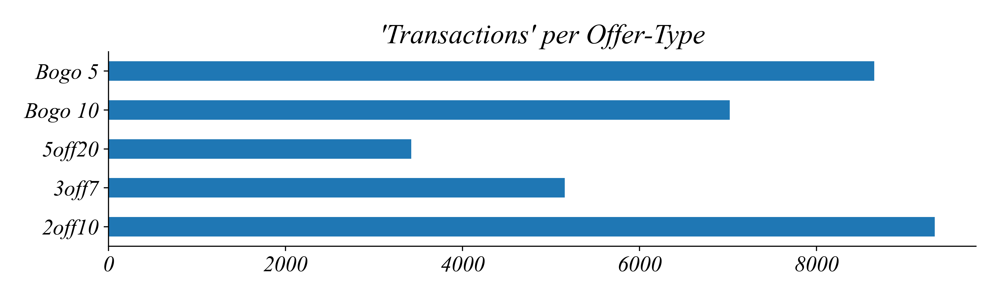
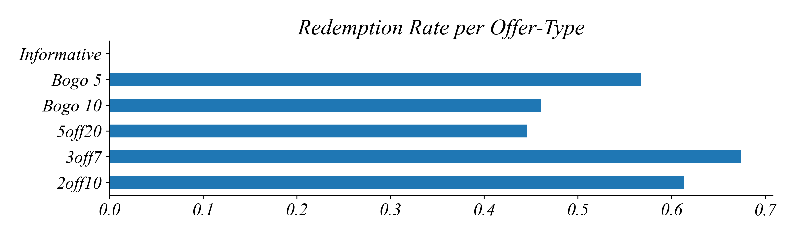

## Part 2.4 Grouping

One of the basic ideas in economics is that people respond to incentives. Like many restaurants and retailers, Starbucks offers a variety of incentives to help entice customers to change their behavior. Every time you make a purchase, unless you're using cash, Starbucks will keep track of you and your decisions. If you use a promo code, Starbucks knows what you've bought in the past, and that you're using the promo now. Starbucks preserves a record of every time a customer uses an offer so they can determine which offers are most effective at changing behavior. We're going to use this data to examine which of their promos changes behavior the most. 

*How can they tell which promotions are working?* This table contains a record of every time an offer has been sent to a customer (an “Offer”) or used for a purchase (a “Transaction”). 

*Can you tell from the table which offer types are most effective?* Clearly not. As is typical for large datasets, the dataset itself can give a nice picture of what's in the data, but it's very difficult to get a sense of the data and the relationships in the data without doing something else. 

*What should we do here to try to understand which offers have been sent?* Well we could count up the offers sent and then make a bar chart of counts by `Offer ID`! 

*Does this tell us which offers were most effective?* Not directly. It tells us which offers were sent, but we want to understand something meaningful about how effective the offers were when they were sent. 

*What's a way we could measure how much revenue each offer brings in?* Lets add up the revenue by `Offer ID`. Here is a more useful-looking table and figure of total revenue from each promotion. 

*How did we get this from the original table?* I made this table from the original data by **grouping** rows by their Offer ID, and **summing** the revenues. Every good data analysis program has this functionality. Notice that our grouped table has 5 rows, corresponding to the 5 different Offer IDs. But that’s not the only column we can group by.

*How many rows would you expect if we group by `Event`?* We get one for every cateogy in the column. There are only two rows, because there are only two types of values in `Event`

*How much revenue do you think is brought in for each of these two Event-Types?* Here’s what we get when we group by `Event` and then sum up the revenue in each group. The sum value for 'offer' is 0 because there is no revenue from these values. 

#### Grouping and Filtering

*Now we have an idea of how grouping works, how might we use the data to find out which offer has changed behavior the most?* We saw earlier that of all Starbucks' offers, *2off10* brought in the most revenue in total. 

*But does this mean that 2off10 is the most effective?* Not necessarily. It might be that Starbucks sent out way more of this offer. It turns out '2off10' is sent out way more often than '5off20' and '3off7'.

*How might we compare revenue by offers according to how often they were sent out?* Lets find the average revenue by Offer-Type! When we group by Offer ID and take the mean we get surprisingly small numbers. 

*How can the average spend be only 8.81 for the offer "5 off when you spend 20”?* Should the spending be at least 20? We forgot to remove the Offer rows! All the Offer rows in the table had a revenue of 0. 

*How should we fix this problem?* Lets filter for only Transaction rows then find the mean. We can see now that *5off20* brings in the most Revenue per Transaction. 

*Do you think that means it is the most effective offer?* It depends what we mean by effective. You have to spend at least $20 to unlock this offer, so it’s not surprising that the average spend is high. 

*How would we measure which offer changed behavior the most?* Even though Mean Revenue by Offer Type is useful, I would want to know which offer would be most likely to be used upon being sent. In other words, what is the Redeption Rate by Offer Type? I want to know how likely the offer is to be used once it's sent. 

#### Grouping, Filtering, and Transforming

*Mechanically, how would we go about finding the Redemption Rate?* All we need is the number of Transactions divided by the number of Offers. To start, lets filter for Transactions, then group by `Offer ID`, then count. 

Then we can do the same thing for all the offers sent out: filter for 'Offer', group by `Offer ID`, then count. 

Then all we need to do is divide the number of Transactions per Offer-Type by the number of Offers per Offer-Type.

#### Conclusions

As usual, our question informs our analysis. The main question we might be interested in are which offer changes behavior the most. We can either look at behavior as whether the buyer used the offer or how much they spent when the used the offer. 

If we look at how much revenue would we expect each offer type to bring in, according to 'Mean Revenue per Offer-Type', it looks like *5off20* is the most effective by this metric. However, at $5 per transaction it's fairly expensive for Starbucks. 

Instead, if we look at how likely is the buyer to purchase something with the offer, according to 'Redemption Rate per Offer-Type', *5off20* doesn't look so good on this metric — less than half of the *5off20* offers sent to customers are ever used.

If we look at both together:

- *2off10* ranks second on both metrics, while *3off7* is best for Transactions per Offer and third best for Revenue per Offer.

- *3off7* and *2off10* do a similar job of bringing in customers and revenue. But the cost of offering these discounts for the cafe is not the same.

Which would you recommend as the most cost effective offer?

*2off10* is a smaller discount than *3off7* both in dollars ($2 vs. $3) and as a percentage of the sale (20% vs. 43%)

