## Part 2 | Probability and Statistics

#### Making an Estimate

Whether you love or hate televised sports, it is a great way to see probability in action. Let's look at an example. Two friends are watching a soccer match in a bar.

Friend A has never watched soccer before and knows nothing about the teams. Friend A knows nothing about either team, so she has no way to tell which is more likely to win. 

***Q. What probability might Friend A place on the Red team winning?***

***A. It makes sense for her to give each team a 50% chance.***

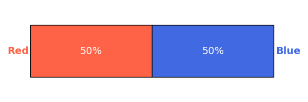


Friend B has heard that the team in blue is the current European champion and has a higher world ranking, while the team in red is missing several key players. 

***Q. How might Friend B estimate the change of winning for both teams? There are a wide range of possible answers.***

***A. Friend B should give a higher probability of the blue team winning than the red team — though we don't have enough information to say how much higher.***


The bartender is also watching the game. He knows one thing that the other two don’t: The game being shown is a recording — the actual match finished a few hours ago and the red team won. The bartender knows that the red team won, so for him the probability of the red team winning is 100%.


All three viewers can estimate how likely each outcome is, and all of their estimates make sense based on the information that they have.

***Probability*** lets us estimate the likelihood of an event based on the information available to us.

#### Adjusting Estimates

The bartender senses an opportunity. He offers a $100 bet on the red team to win. 

***Q. When the bartender proposes the bet, should A's probability estimate change from 50/50?***

***A. Friend A knew nothing about the match before, but now she knows one thing — someone else thinks the red team will win. This should make her rate the red team's chances more highly than before.***

Whenever we make a probability estimate, we should be willing to change it based on new information that seems relevant. 

***Q. Should any of the following events change Friend A's probability estimates?***

- One team scoring a goal
- The TV broadcast going down
- A black cat walking into the bar

***A. A goal being scored could impact how likely one team is to win. The other two should have no impact on that likelihood.***

With five minutes left in the match, the red team is in the lead. B changes her estimate — she now thinks the red team is more likely to win.

***Q. Was B's original probability estimate wrong?***

***A. No, her estimate was correct at the time.***

We don't have enough information to say how good B's original prediction was. The outcome of the match cannot show which probability estimate was correct, but B is certainly right to update her estimate now that the situation has changed. 

*Whenever we gain new information, we should be willing to change our probability estimates.*

#### Simulating Outcomes

The match being replayed in the example was the 2023 Women’s World Cup Final. Spain, in red, defeated England, in blue, by 1 goal to 0. Statisticians examined their past matches and built models predicting that  Spain had a 47% chance of winning before the start of the game.

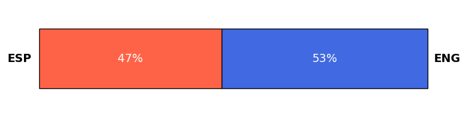

We can plot the predictions over the course of the game. In minute 10, Spains predicted changes of winning were about the same as at the start of the game. Nothing important happened for either team.

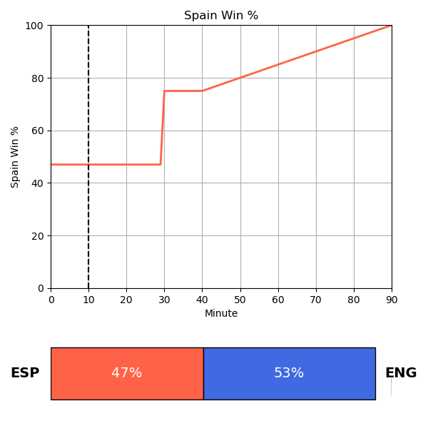

Then at minute 30 something happened. 

***Q. What do you think this might have been?!***

***A. Spain scored in the 29th minute, causing their win probability to jump from under 50% to over 75%.***


Then as the game went on, Spain's chances of winning slowly started to rise.

***Q. What happened that led to the slow rise in the prediction in favor of Spain?***

***A. England was behind and running out of time to catch up.***

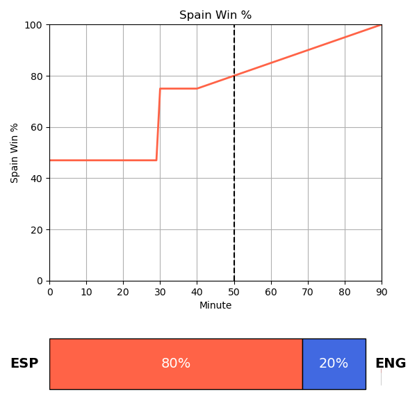

A model like this works by simulation. A computer program can simulate the game thousands of times to see how often each team ends up ahead.

***Q. If the simulation runs 1000 times and Spain wins 400 times, what is the probability of Spain winning the match?***

***A. 40%.***

The probability estimate is the percentage of simulations that produced a particular outcome.

Computer simulation is just one way to produce and update probability estimates — we'll return to it later. Next, we will see how past data, new information and simplifying assumptions can all help us to make predictions.

#### How many goals?

Soccer is a famously low-scoring game. Before spending 90 minutes watching a match, you might want to know how likely it is that one or both sides won't score any goals at all. 

This table shows the goals scored by each team in English Premier League matches from 2013 to 2023 (Gower (2023). Premier League Matches 1993–2023). 

Alvin (2022). English Premier League Results. Kaggle.

Evan Gower (2023). Premier League 2022-2023. Kaggle.

**Excel Exercise:** Filter the table to see the portion of games where the home team scored 0 goals. The home team scored 0 in 24.0% of games.

The home team doesn’t score at all in about 24% of games.

How often do they score just once? The home team scored 1 in 32.0% of games.

For this set of games:

- P(Home Goals = 0) = 0.24
- P(Home Goals = 1) = 0.32

What is the probability that the home team scores either 0 goals or 1 goal? If the home team scores 0 in 24% of games and 1 in 32% of games, they score 0 or 1 in 24 + 32 = 56% of games, so the probability is 0.56. Since a team can never score both 0 goals and 1 goal in the same match, we can just add these probabilities together and call the result:

P(Home Goals = 0 OR Home Goals = 1).

P(A or B) is the probability that only A happens, or only B happens, or both happen.


We can also find P(Home Goals = 0 OR Home Goals = 1) by filtering the data for matches where the home side scored 0 or 1 goals. Check your previous answer by filtering for 0 home goals or 1 home goal.

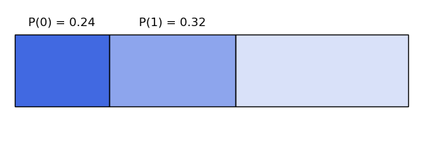

***A. No goals or one goal are scored by the home team in 56.0% of games.***

***Q. If the home team scores 0 goals or 1 goal in 56% of matches, in what percentage of matches do they score 2 or more goals?***

***A. If the home team does not score 0 goals or 1 goal they must score 2 or more goals.***

We subtract the 56% of matches where 0 goals or 1 goal goals were scored from 100% to find the percentage of matches in which 2 or more goals were scored. This gives us

$$
100\% − 56 = 44\%
$$
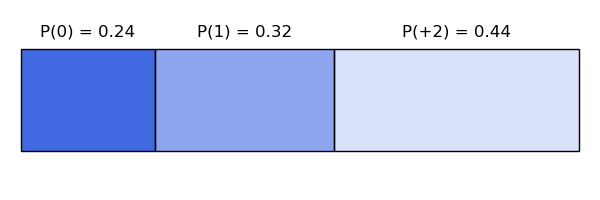

Since the number of goals scored has to be 0, 1 or “2 or more”, these three percentages must add to 100. Similarly, the probabilities P(0), P(1), and P(2+) must add to 1. We need to be careful though, because adding probabilities is not always this simple.

#### Away Goals

If our focus is on entertainment rather than the home team winning, then we should also pay attention to how many goals the away team scores.

**Excel Excercise:** Filter the data to see how often the away team scores 0 goals.

The away team scores 0 goals in 33% of matches. Now we know that the home team doesn’t score in 24% of games and the away side doesn’t score in 33%. If we add these two probabilities together, we get 57%. 

***Q. How often do you think at least one team doesn’t score?***

***A. Less than 57%.***

Let's visualize the probabilities to see why.

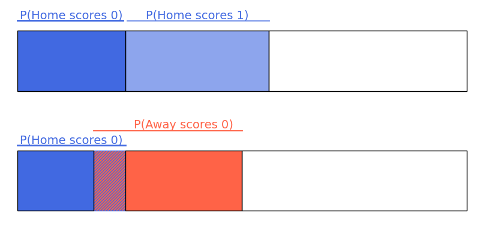

When two events can't happen together, like the home team scoring both 0 goals and 1 goal, the probabilities do not overlap. When two events **can** happen together, we can show this by overlapping the probability bars.

So one of these two diagrams best represents the probability of either or both teams scoring 0 goals in a match. Note that P(H0) represents the chance that the home team scores 0 goals, and P(A0) is the equivalent for the away team.

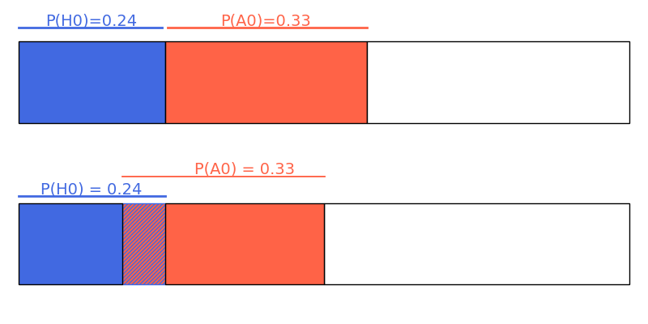

It is possible for both teams to score 0 goals in the same match. This is represented by the overlapping region of the diagram. 24% of matches see the home team score 0 and 33% see the away team score 0, but some of these **are the same matches**. Adding 24% to 33% would mean counting those matches twice.

The overlapping region of the diagram represents the probability of both teams scoring 0, P(Home Goals = 0 and Away Goals = 0). Find the proportion of matches where both teams score 0 goals.

Both teams score 0 in 7.0% of matches. These 7% are the matches we would count twice by adding 24% and 33% to get 57%.

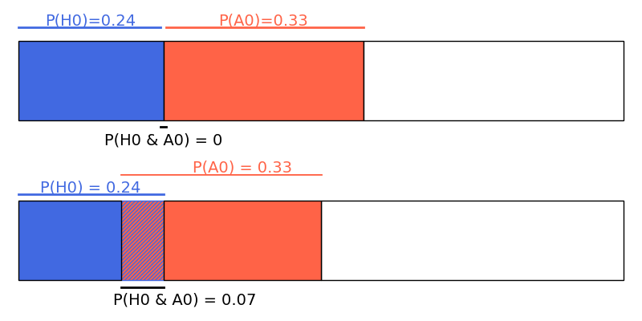

What is P(Home Goals = 0 or Away Goals = 0)? Adding P(Home Goals = 0)P(Home Goals = 0) to P(Away Goals = 0)P(Away Goals = 0) means counting the matches where both teams scored 00 twice.

By subtracting the 7% of matches where both teams score 0, we can count them only once.

There is a more general rule here.

- When two events can’t both happen, the probability of either happening P(A or B)=P(A)+P(B).
- When both could happen at once, we have to subtract that overlap region, so P(A or B)=P(A)+P(B)−P(A and B).


#### High-scoring games

It’s great that there’s only a 7% chance of seeing no goals in a game. But how likely are we to see 2 or more goals from either team?

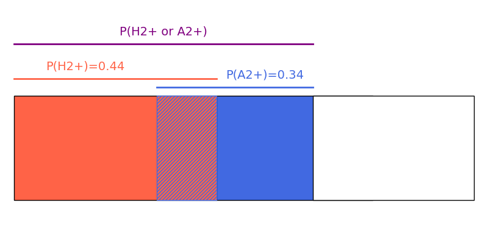

The probability of the home side scoring two or more goals is 0.44 and the probability of the away side scoring two or more goals is 0.34.

***Q. What is the probability that at least one team scores twice or more, P(A2+ OR H2+)?***

- 0.44+0.34=0.78

- Less than 0.78.

- More than 0.78.

The overlap region, P(H2+ and A2+) would be counted twice by adding 0.34 to 0.44. The actual answer must therefore be less than 0.78.


The probability of **both** sides scoring two or more goals is 0.13. 

***Q. What is P(Home: 2+ or Away: 2+), the probability of at least one team scoring 22 or more goals?***

To find the probability of at least one team scoring 2 or more goals, we add the probability of scoring 2 or more for each team, and subtract the probability of both teams scoring 2 or more.
$$
\begin{align*}
& P(H2+ or A2+) \\ 
= & P(H2+) + P(A2+) − P(H2+ AND A2+) \\
= & 0.44 + 0.34 − 0.13 = 0.65
\end{align*}
$$
We can use the relationship we saw between “AND” and “OR” probabilities to see that P(H2+ OR A2+)  should be 0.65. 

**Excel:** Let's check by filtering the data to see what percentage of games saw 2 or more goals for either team. At least one team scores 2 or more goals in 65.2% of matches. This suggests a probability of seeing two or more goals from at least one team of about 0.65.

Soccer may be low-scoring, but in around two thirds of games at least one team scores twice or more. And for people who feel that isn’t enough, there is always basketball.

#### Conditional Probability

Data shows the home team has a 45% chance of winning going into any English Premier League match. 

***Q. What do you think the chance is if the away team is leading at halftime?***

It is harder for the home team to win if the away team is leading at halftime, but it does sometimes happen.

**Excel.** Lets find the percentage of games where the away team is ahead at halftime, but the home team wins anyway. To do this, we'll filter:

```
HalfTime=AwayLead AND Result=HomeWin
```

The away team leads at halftime **and** the home team wins in 2.5% of games.

***Q. Does that mean the home team’s chances of winning are just 2.5% when they are behind at halftime?***

***A. The home team’s chances of winning are better than 2.5%.***

To see why, lets identify the regions which represent the away side leading at halftime AND the home side winning, and the away side leading at halftime AND the home side losing. 

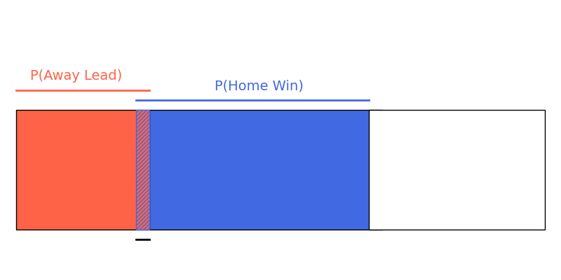

The overlap between “Away Lead” and “Home Win” represents the matches where the home team wins after trailing at halftime. The red and overlapping regions together represent the chance of the away team leading at halftime. The overlapping region is 2.5% is the proportion of **all matches**. But we're interested in how often does an away lead end up with a home win. So we can ignore all the games where the away team isn't leading at halftime.


We can find that the away side leads at halftime in 25.2% of games by filtering:

```
Away Lead AND Any
```

We know that:

- The away team leads at halftime in 25% of matches.
- The away team leads at halftime **and** the home team wins in 2.5% of matches.

This means that the home team can expect 2.5 wins for every 25 matches where the away team leads at halftime.

***Q. What is the probability of the home team winning if the away team is ahead at halftime?***

***A. 2.5 wins for every 25 matches corresponds to a probability of 2.5 / 25 = 0.10.***

10% is not a great chance of winning, but is much better than 2.5%.

This is called the **conditional probability**. We're finding the probability of an event within a subset of all events. Here the subset is games in which the away team is leading, and we're looking at probabillity the home team wins within this subset of games.
$$
P(\text{Home Win} | \text{Away Lead}) = \frac{P(\text{Home Win AND Away Lead)}}{P(\text{Away Lead})}
$$
We found P(Home Win AND Away Lead) = 2.5% and P(Away Lead) = 25% so we had P(Home Win | Away Lead) = 2.5 / 25 = 0.10. The symbol “|” is used to mean “given”. More generally:


$$
P(\text{A} | \text{B}) = \frac{P(\text{A AND B)}}{P(\text{B})}
$$
Do no memorize this. Understand why it's true. Once we're in the world of B, then how often does A happen. 

#### Excel Exercise: Tied At Halftime

Let’s see how much better the chances of a home win are when the scores are tied at halftime. 

First, we'll find the percentage of games that are a tie at halftime by filtering: 

```
HalfTime = Tie
```

The scores are tied at halftime in 40.6% of games.

Second, we'll find the percentage of games that are tied at halftime **and** end with a home win by filtering: 

```
HalfTime = Tie AND Result = Home Win
```

The scores are tied at halftime and the home team goes on to win in 14.9% of all games. We know that:

- 40.6% of all matches are a tie at halftime.
- 14.9% of all matches are a tie at halftime and end with a home win.

***Q. What is P(Home Win|Halftime Draw) — the probability of the home team winning, given they are tied at halftime?***

***A. The probability of a home win given a halftime tie, or P(Home Win|Halftime Draw), is the fraction of matches that end in a home win despite a halftime tie out of all matches that tie at halftime.***

P(Home Win|Halftime Draw) = P(Home Win AND Halftime Draw) / P(Halftime Draw) =14.9 / 40.6  = 0.37

A home win is much more likely when the home team is tied at halftime than if they are behind.

By applying the right filters it is possible to calculate the probability of any result from any given halftime situation.

***Q. What is P(Draw |Halftime Tie) — the probability of a draw given a tie at halftime?***

The probability of a draw given a halftime tie, or P(Draw | Halftime Tie), is the fraction of matches that tie at halftime and end in a draw out of all matches that tie at halftime.

By filtering:

- P(Halftime Tie) = 40.6%
- P(Draw AND Halftime Tie) = 14.2%

So P(Draw |Halftime Tie)  = 14.2 / 40.6 = 0.35. 

***Q. Find P(Away Win | Halftime Tie).***

The probability of an away win given a halftime tie, or P(Away Win | Halftime Tie), is the fraction of matches that tie at halftime and end in an away win of all matches that tie at halftime.

By filtering:

- P(halftime tie)=40.6%
- P( away win and halftime tie)=11.5%

So P(Away Win | Halftime Tie) = 11.5/40.6 = 0.28.

Here are the conditional probabilities we found:

- P(home win | halftime draw)=0.37
- P(draw | halftime draw)=0.35
- P(away win | halftime draw)=0.28

***Q. What is the sum of these three probabilities?***

***A. They sum to one: 0.37 + 0.35 + 0.28 = 1.***

It's no coincidence that these probabilities add to 1. If the score is tied at halftime, one of these outcomes has to happen.

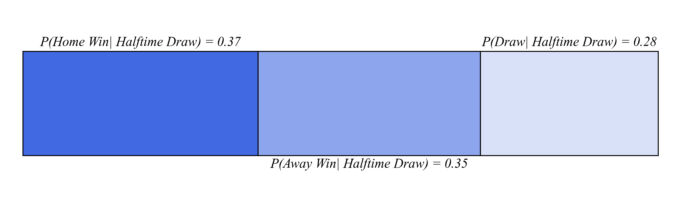

#### Red Cards

When a soccer team gets a red card, they must finish the game with ten instead of eleven players. 

***Q. Will a red card impact the result?***

Between 2013 and 2023, the home team won 45% of English Premier League matches, while the away team won 32%.

A **red card** is the most severe form of punishment in soccer. A player shown a red card must leave the field and the team has to finish the game with one player fewer. 

***Q. Which team do you think is more likely to win the game after someone on the home team receives a red card for foul play? How likely is the home team to win given they got at least one red card?***

Let’s see what the data says. The home team got a red card **and** won in 1.2% of games. They got a red card in 5.1% of games.

This means that P(Home Win | Home Red) = 1.2/5.1 = 0.24.

The information that the home team has received a red card decreases the probability of the home team winning from 0.45 to 0.24, and an away win is now more likely.

Let's look next at what happens when we know the home team **won't** get a red card.

How likely would the home team be to win if they did **not** get any red cards?

The home team received 0 red cards in 94.9% of games. They received 0 red cards **and** won in 43.8% of games.

P(Home Win | No Home Red) = P(Home Win AND No Home Red) / P(No Home Red) =  43.8 / 94.9 = 0.46

Before the game, the home team's probability of winning is 0.45, which rises to 0.46 if we know they won't get a red card, and drops to 0.24 if we know they will receive one.

Next we'll visualize this information to understand it better.

#### Probability Grids

If the home team gets a red card, they have a 0.24 chance of winning. If they don't get a red card, they have a 0.46 chance of winning. We can plot this using two bars: the top represents the probability of the home team's win and loss/draw after getting a red card, and the bottom represents the probability of **not** getting a red card. 

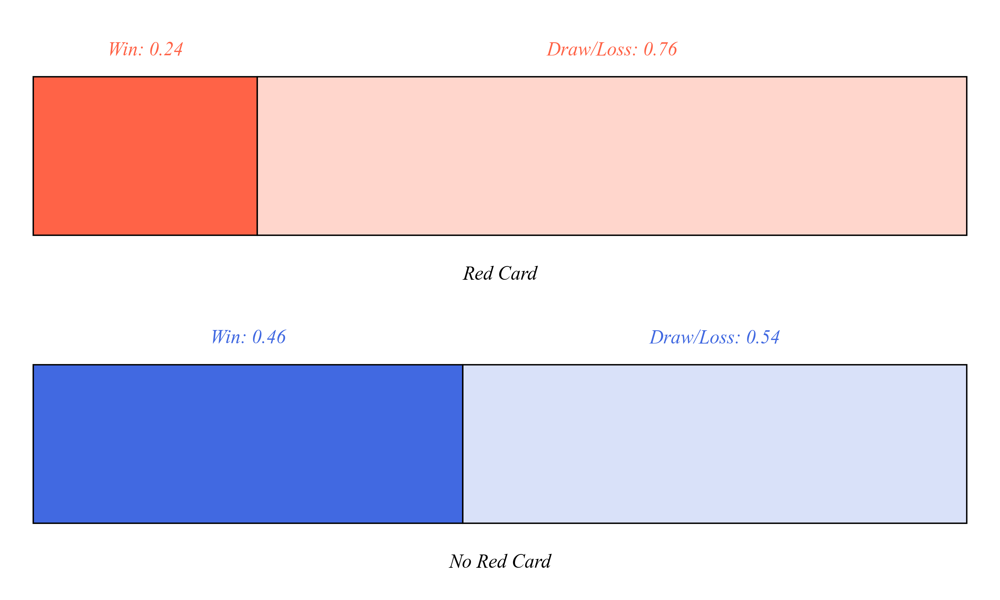

The probability of the home team winning is represented by the widths of the dark regions. The dark red region is 0.24 and of the dark blue region is 0.46. The two bars show four possible outcomes of the game:

- Home Red and Home Win
- Home Red and Home Draw/Loss
- No Home Red and Home Win, and
- No Home Red and Home Draw/Loss

We can combine these four possibilities into a **probability grid**. Since the probability of the home team getting a red card is 0.05, we adjust the width of the red bar to have a height of 0.05. 

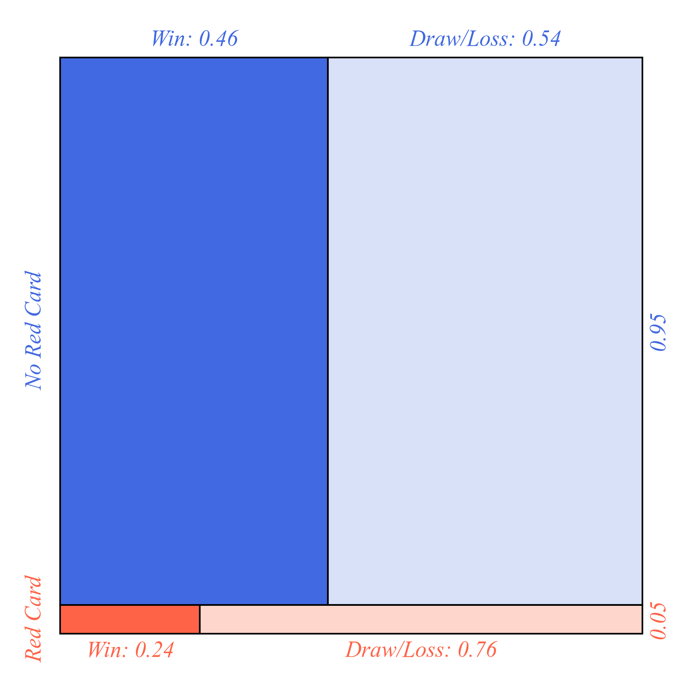

The full grid has an area of 1 and represents all possible outcomes of a game. The area of each rectangle represents the probability of each outcome. 

The dark red region represents the home team getting a red card and winning.

The light red region represents the home team getting a red card and losing.

The dark blue region represents the home team not getting a red card and winning. 

The light blue region represents the home team not getting a red card and losing. 

So dark represents winning and red represents red card.

***Q. What is the probability that the home team gets a red card and wins?***

We need to find the area corresponding to the home team getting a red card and winning the game. It's a rectangle, so we multiply its side lengths:

P(Home Red AND Home Win) = 0.05 ⋅ 0.24 = 0.012

***Q. Now how do we find the probability that the home team wins?***

The home team winning the game corresponds to dark red plus the dark blue areas. So to find the probability the home team wins we need to find the sum of the dark areas:

P(Home Win) = P(Home Red and Home Win) + P(No Home Red and Home Win) = 0.05 ⋅ 0.24 + 0.95 ⋅ 0.46 = 0.45

The **law of total probability** expresses the probability of an event as a sum of two distinct parts

P(A) = P(A AND B) + P(A AND NOT B)

Next, we'll use the law of total probability to see how the home team's probability of winning changes when a new player enters the game.

#### The Bad-Tempered Player

The manager would like to introduce a talented but bad-tempered player, who might lead the team to victory, but might also earn them a red card. Is it worth the gamble?

The bad-tempered player would increase the home team's probability of getting a red card to 0.15. If the team gets a red card, the probability of winning would remain 0.24, but otherwise, it would increase to 0.52. 

The probability of the home team getting a red card is equal to the width of the red region, so we need to adjust it to 0.15.

The probability of the home team winning a game after getting a red card is equal to the width of the dark blue region, so we need to adjust it to 0.52.

We adjust the grid to reflect that:

- P(Home Red) = 0.15
- P(Home Win | Home Red) = 0.24
- P(Home Win | No Home Red) = 0.52


***Q. With the new player, how likely is the home team to win?***

To find the probability of the home team winning, we need to compute the area of the two dark regions.

P(HomeWin) = 0.15 ⋅ 0.24 + 0.85 ⋅ 0.52 = 0.48

So even though the bad-tempered player would increase the probability of a red card, because they're so effective, they increase the probability of winning from 0.45 to 0.48.

#### The Captain and the Groundskeeper

The AFC Richmond soccer team is preparing for the next season. Based on last year’s results, Richmond's probability of winning the first game is 0.39. Before the opening game this year, the team’s captain predicts a win. 

***Q. What happens to the initial 0.39 estimate after the captain's prediction?***

***A. The change in the probability estimate will depend on the captain’s track record of predictions.***

It won't change only if the captain is really bad at predicting. The more we can rely on the new information (the captain’s prediction), the more we can increase our estimate of Richmond's probability of winning the game.

***Q. What if the captain predicted a win every time Richmond won? What does that mean in terms of probability?***

The captain correctly predicted all of Richmond wins. Every time the team won, the captain had predicted it. So we consider only the games where the team won, and ask whether the captain predicted it. 

P(Predicted Win ∣ Win) = 1

***Q. Does this give us confidence in the captain's predictions?*** 

We *still* need more information. It turns out that in the previous season, the captain had predicted a win for Richmond in *every* game. This means he correctly predicted all the wins:

P(Predicted Win | Win) = 1

But he also predicted a win every time:

P(Predicted Win) = 1

This means he predicted a win every time the team lost:

P(Predicted Win | Loss) = 1

***Q. How should we adjust the initial 0.39 estimate based on the captain’s prediction?***

***A. We should ignore the captain’s prediction. Since the captain is no more likely to predict a win when his team wins than he is in general, his prediction is useless and we should ignore it.***

Richmond's groundskeeper has also been making predictions. In the last season, he correctly predicted 40% of wins and predicted a win in 20% of all matches. This mean's the groundskeeper predicted Richmond's win in 20% of all matches:

P(Predicted Win) = 0.2

When Richmond won, the groundskeeper predicted a win in 40% of cases:

P(Predicted Win | Win) = 0.4

The groundskeeper is twice as likely to predict a victory when Richmond wins as he is in general. 

***Q. What should our prediction of Richmond's chances be if the groundskeeper thinks they will win?***

Since the groundskeeper is more likely to predict a victory in matches Fulham goes on to win, his prediction tells us that a win is more likely.

Next, we'll see how we can use this information to update our initial estimate.

#### Geometry of Predictions

The grid shows the probability of Richmond's winning the game before any predictions have been made. The red rectangle represents the probability of Richmond winning. The orange rectangle represents the probability of Richmond not winning. You can think of the grid as a being of size one, and we divide the area into parts that represent the respective probabilities. You can also think of the grid as made up of 100 small squares. The probabilities are the number of times out of 100 that an event will happen.

The probability of winning is the red area divided by the sum of the red and orange areas. 


Here's how the picture changes when we only look at matches where the groundskeeper predicted a win. Now that we have new information, the predictions change. Like we said before, in the last season, he correctly predicted 40% of wins and predicted a win in 20% of all matches. Here we've adjusted the red region to reflect the fact that of all the wins, he predicted 40/100 of them. So the dark red region represents the games where he correctly predicted a win. 

What happened to the ratio Red / (Red + Orange)?

The width of the orange rectangle decreased more than the width of the red rectangle, so the **ratio** increased.

***Q. What's the probability a game will be correctly predicted as a win? P(Predicted Win AND Win)***

This is the area of the red rectangle. One side of the red rectangle is still equal to P(Win) = 0.39, but the other side decreased to P(Predicted Win∣Win) = 0.40. 

***A. It's the probability the game will be a win times the probability it will be predicted as a win: $0.4 \cdot  0.39$ .***

The red region has shrunk to 0.40 times its original size since the groundskeeper correctly predicts 40% of wins. 

***Q. What about the other part of our ratio, that is, the sum of the red and orange regions?***

Before the groundskeeper's prediction, the red and orange regions had a total area of 1, as they represented all outcomes.

***Q. What do the combined red and orange regions represent now?***

***A. It's the probability of predicting a win given a win plus the probability of predicting a win given a loss. So their combined area is simply:*** P(Predicted Win)

We already knew that for the groundskeeper, P(Predicted Win) = 0.2. This means that:

- The red region is P(Predicted Win | Win) = 0.40 times its original size.
- The red and orange regions together are P(Predicted Win)=0.20 times their original size.

How has the ratio

red/ (red + orange) = P(Predicted Win∣Win) / P(Predicted Win)

changed?

In most games where Richmond wins, the groundskeeper does not correctly predict a win. 

***Q. Does this mean the groundskeeper's predictions aren't informative?***

***A. Not necessariliy.***


We need to change our probability prediction by a factor of

P(Predicted Win∣Win) / P(Predicted Win)=0.400/ 0.20=2.00

Before the groundskeeper's prediction, P(Win)=0.39.

Before the groundskeeper's prediction, P(Win)=0.39.

What is P(Win∣Predicted Win) if the groundskeeper predicts a win?

We know that P(Win)=0.39. So,

P(Win∣Predicted Win)

=2.00* P(Win)

=2.00* 0.39

=0.78

So, the groundskeeper's win prediction doubles our estimate of Fulham's chances from 0.39 to 0.78.

This generalizes to **Bayes’ theorem**.

**Bayes’ theorem** tells us how to update the initial probability of event A as we gather new information B:
$$
P(A∣B) = \frac{P(B∣A)}{P(B)} \cdot P(A)
$$
Next, we'll see whether a real analyst can do better than the groundskeeper.

#### Applying Bayes’ Theorem

Last season, Fulham's analyst correctly predicted 70% of their wins and predicted a win in 40% of all Fulham's games.

We know that P(Predicted Win∣Win)=0.70 and P(Predicted Win)=0.40. So,

P(Predicted Win∣Win)/P(Predicted Win)=0.70/0.40=1.75

Before any predictions, we can take P(Win)=0.39 for all games.

If the analyst predicts a win, how likely is Fulham's victory?

According to Bayes’ theorem,
$$
P(Win∣Predicted Win) = \frac{P(Predicted Win∣Win)}{P(Predicted Win)}⋅P(Win) = \frac{0.70}{0.40}⋅0.39=0.68
$$
The analyst's prediction increases our best estimate of Fulham's chances from 0.39 to 0.68 — a smaller effect than the groundskeeper's prediction.

Does that mean the groundskeeper is better at predictions than the analyst?

Right. We haven't looked at predictions of draws and losses yet.

If a good analyst predicts a loss or a draw, we should lower our expectations of P(Win) substantially.

What should we multiply our estimate of P(Win)=0.39 by when the analyst predicts a loss or a draw?
$$
\frac{P(Predicted Loss or Draw∣Win)}{P(Predicted Loss or Draw)}
$$

$$
\frac{P(Predicted Loss or Draw)}{P(Predicted Loss or Draw∣Win)}
$$

The first one.

If the new evidence (the analyst's loss or draw prediction) is less likely when Fulham wins than when they don't, we should lower our estimate of the probability of a win.

Recall that for the analyst,

- P(Predicted Win)=0.40
- P(Predicted Win∣Win)=0.70

The analyst predicts either a win or a lack of a win (a loss or a draw), so P(Predicted Win) and P(Predicted Loss or Draw) must add up to one. This means that:

$$\mathbb{P}\left(\text{Predicted Loss or Draw}\right) = 1.00−P(Predicted Win) = 1.00−0.40 = 0.60$$

This holds regardless of the game's result, so

$$\mathbb{P}\left(\text{Predicted Loss or Draw|Win}\right) = P(Predicted Loss or Draw∣Win) = 1.00−P(Predicted Win∣Win) = 1.00 − 0.70 = 0.30$$

We've found that:

- P(Win)=0.39
- P(Predicted Loss or Draw∣Win)=0.30
- P(Predicted Loss or Draw)=0.60

How likely would Fulham be to win if the analyst predicts a loss or a draw?

By Bayes’ theorem,

$$\mathbb{P}\left(\text{Win|Predicted Loss or Draw}\right) = \frac{P(Predicted Loss or Draw)}{P(Predicted Loss or Draw∣Win)}⋅P(Win) = \frac{0.60}{0.30}⋅0.39 = 0.20$$

Now let's do the same calculation for the groundskeeper. For him,

- P(Predicted Loss or Draw)=0.80, and
- P(Predicted Loss or Draw∣Win)=0.60

How likely would Fulham be to win if the groundskeeper predicts a loss or a draw?

By Bayes’ theorem,

$$P(Win∣Predicted Loss or Draw) = \frac{P(Predicted Loss or Draw∣Win)}{P(Predicted Loss or Draw)}⋅P(Win) = \frac{0.60}{0.80}⋅0.39 = 0.29$$

The groundskeeper's pessimistic approach makes his win predictions more reliable than the analyst's, but his loss or draw predictions are less reliable. Perhaps the analyst knows what she's doing after all.


#### Independent Events

Australian fans were so proud of their team when they reached the semifinals of the Women's World Cup. Would they stand a chance against their rivals?

Mart Jürisoo (2023). Women's International Football Results.

Australia faced England in the semifinal and would go on to face either Spain or Sweden if they reached the final. Analysts made the following predictions:

- P(AUS beats ENG)=0.43
- P(ESP beats SWE)=0.60


The grid represents the possible outcomes of the two semifinals.

***Q. Which region represents the chance of Australia and Spain meeting in the final?***

The dark regions represent Australia's win in the semifinal. The blue regions represent Spain's win in the second semifinal.

The event of Australia and Spain both making it to the final corresponds to the intersection of the two, so the dark blue region.


What was the probability that Australia and Spain would meet in the final?

The probability of Australia and Spain meeting in the final is equal to the area of the dark blue region.

To find the area of a rectangle, we multiply the lengths of its sides, which gives us

0.43 ⋅ 0.60 = 0.26

To estimate the probability of Australia and Spain meeting in the final, we multiplied the probabilities of Australia reaching the final and Spain reaching the final:

P(AUS in final and ESP in final) = P(AUS in final)⋅P(ESP in final)

To do this we had to make an assumption: the results of the two semifinals did not depend on each other.

The probability of each outcome in one match was not affected by knowing the outcome of the other match. This means that the results of the two matches were **independent**.

Two events A and B are **independent** if, and only if, P(A and B)=P(A)⋅P(B)

Next, we'll explore Australia's chances for victory in the World Cup.

#### Winning the World Cup

Of course, Australia’s ultimate goal wasn’t to reach the final but to win the World Cup. How likely were they to win?

How can we express the probability of Australia winning the World Cup?

- P(AUS wins final **or** AUS wins semifinal)

- **P(AUS wins final and AUS wins semifinal)**
- P(AUS wins final∣AUS wins semifinal)

To win the World Cup, Australia would have had to first win the semifinal and then win the final. This means that

P(AUS wins World Cup) = P(AUS wins final **and** AUS wins semifinal)

Were the events “Australia wins final” and “Australia wins semifinal” independent?

A team cannot win the final if they don't win the semifinal, so the two events were **dependent**.

If events A and B are **dependent**, then

P(A and B)=P(A∣B)⋅P(B)

So, to find the probability of Australia winning the World Cup, we need to compute

P(AUS wins final **and** AUS wins semifinal) = P(AUS wins final∣AUS wins semifinal)P(AUS wins semifinal)


Which of the following would have led to Australia winning the final **if** Australia had won the semifinal?

- Spain beats Sweden and Australia beats Spain.
- Spain beats Sweden and Australia beats Sweden.
- Both of these
- Neither of these

Australia could have won the final in two cases:

- Spain beats Sweden in the semifinal and then Australia beats Spain in the final
- Sweden beats Spain in the semifinal and then Australia beats Sweden in the final.

Next, we'll find the probability of Australia winning the World Cup by considering two cases: Australia winning against Spain and Australia winning against Sweden.

#### Spain or Sweden?

One way for Australia to win the World Cup was to win the final against Spain.


Which of the following would have had to happen for Australia and Spain to meet in the final?

- Australia beats England.
- Spain beats Sweden.
- Both of these
- Neither of these

For Australia and Spain to meet in the final, Australia would have had to beat England and Spain would have had to beat Sweden in the semifinals.

The analysts estimated that

P(AUS beats ESP) = 0.35

The width of the top left rectangle represents the probability of Australia beating Spain in the final. So, we adjust it to 0.35.

What was the probability of Australia winning the final against Spain?

Australia winning the final against Spain is represented by the top left rectangle. Its area makes up 0.35 of the dark blue rectangle, whose area is 0.60⋅0.43.

This gives us the probability of

0.60⋅0.43⋅0.35≈0.09

Albeit less likely, there was also the possibility that Sweden would reach the final. The analysts estimated that

P(AUS beats SWE)=0.48


What was the probability of Australia winning the final against Sweden?

The dark red rectangle with an area of 0.40⋅0.430 represents Australia playing against Sweden in the final.

The probability of Australia winning this game is 0.48 of this value, which makes

0.40⋅0.43⋅0.48≈0.08

We've found that

P(AUS wins final and ESP in final)=0.09

and

P(AUS wins final and SWE in final)=0.08

What was the probability of Australia winning the Women's World Cup?

By the law of total probability,

P(AUS wins final) 

=P(AUS wins final and ESP in final)+P(AUS wins final and SWE in final)

=0.09+0.08

=0.17

Australia were not expected to win the 2023 World Cup, and they ultimately lost their semi-final to England. But with a 0.17 probability of winning the tournament, Australian fans had reasons to dream.

